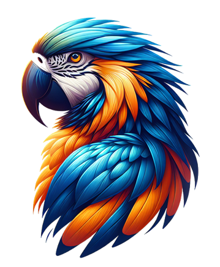

# Programming GPTs 🦜

In this repo, you will learn how to program GPTs primarily leveraging OpenAI’s APIs. If you don’t know what an API is (Application Programming Interface), then this is not the repo you’re looking for. Go look it up on the internet, and come back after learning some basics of programming, preferably in Python, as this will be the language used for the tutorials in each chapter.
Generative Pre-Trained Transformers are quite complicated general-purpose machines that can do a lot of different things, like handling sequences of text, images, and sounds. You will learn the basic concepts and principles behind GPTs, and how they work under the hood. But more importantly, you will learn how to integrate them inside of your applications.

The repo is divided into 10 chapters, each covering a different topic and a different aspect of programming GPTs. The chapters are:
- **Chapter 1: 🤖 Introduction to GPTs**. How they work and their evolution. 

- **Chapter 2: 🐱💬 The Chat API.** In this chapter, you will learn how to use the Chat API, a simple way to create conversational agents with GPTs. You will learn how to create your own chatbot.

    

<video src="https://github.com/slevin48/openai/assets/12418115/91b2c4c6-7338-4f51-9440-16e59626378d" controls="controls" style="max-width: 730px;"></video>

- **Chapter 3: 🔗 Chaining & Summarization.** In this chapter, you will learn how to chain calls to a Large Language Model and use it to summarize texts, such as articles, books, or transcripts. You will learn how to use the Chat API together with the LangChain package to enhance GPTs.

    

<video src="https://user-images.githubusercontent.com/12418115/229315555-c9d2077a-a2ed-4538-816c-ce0b9cece761.webm" controls="controls" style="max-width: 730px;"></video>

- **Chapter 4: 🔎❓ Vector search & Question Answering.** In this chapter, you will learn how to use embeddings and vector search as a way to retrieve informative answers to answer questions while quoting sources. 

    

<video src="https://github.com/slevin48/openai/assets/12418115/b37ec63c-1a7d-4c81-a4b0-5f10f7ceb428" controls="controls" style="max-width: 730px;"></video>

- **Chapter 5: 🕵️‍♀️🛠️ Agent & Tools.** In this chapter, you will learn to build an Agent, called Smith, that has access to tools, such as getting the current weather. You will also learn how to use the Assistant API provided by OpenAI, and to extend their capabilities with tools to integrate GPTs with external services. This will be illustrated with the implementation of your own Code Interpreter, that can help you write and run code with GPTs.

    

<video src="https://github.com/slevin48/openai/assets/12418115/f8e0a3e6-50c9-4eb9-961f-177000a2d7f4" controls="controls" style="max-width: 730px;"></video>

- **Chapter 6: 🗣️📢 Text to Speech & Synthesis.** In this chapter, you will learn how to use GPTs to transcript text from speech (such as Youtube videos), and synthetize speech from text (such as articles). 

    

<video src="https://github.com/slevin48/ami/assets/12418115/6d12b2dd-b349-48be-bdf9-4efafae4e0bf" controls="controls" style="max-width: 730px;"></video>

- **Chapter 7: 👀 Vision API.** In this chapter, you will learn how to use GPTs to process and analyze images, such as mock-ups or drawings. You will learn how to use the Vision API, to perform various tasks with GPTs, such as text recognition, or video captioning.

    

<video src="https://github.com/slevin48/openai/assets/12418115/1a83c37c-b105-42cf-b2d7-b25656824e13" controls="controls" style="max-width: 730px;"></video>

- **Chapter 8: 🎨🖌️ Dall-E image generation.** In this chapter, you will learn how to use Dall-E 2 & 3, which can create stunning and creative images from any text input. You will also learn how to use the outpainting, inpainting and variations APIs, which can complete or modify existing images.

    

<video src="https://github.com/slevin48/openai/assets/12418115/3726aa2c-67e0-474c-909f-5cb54eaa39db" controls="controls" style="max-width: 730px;"></video>

- **Chapter 9: 📌 Conclusion.** In this chapter, you will review what you have learned, and reflect on the potential and challenges of programming GPTs. You will also learn how to keep up with the latest developments and innovations in the field of GPTs and OpenAI with additional resources.

- **Chapter 10: 📚 Appendix.** In this chapter, you will find additional resources, such as a glossary of terms, and a list of references and further readings. You will also find some applications I developed to support some of my work.
