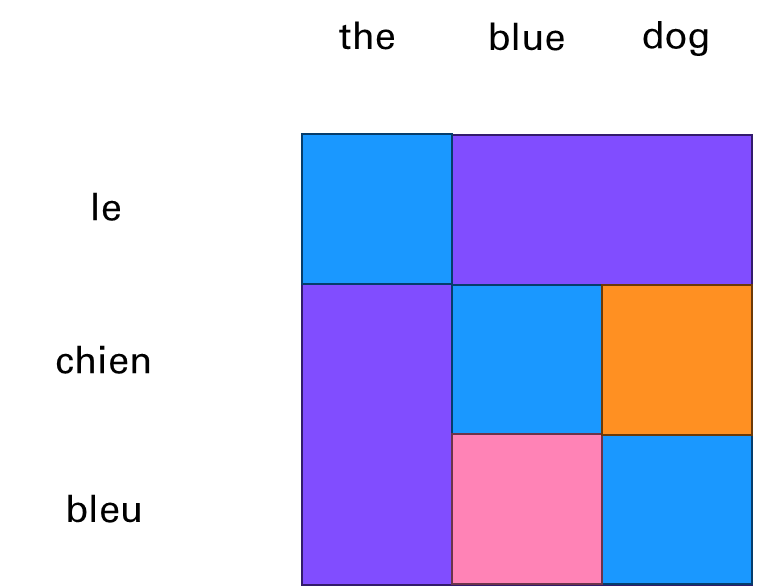
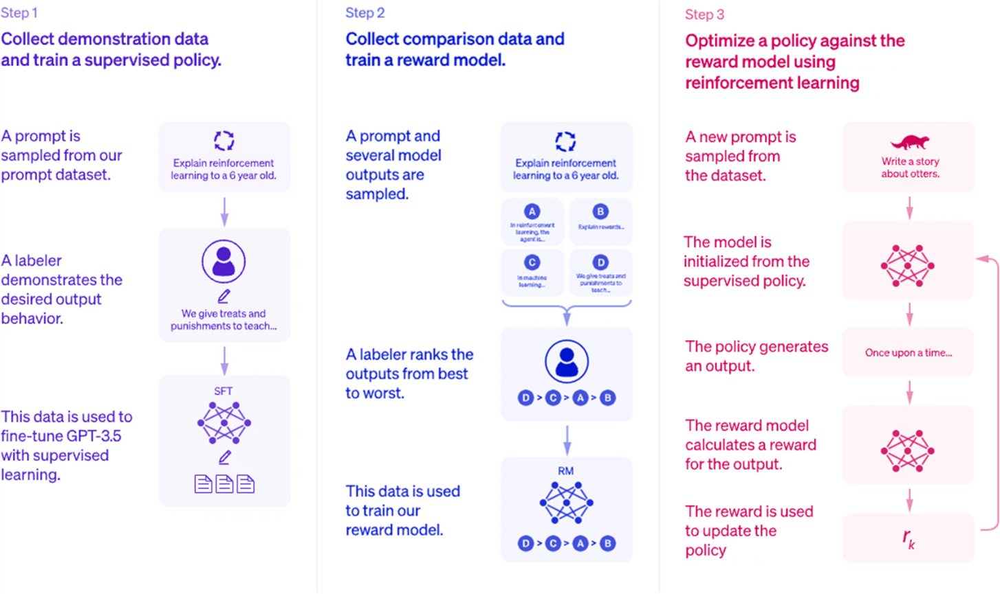

# 1. Introduction to GPTs and Programming Landscape

What are Generative Pre-trained Transformers (GPTs)? In this first part,
we will go over the basics:

-   Definitions
-   How GPTs work
-   Evolution of GPTs
-   How to build your own GPT

Let's start with a bit of theory. I'll take as assumption that the
reader has a basic mathematic or scientific education, with notions of
programming. I will not go deep into the different dimensions of
Artificial Intelligence and Machine Learning. I'll simply provide the
necessary background to apply AI to your concrete applications.

## 1.1. Definitions

### 1.1.1. What the GPT acronym stands for

GPTs (**Generative Pre-Trained Transformers**) are a family of AI models
that can perform tasks such as generating natural language from a query
(also called a prompt).

GPTs are a type of **generative** models,
which means that they can create new data from existing data. For
example, given an image, a generative model can produce another image
that is similar but not identical to the original one. Similarly, given
a text, a generative model can produce another text that is related but
not identical to the original one.

They have been **pre-trained** on massive amounts of text from the
internet and can produce coherent and diverse responses on almost any
topic. They can also perform various tasks, such as answering questions,
summarizing texts, generating images, and more.

GPTs use a special kind of model called a **transformer**. A transformer
is a neural network that can learn to map any input sequence to any
output sequence. For example, given a sentence in English, a transformer
can learn to translate it to French.

### 1.1.2. Key concepts

A transformer consists of two parts: [an **encoder** and a
**decoder**](https://www.youtube.com/watch?v=zbdong_h-x4). The encoder takes the input sequence and transforms it
into a vector representation, which captures the meaning and context of
the input. The decoder takes the vector representation and generates the
output sequence.

**Self-Attention** is a key ingredient of the transformer architecture.
This has been introduced in 2017, in a paper called [*"Attention is all you need"*](https://arxiv.org/abs/1706.03762). The attention layer provides **contextual
understanding.** It enables the model to consider the context of each
word in a sentence, regardless of its position. This means each word's
representation is influenced by every other word in the sentence,
allowing for a more nuanced understanding of language. This provides
efficiency in processing. Unlike recurrent neural networks (RNNs),
self-attention processes all words in a sentence simultaneously, leading
to significant gains in computational efficiency.

**Large Language Models** (LLM) are the main type of Generative
Pre-trained Transformers, that have been popularized by ChatGPT. They
operate word by word, based on the probability of each word being the
most likely next word. This property is called autoregressive.

-   It means that, given the input "How are you", an LLM might
    generate the output "I am fine, thank you".

-   To generate the first word, it uses only the input. To generate the
    second word, it uses the input and the first word.

-   To generate the third word, it uses the input, the first word, and
    the second word, and so on.

This way, an LLM can generate coherent and fluent texts, by learning
from the patterns and structures of natural language. Here is an example
with the motto of MathWorks: Accelerating the pace of ...

If you want to go deeper into the inner workings of LLMs, I recommend
the book [Natural Language Processing with Transformers](https://transformersbook.com/).

## 1.2. How LLMs Work

The process of building a Generative Pretrained Transformer requires the
following steps:

-   **Training Data:** LLMs are trained on vast amounts of text data.
    This data helps the model learn language patterns, grammar, and
    information about the world.

-   **Learning Process:** During training, AI models use supervised
    learning by simply comparing pairs of inputs and outputs with what
    the networks predict from the input alone. And it corrects the
    internal parameters accordingly to fit the training set. LLMs are
    using the attention mechanism to weigh the importance of each word
    in a sentence relative to the others. This process helps the model
    understand context and relationships between words.

-   **Language Modeling:** The primary task during training is language
    modeling, where the model learns to predict the probability of a
    word given the preceding words. This process is what makes the model
    generative.

-   **Tokenization:** Text input is broken down into tokens (which can
    be words or parts of words) before being fed into the model. The
    model then processes these tokens through its layers to generate
    predictions.

-   **Output Generation:** When generating text, the model uses its
    learned probabilities to select the most likely next word. This
    process continues, generating text one word at a time until a
    stopping condition is met (like reaching a maximum length or
    generating a specific token).

## 1.3. Evolution of GPTs

### 1.3.1. Life BC (Before ChatGPT)

One of the first GPT models was GPT-1, which was released in 2018 by
OpenAI. It had 117 million parameters, which are the numbers that
determine how the model processes the input and output. GPT-1 was
trained on a large corpus of text from the Web, called WebText, which
contained about 40 GB of data. GPT-1 showed impressive results in
generating realistic and diverse texts, as well as performing well on
several natural language tasks, such as summarization, translation, and
question answering.

However, GPT-1 also had some limitations. For example, it could not
handle long-term dependencies, which means that it could not remember or
use information that appeared earlier in the text. It also struggled
with factual consistency, which means that it could not verify or
correct the information that it generated. Moreover, it sometimes
produced offensive or biased texts, which reflected the quality and
diversity of the data that it was trained on.

To address these issues, OpenAI released GPT-2 in 2019, which was a much
larger and more powerful version of GPT-1. It had 1.5 billion
parameters, which was more than 10 times the size of GPT-1. It was also
trained on a much larger corpus of text, called WebText2, which
contained about 570 GB of data. GPT-2 improved significantly on the
performance and quality of GPT-1, and achieved state-of-the-art results
on many natural language benchmarks. It also demonstrated a remarkable
ability to generate coherent and engaging texts on a variety of topics
and styles, such as news articles, essays, stories, and reviews.

However, GPT-2 also raised some ethical and social concerns. Due to its
high level of realism and versatility, GPT-2 could potentially be used
for malicious purposes, such as spreading misinformation, impersonating
others, or generating fake content. Therefore, OpenAI decided to release
GPT-2 gradually, starting with a smaller version of 124 million
parameters, and then releasing larger versions over time, along with
some tools and guidelines to help researchers and developers use GPT-2
responsibly and safely.

The latest and most advanced GPT model is GPT-3, which was released in
2020 by OpenAI. It is the largest and most complex language model ever
created, with a staggering 175 billion parameters, which is more than
100 times the size of GPT-2. It was also trained on an enormous corpus
of text, called WebText3, which contained about 45 TB of data. GPT-3
surpassed GPT-2 in every aspect, and achieved unprecedented results on a
wide range of natural language tasks, such as reading comprehension,
text classification, sentiment analysis, and semantic search. It also
demonstrated a remarkable ability to generate high-quality and diverse
texts on almost any topic and style, such as poetry, lyrics, recipes,
jokes, and dialogues.

GPT-3 is not only a powerful language generator, but also a
general-purpose artificial intelligence system, that can learn to
perform any task that can be described in natural language. For example,
given a prompt like "Write a summary of this article", or "Create a
slogan for this company", or "Solve this math problem", GPT-3 can
generate appropriate and accurate responses, by using its vast knowledge
and understanding of language and the world.

One of the key features of GPT-3 was its ability to perform tasks with
little to no task-specific training, known as **zero-shot** or
**few-shot learning**. This means it could understand and respond to
prompts in a meaningful way, even if it hadn't been explicitly trained
on that task.

GPT-3.5, also known as ChatGPT, is an improved version of GPT-3, that
focuses on enhancing its conversational skills. ChatGPT is designed to
be a friendly and engaging chatbot, that can chat with humans about any
topic, and provide relevant and interesting information and jokes.

### 1.3.2. AI Alignment 

ChatGPT is based on the same architecture and data as GPT-3, but with
some key differences. The main issue that it is "fixing" is what is
called [alignment](https://research.ibm.com/blog/what-is-alignment-ai). Alignment is the process of encoding human values
and goals into large language models to make them as helpful, safe, and
reliable as possible. Essentially it builds guardrails so that the AI
doesn't embed the biases that can be found in some places of the
internet.

**How did OpenAI achieve this?**

ChatGPT was initially meant only as a research project to demonstrate
the potential of **Reinforcement Learning from Human Feedback**. This
was leveraging some of the early work of OpenAI in the field of
Reinforcement Learning that is often associated with robotics or games
like chess, go or playing mario.

In traditional Reinforcement Learning, an agent learns to make decisions
by interacting with an environment to maximize cumulative reward. The
agent explores actions, observes results, and receives rewards or
penalties, which guide future actions.

In RLHF, human feedback supplements or replaces the predefined reward
signals. Human evaluators observe the agent's actions and provide
feedback on their quality or appropriateness. This feedback helps shape
the reward function.

Here are the steps explained for the alignment of ChatGPT through
reinforcement:

-   **Step 1:** *Collect demonstration data and train a supervised
    policy*
    Human feedback is used to label the training data. This is used to
    fine-tune the model.

-   **Step 2:** *Collect comparison data and train a reward model*
    Humans are rating the output of the model from the previous step.
    This is captured in a reward function.

-   **Step 3:** *Optimize a policy against the reward model*
    This is now an iterative process without manual human input where
    the two previous steps are brought together to improve alignment.

## 1.4. How to build your own GPT

When OpenAI coined the term GPT, they offered a low-code approach to
building your own GPT (by programming without coding). This book offers
an alternative for programming GPTs that offers richer options (as
described in the table below). A strong ecosystem boomed in 2023 from
this rich set of options around different opiniated approaches to tackle
this challenge.

Here is a [high-level table](https://help.openai.com/en/articles/8673914-gpts-vs-assistants) that compares what can be done via the
ChatGPT app vs the API:

  |                  |**ChatGPT App**             | **ChatGPT API**          |
  |------------------|---------------------------|---------------------------|
  |**Creation Process**| No code                    | Requires coding for integration |
  |**Operational Environment** | Located in ChatGPT         | Can be integrated into any product or service |
  |**Pricing** | Included in ChatGPT on Plus/Team/Enterprise plans| Billed based on usage of different Assistant features|
  |**User Interface**| Built-in UI with ChatGPT|Designed for programmatic use; can use playground for visualization|
  |**Shareability**| Built-in ability to share|No built-in shareability|
  |**Hosting**| GPTs hosted by OpenAI|OpenAI does not host Assistants|
  |**Tools**| Built-in tools like: Browsing, DALL·E, Code Interpreter, Retrieval, and Custom Actions| Built-in tools like: Code Interpreter, Retrieval, and Function calling |
  
Some [very clever programmers](https://www.youtube.com/watch?v=kCc8FmEb1nY) even go so far as to build such
elaborate AI models from scratch, or based on open-source
implementations such as the Llama family of models (from Meta). This
isn't the approach taken in this book as it is way more involved and
requires very deep AI and programming skills.

In this book, we will adopt an approach in between the "low-code" and
"high-code" to build your own AI-powered applications. For this we will
just get the right level of understanding of how those GPTs are
operating by familiarizing ourselves with the ChatGPT Application
Programming Interface (API).

To explain the need for the API, you can consider the cases of using vs
building AI-powered products.

This is really well explained in a video about [Generative AI in a nutshell](https://www.youtube.com/watch?v=2IK3DFHRFfw ).
