# 10. Appendix

## 10.1.  More AI theory

### 10.1.1.  Basic AI concepts

-   **Machine Learning**

Machine learning is a branch of artificial intelligence that enables
computers to learn from data and experience, without being explicitly
programmed for every possible scenario. Machine learning can be used to
solve complex problems that are hard to codify with rules, such as image
recognition, natural language processing, or recommendation systems.


Machine learning can be broadly divided into two categories: supervised
and unsupervised learning. Supervised learning is when the computer
learns from labeled data, that is, data that has a known output or
target. For example, in image recognition, the computer learns from
images that are labeled with their corresponding categories, such as
cat, dog, or car. The goal of supervised learning is to train the
computer to predict the correct output for new data that it has not seen
before.

Supervised learning can be further divided into two types: regression
and classification. Regression is when the output is a continuous value,
such as temperature, price, or speed. Classification is when the output
is a discrete category, such as spam or not spam, positive or negative,
or one of several classes.

Unsupervised learning is when the computer learns from unlabeled data,
that is, data that has no known output or target. For example, in text
analysis, the computer learns from documents that are not labeled with
any topic or sentiment. The goal of unsupervised learning is to discover
hidden patterns or structures in the data, such as clusters, outliers,
or features.

Unsupervised learning can be mainly divided into two types: clustering
and dimensionality reduction. Clustering is when the computer groups
similar data points together based on some measure of similarity or
distance, such as k-means, hierarchical clustering, or Gaussian mixture
models. Dimensionality reduction is when the computer reduces the number
of features or dimensions of the data, while preserving as much
information as possible, such as principal component analysis, linear
discriminant analysis, or autoencoders.

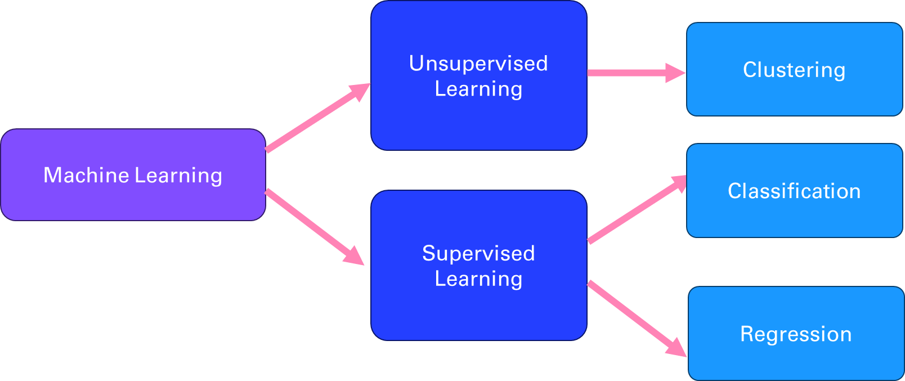

-   **Deep Learning**

Deep learning is a branch of machine learning that uses neural networks
with multiple layers to learn from data in a hierarchical manner. Neural
networks are computational models that mimic the structure and function
of biological neurons, which can process and transmit information
through connections called synapses. Deep learning can handle complex
and high-dimensional data, such as images, speech, or natural language,
and perform tasks such as object recognition, speech recognition,
natural language processing, or machine translation. Deep learning is
inspired by the discoveries of neuroscience and cognitive science, and
relies on advances in mathematical optimization, parallel computing, and
big data.

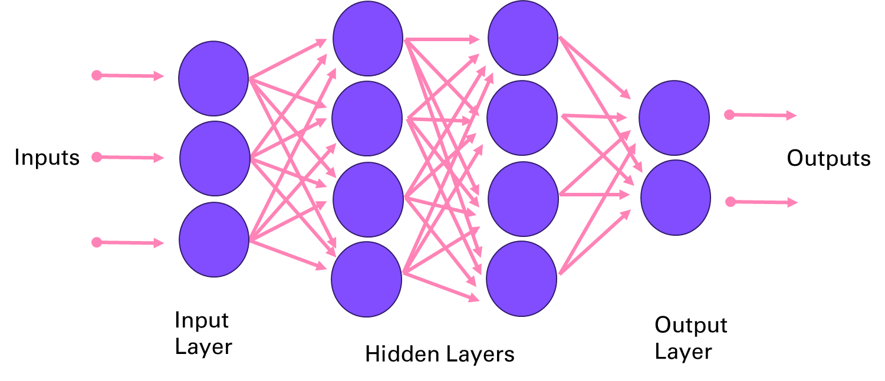

-   **Natural Language Processing**

Natural language processing (NLP) is the field of artificial
intelligence that deals with understanding and generating natural
language, such as text or speech. NLP has many applications, such as
question answering, sentiment analysis, machine translation,
summarization, dialogue systems, information extraction, and more. NLP
faces many challenges, such as ambiguity, variability, complexity, and
diversity of natural language.

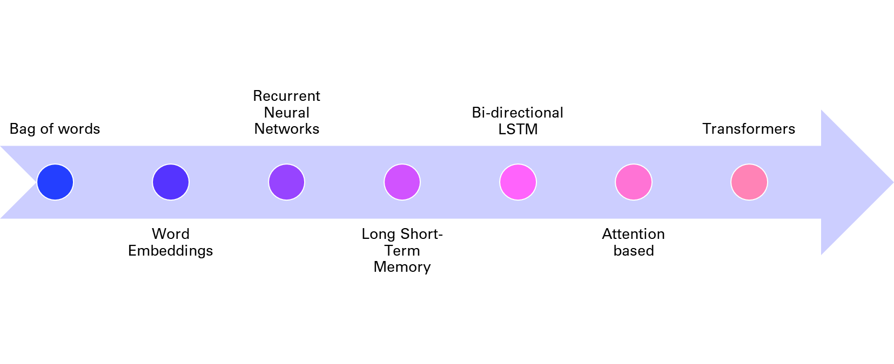

One of the key tasks in NLP is to represent natural language in a way
that computers can understand and manipulate. Traditionally, this was
done by using rule-based or statistical methods to extract features from
words, such as their part-of-speech, syntactic structure, semantic role,
or frequency. However, these methods often require a lot of human effort
and domain knowledge and cannot capture the rich and dynamic nature of
natural language.

To overcome these limitations, deep learning methods have been developed
to learn distributed representations of natural language, also known as
embeddings, from large amounts of data. As mentioned in chapter 4,
embeddings are vectors that encode the meaning and usage of words or
sentences in a low-dimensional space, and can be used as input or output
for various NLP tasks. Embeddings can capture the semantic and syntactic
similarities and relationships between words or sentences, and can also
adapt to new domains and languages.

One of the first methods to learn word embeddings was the bag-of-words
model, which represents a document as a vector of word frequencies,
ignoring the order and context of words. The bag-of-words model is
simple and efficient, but it suffers from sparsity, dimensionality, and
lack of semantics. To address these issues, neural network models such
as word2vec and GloVe were proposed to learn word embeddings from the
co-occurrence patterns of words in large corpora, using techniques such
as skip-gram and negative sampling. These models can learn more
expressive and dense word embeddings, but they still treat words as
independent units, ignoring their morphology and compositionality.

To account for the sequential and hierarchical structure of natural
language, recurrent neural networks (RNNs) were introduced to learn
sentence or document embeddings from word embeddings. RNNs are neural
networks that process sequential data by maintaining a hidden state that
captures the history of previous inputs. RNNs can learn long-term
dependencies and generate variable-length outputs, making them suitable
for tasks such as language modeling, machine translation, or text
generation. However, RNNs also face some challenges, such as vanishing
or exploding gradients, difficulty in parallelization, and sensitivity
to noise.

To improve the performance and stability of RNNs, variants such as long
short-term memory (LSTM) and gated recurrent unit (GRU) were developed
to introduce gates that control the flow of information in the hidden
state. These gates can learn to remember or forget relevant or
irrelevant information over time, and can handle long-term dependencies
better than vanilla RNNs. LSTM and GRU have achieved state-of-the-art
results on many NLP tasks, such as machine translation, speech
recognition, or sentiment analysis.

However, even LSTM and GRU have some limitations, such as the inability
to model long-range dependencies beyond a fixed window, the sequential
nature of computation that limits parallelization, and the lack of
attention mechanisms that can focus on relevant parts of the input or
output. To overcome these limitations, a new paradigm of neural network
models was proposed, based on the concept of transformers. Transformers
are neural networks that use attention mechanisms to learn the
dependencies and relationships between words or sentences, without
relying on recurrence or convolution. Attention mechanisms are functions
that assign weights to different parts of the input or output, based on
their relevance or similarity. Transformers can learn global and local
dependencies, parallelize computation, and generate diverse and coherent
outputs, making them suitable for tasks such as machine translation,
text summarization, or natural language understanding. Transformers have
achieved state-of-the-art results on many NLP benchmarks, such as GLUE,
SQuAD, or WMT.

In summary, deep learning has revolutionized the field of natural
language processing, by providing powerful and flexible methods to learn
distributed representations of natural language, from words to sentences
to documents.

### 10.1.2.  Papers, papers, papers

Let's take a drive through memory lane and look at the main research
papers that made possible the innovations presented in this book.

-   [*Yann LeCun et al* (1989) Backpropagation Applied to Handwritten Zip Code Recognition](http://yann.lecun.com/exdb/publis/pdf/lecun-89e.pdf)

This paper that is the same age as me introduced way back the potential
of neural network for image processing, on the famous [MNIST dataset](http://yann.lecun.com/exdb/mnist/)


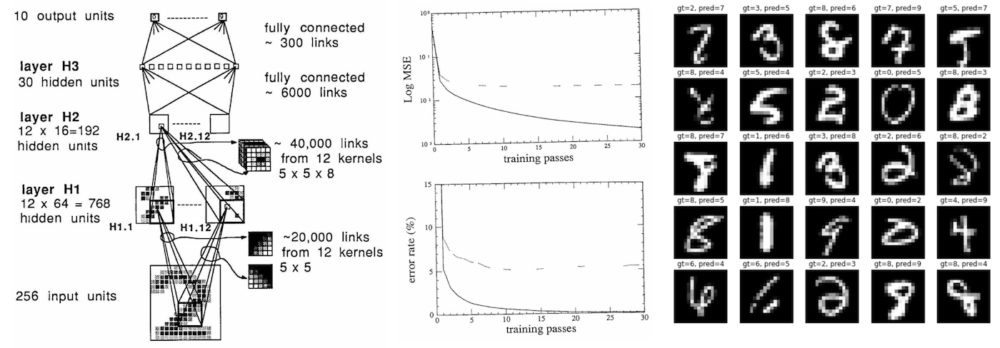

-   [*Alex Krizhevsky, Ilya Sutskever, Geoffrey E. Hinton* (2012) ImageNet Classification with Deep Convolutional Neural Networks](https://papers.nips.cc/paper_files/paper/2012/hash/c399862d3b9d6b76c8436e924a68c45b-Abstract.html)


This paper introducing AlexNet marks a turning point in machine learning
and is considered one of the most papers publication in computer vision,
having spurred many more papers employing CNNs and GPUs to accelerate
deep learning.

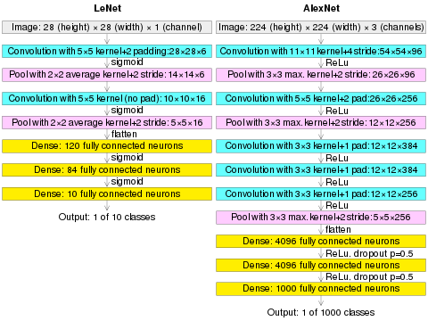

-   [*Google DeepMind team* (2017) Attention is all you need](https://arxiv.org/abs/1706.03762)

Already mentioned in the beginning of this book, this paper is
foundational in the field of Natural Language Processing. It introduces
the transformer architecture with the attention layer that will be used
in every Large Language Model moving forward.


## 10.2.  More on OpenAI

### 10.2.1.  Managing your OpenAI usage and budget

To give you a sense of the cost of using the API, here is a view over
the month of May, where I spend the most of my time writing this book
and developing the associated GPTs.

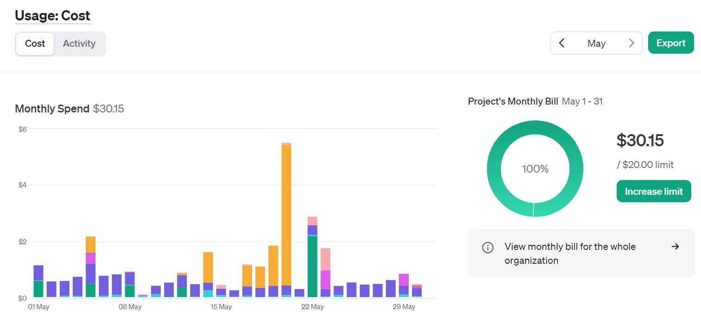

If you hover over the graphic, you can see the breakdown by service
(image, audio, embeddings, ...) or by model (3.5, 4o, ...). The big
spike mid-month was due to the Dall-E 3 service usage for over $5 on 1
day.

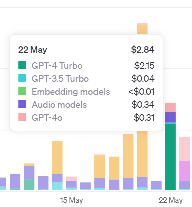

You can add email alerts and set budget limits to control your spending.
As I started integrating more AI into my apps over the year, I ended up
creating new keys for each project, and even distributing keys to
friends and colleagues:

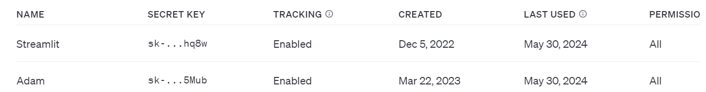

This enabled me to have a finer grain control over the different
projects including AI. You now have the ability to actually create a
"project" that can contain members and have dedicated limits attached to
it.

### 10.2.2.  GPT Builder

In this section, we will see how you can use the GPT builder in the
ChatGPT App (with Plus subscription).

-   How to design your own AI (for your personal needs or for your
    professional tasks).

-   How to use actions to give your GPT access to web services

-   And what would be the experience of interacting with it.

If you have a ChatGPT Plus account, you will be able to create your own
GPTs using a low code builder:

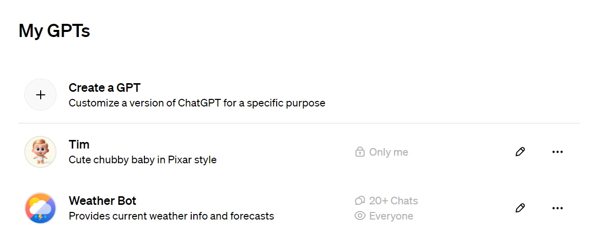

This is the first GPT that I created:

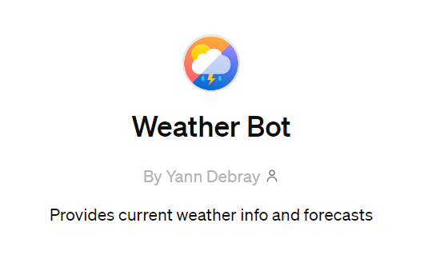

Here is an example of what it does:

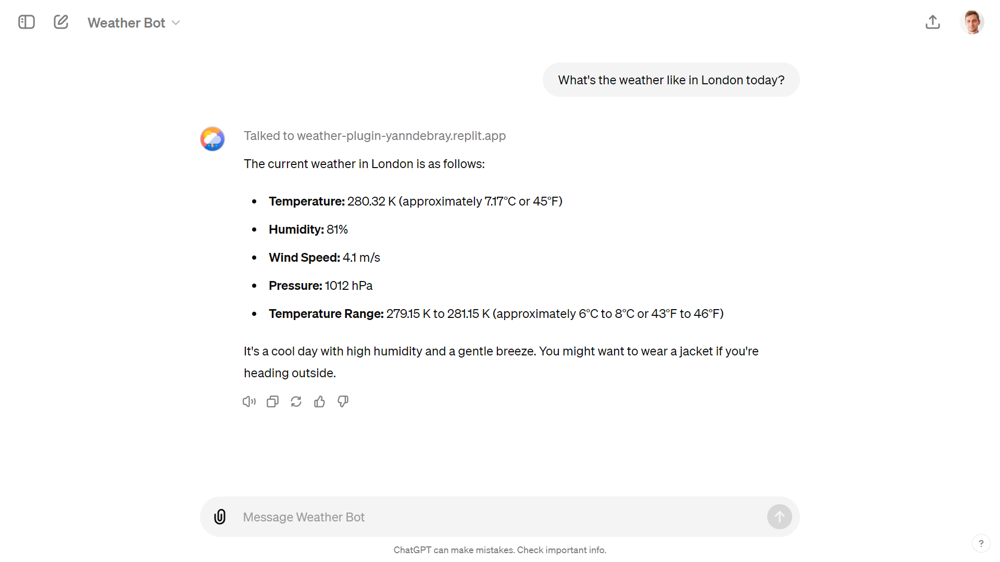

You can create your own GPT with the low-code GPT builder in the ChatGPT
app:


The secret ingredient in my Weather GPT is the ability to call a weather
service.

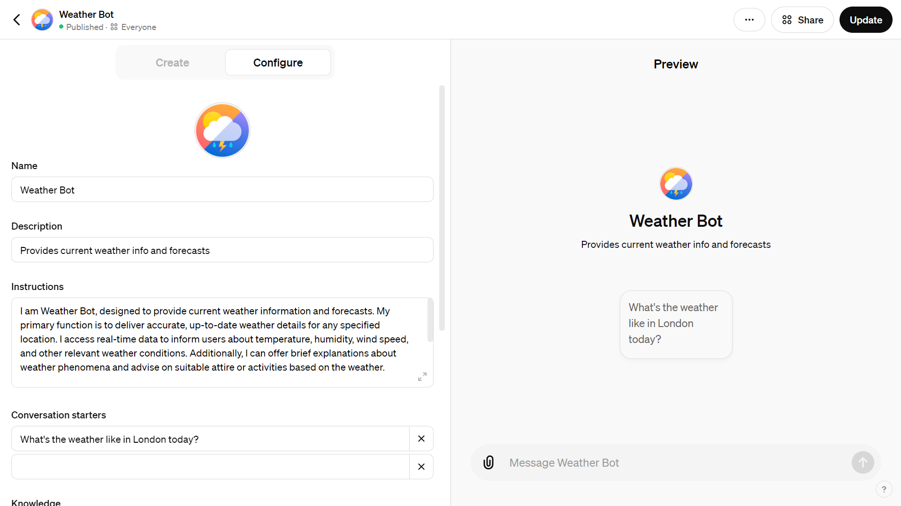

For this I'm using an "Action". To find out more about [actions](https://platform.openai.com/docs/actions/introduction), you
can ask help to ActionsGPT

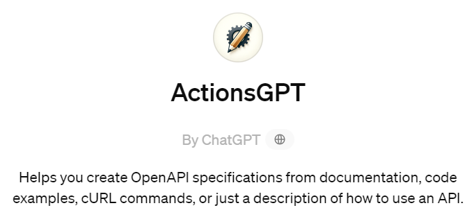

The actions are specified in the OpenAPI format (not to confuse with
OpenAI, without a P):

**Schema openapi.yml**
```yaml
openapi: 3.0.1

info:

    title: Weather

    description: Get weather data for a given city.

    version: "v1"

servers:

    - url: https://weather-plugin-yanndebray.replit.app/

paths:

    /weather:

        get:

            operationId: getWeatherData

            summary: Retrieves the weather data.

            parameters:

                - in: query

                  name: city

                  schema:

                      type: string

                  description: The city to get the weather from. For
example, London,uk.

            responses:

                "200":

                    description: OK
```
For this demonstrator, I've deployed my get_weather_data function with
Replit:

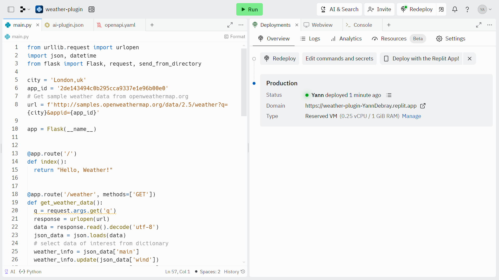

This is how Function calling looks like from my WeatherGPT, in debug
mode to test the Replit endpoint:

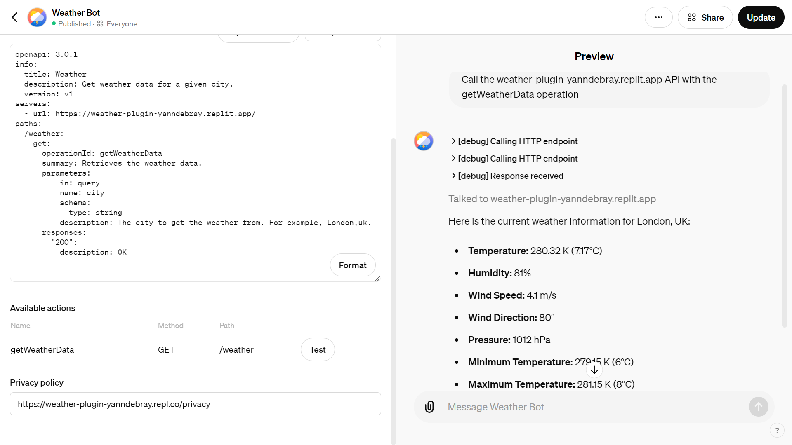

My weather Bot is available in the GPT Store (but the backend will likely be down if you try it):

[https://chatgpt.com/g/g-HB1PWjLVs-weather-bot](https://chatgpt.com/g/g-HB1PWjLVs-weather-bot)

## 10.3.  More LLMs: open-source and local alternatives

### 10.3.1.  Mistral

[Mistral AI](https://mistral.ai/) is a French startup that created an open-source LLM
competitive with GPT-3.5 in about 1 year and with a team of 20 engineers. Setting aside the Frenchmanhood, I find this very impressive.
The members of the founding team were previously employed at Google
DeepMind and at FAIR (Facebook AI Research) working on important
projects like the Llama model from Meta.

In only a few hours, I've been able to port my first three applications
to be working with the Mistral API (la Plateforme):

-   Chat

-   Summarization

-   Q&A with vector search

To get started with the API, you can use the [python client](https://github.com/mistralai/client-python):

`pip install mistralai`

Here is how you can convert some of your code 
```python
from OpenAI to MistralAI:
from mistralai.client import MistralClient
from mistralai.models.chat_completion import ChatMessage

model = "mistral-tiny"
client = MistralClient(api_key=api_key)
m = [{'role': 'system', 'content': 'If I say hello, say world'}]

def struct2chat(struct):
    return [ChatMessage(role=m['role'], content=m['content']) for m in struct]
struct2chat(m)

[ChatMessage(role='system', content='If I say hello, say world')]

messages = [
     ChatMessage(role="user", content="What is the best French cheese?")
]
def chat2struct(chat):
     return [{'role': m.role, 'content': m.content} for m in chat]
chat2struct(messages)
```
```
[{'role': 'user', 'content': 'What is the best French cheese?'}]
```
```python
# No streaming

chat_response = client.chat(
     model=model,
     messages=messages,
)
print(chat_response.choices[0].message.content)
```
```
It is subjective to determine the "best" French cheese as it depends
on personal preferences. Some popular and highly regarded French cheeses
are:

1\. Roquefort: A blue-veined cheese from the Massif Central region,
known for its strong, pungent flavor and distinctive tang.

2\. Comté: A nutty, buttery, and slightly sweet cheese from the
Franche-Comté region, made from unpasteurized cow's milk.

3\. Camembert de Normandie: A soft, Earthy, and tangy cheese from the
Normandy region, famous for its white mold rind.

...
```
### 10.3.2.  Ollama

Download [Ollama](https://ollama.com/) on your laptop and select the open-source LLMs you
want to serve up locally:

`$ ollama run llama3:8b`
```shell
pulling manifest
pulling 6a0746a1ec1a\... 100%
▕████████████████████████████████████████████████████████▏ 4.7 GB
pulling 4fa551d4f938\... 100%
▕████████████████████████████████████████████████████████▏ 12 KB
pulling 8ab4849b038c\... 100%
▕████████████████████████████████████████████████████████▏ 254 B
pulling 577073ffcc6c\... 100%
▕████████████████████████████████████████████████████████▏ 110 B
pulling 3f8eb4da87fa\... 100%
▕████████████████████████████████████████████████████████▏ 485 B
verifying sha256 digest
writing manifest
removing any unused layers
success
```
Once you successfully retrieved the weights of the model (here 4.7Gb for
the 8B Llama3 model), you can start interacting with the command line:
```shell
>>> Send a message (/? for help)
```
You can also use the [Ollama Python client](https://github.com/ollama/ollama-python) to build local LLMs applications, as an alternative to OpenAI:

`pip install ollama`

Depending on your laptop resources (CPU, GPU and RAM) you might have a
very slow response compared to what you are used to with GPT-3.5 or 4.

import ollama
response = ollama.chat(model='llama3:8b', messages=[
   {
    'role': 'user',
     'content': 'Hello world',
   },
])
print(response['message']['content'])
```
You can also stream the response and observe the throughput latency:
```python
import ollama

stream = ollama.chat(
    model='llama3:8b',
    messages=[{'role': 'user', 'content': 'Why is the sky blue?'}],
     stream=True,
)
for chunk in stream:
  print(chunk['message']['content'], end='', flush=True)
```
This kind of setup can be useful for batch workflows where you want to
process sensitive information without having to share it with a web
service.

## 10.4.  More applications

### 10.4.1.  Image generator

In chapter 8, we touch on image generation. This is a simple application
implementing it: [openai-image.streamlit.app](https://openai-image.streamlit.app/)

`Prompt: blue and orange parrot with a white background`

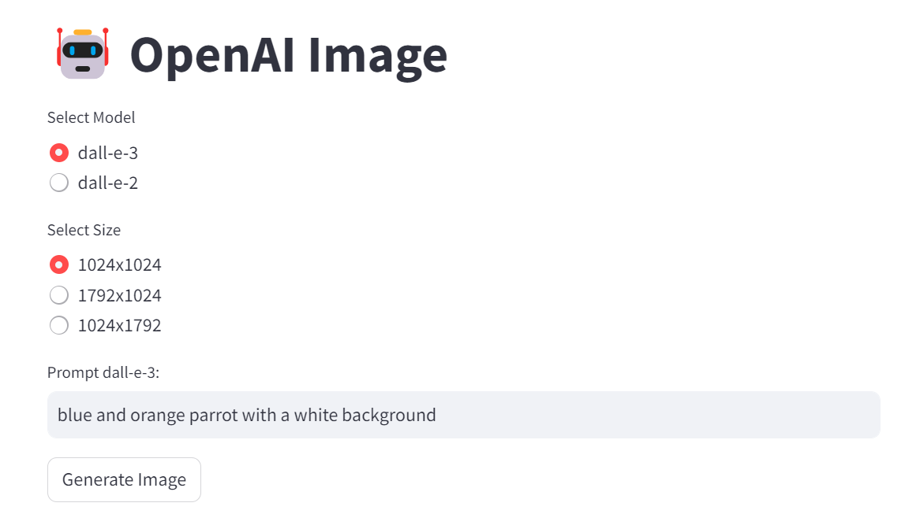


### 10.4.2.  Image cropper

To create variations in chapter 8, you first need to crop the input
image to the right shape (e.g. 512x512). Here is an [app](https://github.com/turner-anderson/streamlit-cropper) that
enables you to interactively crop images.

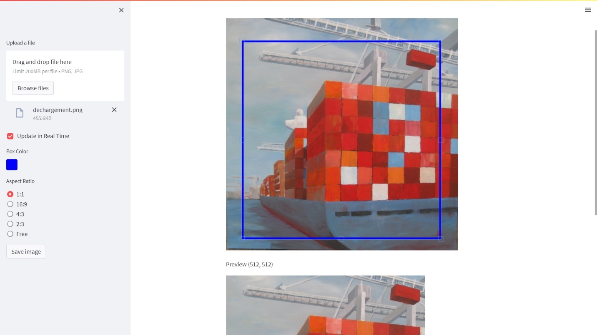

You can simply crop the image programmatically as long as you know the
location of your top left pixel.
```python
import PIL
im1 = PIL.Image.open('../img/dechargement.jpg')
left=0
top=0
right=512
bottom=512
im2 = im1.crop((left, top, right, bottom))
im2.save("../img/dechargement_cropped.jpg")
im2
```
The resulting image can then be used to generate variations like in
chapter 8.
```python
import io
from IPython.display import Image
# Convert the image to bytes
image_bytes = io.BytesIO()
im2.save(image_bytes, format='PNG')
# Use the image bytes in the API call
response = openai.images.create_variation(
   model="dall-e-2",
   image=image_bytes,
   n=1,
   size="512x512"
)
image_url = response.data[0].url
print(image_url)
Image(url = image_url)
```
                    


This use case has a particular emotional meaning for me as this painting
is hanging in my living room and was authored by my godmother who I love
dearly. Seeing a new take on her creative work is lightning a thousand
lights in my heart (this expression isn't AI generated, it really is how
this makes me feel).

### 10.4.3.  Video Analyzer

Post process Andrej amazing videos. For example:

> Andrej Karpathy [1hr Talk] Intro to Large Language Models
> [https://www.youtube.com/watch?v=zjkBMFhNj_g](https://www.youtube.com/watch?v=zjkBMFhNj_g)\
> slides:
> [https://drive.google.com/file/d/1pxx_ZI7O-Nwl7ZLNk5hI3WzAsTLwvNU7/view](https://drive.google.com/file/d/1pxx_ZI7O-Nwl7ZLNk5hI3WzAsTLwvNU7/view)

-   Download the Youtube video
```python
from pytube import YouTube
video_id = "zjkBMFhNj_g"
# Define the URL of the YouTube video
url = f'https://www.youtube.com/watch?v={video_id}'  
# Create a YouTube object
yt = YouTube(url)
# Download the video in the best quality
video_path = yt.streams.get_highest_resolution().download()
```
You can use a package called MoviePy to extract images from the video:
```python
from moviepy.editor import VideoFileClip
time = 42
clip = VideoFileClip(video_path)
clip.save_frame(f"frames/frame\_{time}.jpg", t = time)
```
To select manually frames from a Youtube video, I've created the following wanky app:\
[https://video-analyzer.streamlit.app/](https://video-analyzer.streamlit.app/)

-   Extract/crop area of the picture (semi-manual process)

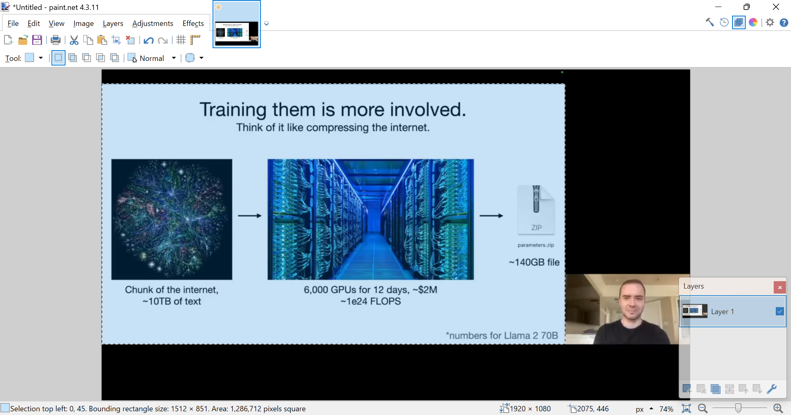

I took a printscreen of the bottom left corner information and ask the
Code interpreter to *write python code to crop the following selection*:

`Selection top left: 0, 45. Bounding rectangle size: 1512 x 851`

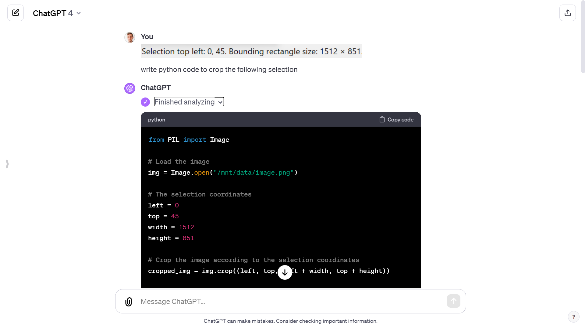

```python
# The selection coordinates
left = 0
top = 45
width = 1512
height = 851
# Crop the image according to the selection coordinates
cropped_img = img.crop((left, top, left + width, top + height))
# Save the cropped image
cropped_img_path = f"cropped_frames/cropped_frame\_{time}.png"
cropped_img.save(cropped_img_path)
```
-   Extracted the audio
```python
from moviepy.editor import VideoFileClip
# Define the path of the video file
# video_path = 'path/to/video.mp4'
# Create a VideoFileClip object
video = VideoFileClip(video_path)
# Extract the audio from the video
audio = video.audio
# Save the audio as a separate file
# audio_path = 'path/to/audio.wav'
audio_path = f'./{video_title}.mp3'
audio.write_audiofile(audio_path)
```
-   Breakdown into chapters

Finally, I used the GitHub copilot chat panel to breakdown the audio
file into chapters (from the chapter structure of the Youtube video):

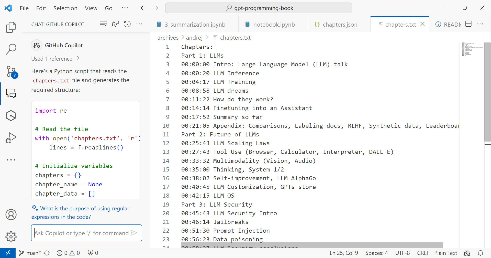

## 10.5.  More copilots

### 10.5.1.  Microsoft copilot


As I am thinking about what to write in
those next few lines, a little icon appears on the left of the empty
line in Word. If I hover over it, it informs me that I can use Alt+I as
a shortcut to summon the assistant:

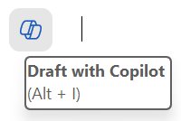

And if I click on it, I can see that an edit text box appears to await
my prompt instructions.

This is a new feature that allows me to write with the help of an AI
assistant. The assistant can suggest sentences, paragraphs, or even
entire documents based on my input and preferences. I can also ask the
assistant questions, give commands, or request feedback. For example, I
can type:

-   Write a chapter about X.

-   Summarize the main points of this document.

-   Check my grammar and spelling.

The assistant will try to respond to my requests as best as it can,
using the information from the document or the internet. The assistant
can also generate tables, charts, images, or other types of media if I
ask for them.

(By the way the previous lines have been generated, and I did only
modify about 30% of it, including removing the inexact facts.)

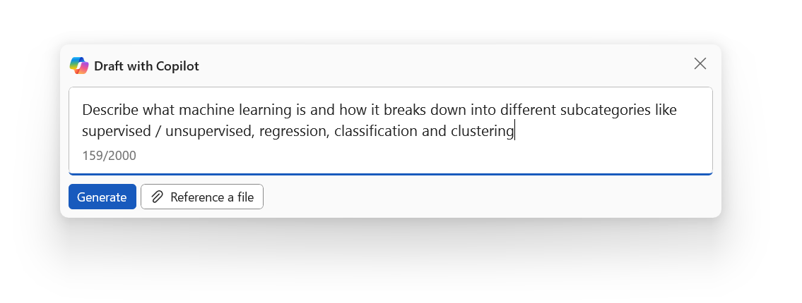

You have now copilot integrated into most of the Microsoft products. I
find them more or less useful, but those capabilities will likely evolve
as copilot gets more widely adopted.

### 10.5.2.  GitHub copilot

GitHub copilot is probably the most useful copilot in my mind, as it
turned me into a better coder.

You can start with a prompt if you have a clear idea of what you want to
develop.

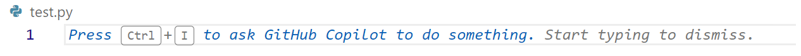

If not, you can dive in the code, and add comments along the way to give
hints to copilot on what you want to do next:

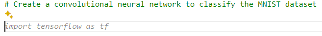

All you have to do next is to enter Tab if you are satisfied with the
code completion suggested. If not you can hover over the code to see if
there are other proposition

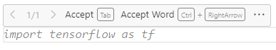

You can play with the tab and escape keys as the code get's written for
you.

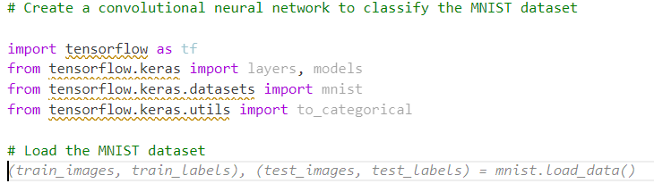

I can assure you that this significantly reduces the cognitive load for
me (especially because I'm not a professional coder). And I'm even
learning a ton along the way. Before copilot, I would Google "How to
code X in Python" and spend hours finding the right tutorial or forum
post that solves a problem close to mine. Then I would still have to
interpolate to my context.

This use case of LLMs generating code is for me by far the most valuable
one, and it was enough to fuel my motivation to learn more about GPTs in
2023 and write this book in 2024.