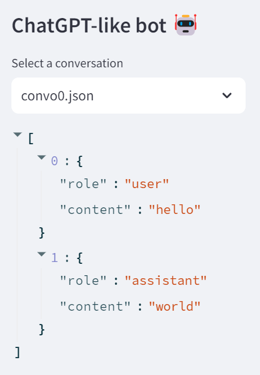

# 2.  The ChatGPT API

On March 1st 2023, [OpenAI introduced a programming interface (API) to
ChatGPT](https://openai.com/blog/introducing-chatgpt-and-whisper-apis ). This essentially enabled developers to build their own
version of ChatGPT. I had been waiting for this ever since the ChatGPT
web app got released in the end of 2022. I knew somehow that OpenAI
could not keep this amazing technology just to themselves, and that they
had to make it a platform for developers to build their own apps. The
availability of APIs to the previous generation of models (GPT3, Dall-E,
...) made me hope for the day when I could build on top of this Large
Language Model.

But when I started programming with this new chat completion API, I
started understanding better how the ChatGPT app was working, especially
when it comes to storing the state of the conversation. Spoiler alert:
the API is stateless: it doesn't store the conversation, and just passes
it entirely each time that a new request is made to the model.

## 2.1.  Setting up the Programming Environment

Setting up an effective programming environment is crucial for working
with Generative Pre-trained Transformers (GPTs). This section will guide
you through the necessary tools, libraries, and hardware requirements,
followed by a step-by-step setup process.

### 2.2.1.  Initial Setup Guide

I'll take as assumption that you are running on a Windows machine.
Wherever there is a major difference in OS, I'll try to make sure that I
give explanations for the different platforms.

**Step 1: Install Python**

Ensure that Python (version 3.6 or later) is installed on your system.
You can download it from the official [Python website](www.python.org).

**Step 2: Set Up a Virtual Environment**

This is a good habit if you don't want to mess up completely your Python
dev environment. That being said, this blog will not leverage a lot of
Python packages, so you might get away without it.

-   Using a virtual environment is recommended to manage dependencies.

-   You can create a virtual environment using tools like **venv** or
    **conda**.

```
python -m venv env

# Activate the environment

envScriptsactivate

# On Linux or Mac: source env/bin/activate
```
**Step 3: Install Packages**

-   [OpenAI-Python](https://github.com/openai/openai-python) is the official library provided by OpenAI for
    interacting with their GPT models..

-   [LangChain](https://www.langchain.com/) is useful for chaining language model calls and
    building complex applications.

-   [Streamlit](https://streamlit.io/) is a Python library for creating and sharing
    beautiful, custom web apps.

`pip install openai langchain streamlit`

**Step 4: API Keys and Authentication (For OpenAI)**

-   Obtain an API key from OpenAI by registering on their platform.

-   Set up authentication by adding your API key to your environment
    variables or directly in your code (not recommended for production).

**Step 5: Test Installation**

-   Verify your setup by running a small script to interact with the
    OpenAI API.

-   As of version 1.X of the OpenAI Python SDK, your code would look
    like this:
```python
from openai import OpenAI
client = OpenAI(api_key = 'sk-XXXX')
res = client.completions.create(
    model="gpt-3.5-turbo-instruct",
    prompt="Say this is a test",
)
print(res.choices[0].text)
```
**Step 6: Streamlit Basic Setup**

-   Create a simple Streamlit app to test the setup and save it under
    [1_3_streamlit_setup.py](1_3_streamlit_setup.py).

```python
import streamlit as st
st.title('GPT with Streamlit')
user_input = st.text_input("Enter some text")
if user_input:
    st.write("Your input was:", user_input)
```

-   Run the Streamlit app with the following command (not simply executing the script with Python)

`$ streamlit run chap1/1_3_streamlit_setup.py`

### 2.1.2.  Setup the dev environment

To setup VSCode for a Python project, you will need to install some
extensions and configure some settings. Here are the steps to follow:

-   Install the Python extension from the VSCode marketplace. This will
    enable syntax highlighting, code completion, debugging, testing, and
    other features for Python files.

-   Install the Pylance extension from the VSCode marketplace. This will
    enhance the Python language server with type information, signature
    help, and more.

-   Create a folder for your project and open it in VSCode. You can use
    the File > Open Folder menu or the command palette (Ctrl+Shift+P)
    and type "Open Folder".

-   Configure VSCode to use the correct Python interpreter and linter.
    You can use the status bar at the bottom of the editor to select the
    interpreter and the linter. Alternatively, you can use the command
    palette and type "Python: Select Interpreter" or "Python: Select
    Linter". You can choose any linter that you prefer, such as pylint,
    flake8, or black.

-   Write your Python code and enjoy the features of VSCode. You can use
    the Run > Start Debugging menu or the F5 key to debug your code.
    You can also use the Test > Run Tests menu or the command palette
    to run your tests. You can also use the Code > Format Document menu
    or the Shift+Alt+F key to format your code.

If you don't want to maintain your dev environment locally, you can get
started with a cloud development environment, like GitHub Codespace.

This works really well with Streamlit, as an end-to-end [full online dev environment](https://blog.streamlit.io/edit-inbrowser-with-github-codespaces/ ).

### 2.1.3.  Develop and deploy a web app with Streamlit

I get to speak about two of my favorites Python frameworks in one blog:
OpenAI and Streamlit.

**What is Streamlit?** Streamlit is a Python framework that lets you
create beautiful and interactive web apps in minutes, without any web
development skills. You can write your app logic in pure Python, and
Streamlit will handle the front-end for you. Streamlit apps are composed
of widgets, charts, maps, tables, media, and custom components that you
can arrange and update dynamically with a few lines of code. Streamlit
also provides a live reloading feature that automatically refreshes your
app whenever you change your code or data.

**How does Streamlit work?** Streamlit works by running a local web
server that serves your app to your browser. You can either run your app
on your own machine, or deploy it to a cloud platform like Heroku, AWS
or the Streamlit Cloud. Streamlit apps are based on a simple concept:
every time the user interacts with a widget, such as a slider or a
button, Streamlit reruns your Python script from top to bottom, and
[updates the app accordingly](https://docs.streamlit.io/library/get-started/main-concepts#app-model). This means that you don't have to
worry about callbacks, state management, or HTML templates. You just
write your app logic as a normal Python script, and Streamlit will take
care of the rest.

I have developed and deployed around 60 apps with Streamlit over the
past couple of years. I wrote apps to manage my Spotify playlist, map
out the houses in Boston suburbs, track the price of Bitcoin, edit
videos from YouTube, play back some chess moves, ... So this feels like
a natural way to bring to live the content of this blog.

## 2.2.  Getting started with the chat completion API

This is what the first lines of code would look like from the version
1.0 of the OpenAI Python SDK:
```python
import openai
openai.api_key = "sk-XXXX"
m = [{'role': 'system', 'content': 'If I say hello, say world'},
     {'role': 'user', 'content': 'hello'}]
completion = openai.chat.completions.create(model='gpt-3.5-turbo',messages=m)
response = completion.choices[0].message.content
print(response) # world
```
In order to facilitate the storage of our API key, we can store it as a
variable `"OPENAI_API_KEY"` in a file `secrets.toml`. Since it will be used
in the next section by Streamlit, save this file in a folder called
`.streamlit/` and load it with the following command:
```python
with open('.streamlit/secrets.toml','rb') as f:
     secrets = tomli.load(f)
```
As you can see from the messages that are passed to the chat completion
API, the structure expected is a [list of dictionaries](https://cookbook.openai.com/examples/how_to_format_inputs_to_chatgpt_models), with each
entry containing a role (either system, user or assistant) and a content
entry. The first entry is a system prompt: it is going to serve as
context for the rest of the conversation, forcing the chat to behave in
a certain way. Some developers have found success in continually moving
the system message near the end of the conversation to keep the model's
attention from drifting away as conversations get longer.

The list of messages can contain as many *user* and *assistant*
exchanges as you want, as long as you do not exceed the model's context
window. For the first version of [GPT-3.5](https://platform.openai.com/docs/models/gpt-3-5), the number of tokens
accepted was 4,096 tokens (inputs and outputs tokens are summed). In
some cases, it's easier to show the model what you want rather than
tell the model what you want. One way to show the model what you want is
with faked example messages. This is what is called few-shot prompting.

The message contained in the [chat completion object](https://platform.openai.com/docs/api-reference/chat/object) that is
returned by the API can be appended to the message list to iterate on
the next question to the assistant:
```json
{"role": "assistant", "content": "world"}
```
Additional parameters can be passed to the [chat completion function](https://platform.openai.com/docs/api-reference/chat/create)
(like max number of tokens, number of choices to generate, and stream
option).

## 2.3. Prices of the API

The [prices](https://openai.com/pricing ) have evolved quite a bit since the introduction of the
ChatGPT API. As of November 2023:

-   GPT 3.5 turbo costs $0.001 / 1k input tokens, $0.002 / 1k output
    tokens.
    This model was introduced at 1/10 of the price of the davinci legacy
    GPT 3 model.

-   GPT 4 (8k version) costs $0.03 / 1k input tokens, $0.06 / 1k
    output tokens.
    The 32k version costs twice as much.

-   GPT 4 turbo (introduced in November 2023) cost 1/3 of GPT 4.

## 2.4.  Build your first chatbot app

In this chapter you will learn how to build your very first chatbot
[chat_app.py](chat_app.py). It will look like this:


We will breakdown the development into the following steps:

1.  Define the graphical components of the app (**text_input**,
    **button**, **selectbox**)

2.  Display the chat conversation in the main area (**chat_message**)

3.  Implement various functions (**new_chat**, **save_chat**,
    **select_chat**, **dumb_chat**) for handling chat functionalities,
    and save the chat history as json file

4.  Handle session states

5.  Stream the conversation (**chat_stream**)

### 2.4.1. Create a first chat graphical user interface

This part is going to focus more on the Streamlit app building
framework.


This is the code for the first chat GUI in Streamlit:
```python
import openai
import streamlit as st
openai.api_key = st.secrets['OPENAI_API_KEY']
st.title('My first chatbot 🤖')
m = [{'role': 'system', 'content': 'If I say hello, say world'}]
prompt = st.text_input('Enter your message')
if prompt:
    m.append({'role': 'user', 'content': prompt})
    completion = openai.chat.completions.create(model='gpt-3.5-turbo', messages=m)
    response = completion.choices[0].message.content
    st.write(response)
```
The basic elements that are useful for any basic app are the
[**text_input**](https://docs.streamlit.io/library/api-reference/widgets/st.text_input) and the [**write**](https://docs.streamlit.io/library/api-reference/write-magic/st.write) method.

We can gradually increase the complexity of the app, by adding a
[**selectbox**](https://docs.streamlit.io/library/api-reference/widgets/st.selectbox) to choose the model:
```python
models_name = ['gpt-3.5-turbo', 'gpt-4']
selected_model = st.sidebar.selectbox('Select OpenAI model', models_name)
```
Notice that Streamlit provides you with a way to store your OpenAI key
as [secrets](https://docs.streamlit.io/library/advanced-features/secrets-management).

### 2.4.2.  Chat elements

Two new methods have been added in 2023 to facilitate the development of
chat-based apps: [**chat_message**](https://docs.streamlit.io/library/api-reference/chat/st.chat_message) lets you insert a chat message
container into the app so you can display messages from the user or the
app. [**chat_input**](https://docs.streamlit.io/library/api-reference/chat/st.chat_input) lets you display a chat input widget so the
user can type in a message.
```python
import streamlit as st
messages = [{'role': 'user', 'content': 'hello'},
             {'role': 'assistant', 'content': 'world'}]
if prompt := st.chat_input('Enter your message'):
    messages.append({'role': 'user', 'content': prompt})
for line in messages:
    if line['role'] == 'user':
        with st.chat_message('user'):
            st.write(line['content'])
    elif line['role'] == 'assistant':
        with st.chat_message('assistant'):
            st.write(line['content'])
```
As you can see from the structure of the code, the rendering of the
messages will be done after a new message has been added to the list.
But the layout of the app is special in this case, as the chat inputs
shows up at the bottom of the page.


A similar result can be achieved in a simpler for loop:
```python
for line in messages:
    st.chat_message(line['role']).write(line['content'])
```
### 2.4.3.  Chat functions

In order to design the behavior of the app, without calling OpenAI each
time, I'd recommend creating a dummy chat function:
```python
import streamlit as st
import json

# Functions
def dumb_chat():
    return "Hello world"

if prompt := st.chat_input():
    with st.chat_message('user'):
        st.write(prompt)
    with st.chat_message('assistant'):
        result = dumb_chat()
        st.write(result)
```
In order to start building a chat that has more than one question and
one answer (not much of a chat), we will need to save the conversation
(and load it back).



First let's start by loading an existing conversation,
with a function called **load_chat**
(we can see the conversation dictionary in the sidebar for debugging):
```python
def load_chat(file):
  with open(f'chat/{file}') as f:
    convo = json.load(f)
  return convo
st.sidebar.title('ChatGPT-like bot 🤖')

convo_file = st.sidebar.selectbox('Select a conversation',
os.listdir('chat'))
# st.sidebar.write(convo_file)
convo = load_chat(convo_file)
st.sidebar.write(convo)
# Display the response in the Streamlit app
for line in convo:
    st.chat_message(line['role']).write(line['content'])
```
Second let's save the new elements of the conversation, with a function
called **save_chat**:
```python
def save_chat(convo,file):
  with open(f'chat/{file}','w') as f:
    json.dump(convo, f, indent=4)
# Create a text input widget in the Streamlit app
if prompt := st.chat_input():
  # Append the text input to the conversation
  with st.chat_message('user'):
    st.write(prompt)
  convo.append({'role': 'user', 'content': prompt})

  # Query the chatbot with the complete conversation
  with st.chat_message('assistant'):
     result = chat(convo)
     st.write(result)
  # Add response to the conversation
  convo.append({'role':'assistant', 'content':result})
  save_chat(convo,convo_file)
```
You can implement other functions such as **add_message** (here with a
more complex version of the dummy chat, with subsequent display of the
messages in the sidebar after each modification):
```python
import streamlit as st
import json

# Functions
def load_chat():
    with open('chat/convo0.json') as f:
        dummy = json.load(f)
    return dummy

def dumb_chat():
    return "Hello world"

def add_message(messages,role,content):
    messages.append({'role': role, 'content': content })
    return messages

messages = load_chat()
st.sidebar.write(messages)

if prompt := st.chat_input():
    with st.chat_message('user'):
        st.write(prompt)
    messages = add_message(messages,'user',prompt)
    st.sidebar.write(messages)
    with st.chat_message('assistant'):
        result = dumb_chat()
        st.write(result)
    messages = add_message(messages,'assistant',result)
    st.sidebar.write(messages)
```
### 2.4.4.  Building the conversation

In the previous chapter, we've seen how to save and load a conversation.
But we don't really want to be writing to disk every element of our app
that needs to store a state. So now is a good time to discover the
execution model of Streamlit, and how to memorize the elements from the
app.

We have seen how to store messages as a list of dictionaries and append
new messages to this list subsequently for the user and the assistant.
In this chapter, we'll see how to make use of Streamlit [session
states](https://docs.streamlit.io/library/advanced-features/session-state) in order to store the conversation.

First you need to initialize the parameters of the session state:
```python
# Initialization
if 'convo' not in st.session_state:
  st.session_state.convo = []
```
Then we append the content of the conversation to the session state:
```python
if prompt := st.chat_input():
  # Append the text input to the conversation
  with st.chat_message('user'):
    st.write(prompt)
  st.session_state.convo.append({'role': 'user', 'content': prompt })
  # Query the chatbot with the complete conversation
  with st.chat_message('assistant'):
    result = chat(st.session_state.convo)
    st.write(result)
  # Add response to the conversation
  st.session_state.convo.append({'role':'assistant', 'content':result})
```
### 2.4.5.  Stream the response

Finally, one small thing is missing in order to have an app that looks
and feels just like ChatGPT. We will modify the call to the openai chat
completion API, by adding the parameter stream.

Setting `stream = True` in a request makes the model start returning
tokens as soon as they are available, instead of waiting for the full
sequence of tokens to be generated. It does not change the time to get
all the tokens, but it reduces the time for first token for an
application where we want to show partial progress or are going to stop
generations. This can be a better user experience and a UX improvement
so it's worth experimenting with streaming.
```python
def chat_stream(messages,model='gpt-3.5-turbo'):
  # Generate a response from the ChatGPT model
  completion = client.chat.completions.create(
        model=model,
        messages= messages,
        stream = True
  )
  report = []
  res_box = st.empty()
  # Looping over the response
  for resp in completion:
      if resp.choices[0].finish_reason is None:
          # join method to concatenate the elements of the list
          # into a single string, then strip out any empty strings
          report.append(resp.choices[0].delta.content)
          result = ''.join(report).strip()
          result = result.replace('n', '')        
          res_box.write(result)
  return result
```
Congratulations 🎉 You have created your first chatbot. If you assemble
the learnings from the previous sections, you will be able to replicate
the code in [chat_app.py](chat_app.py).