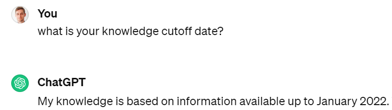
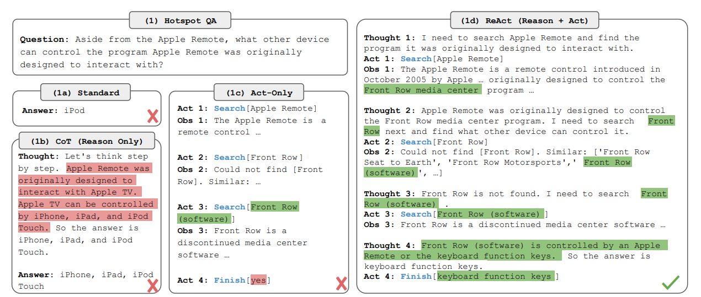
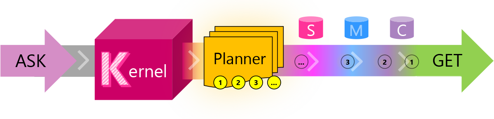
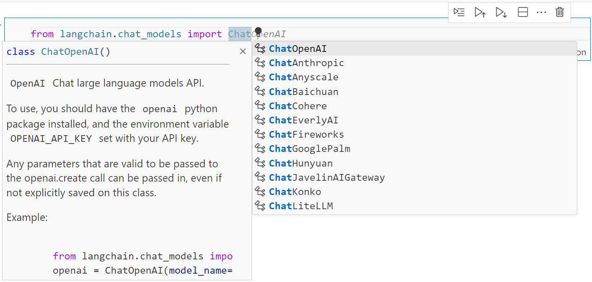
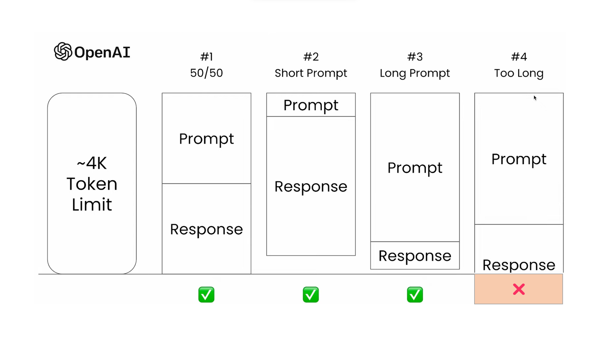
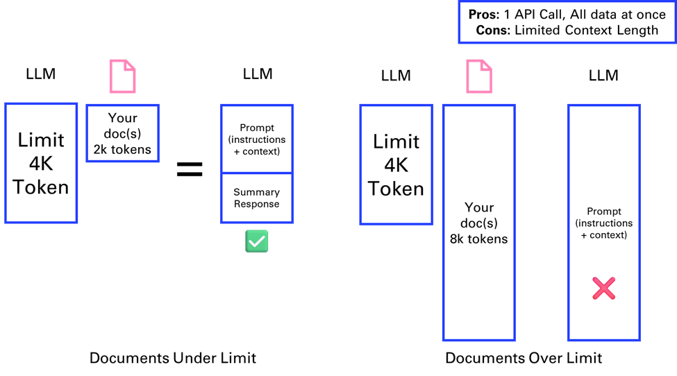
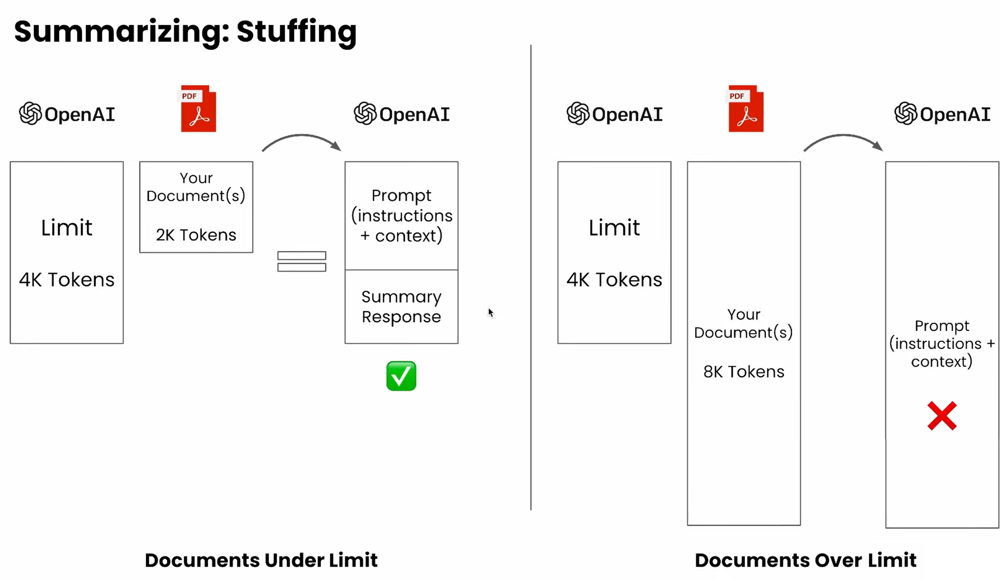
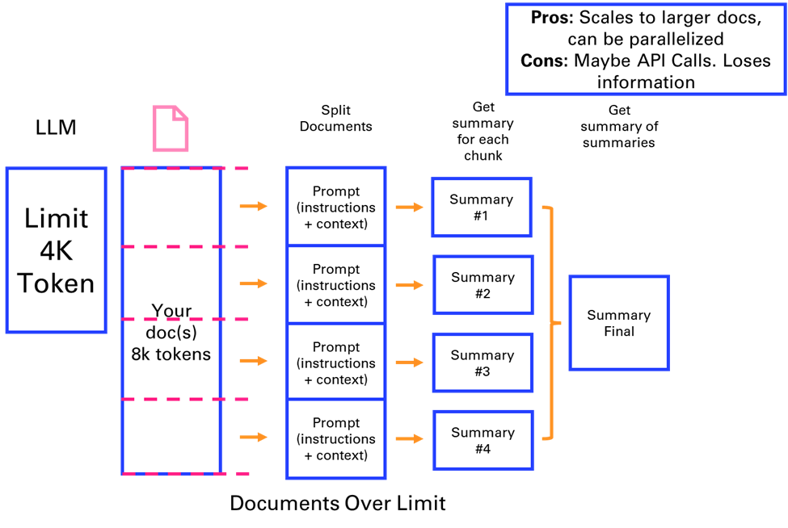
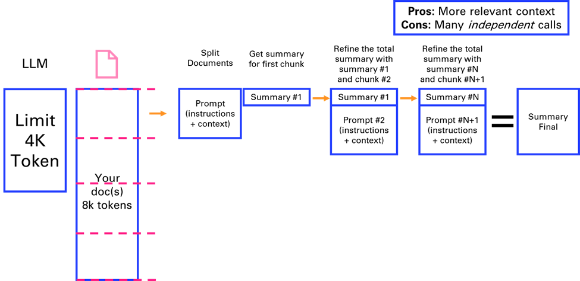

# 3. Chaining and Summarization

In this chapter, you will learn how to chain calls to a Large Language
Model (LLM) and use it to summarize texts, such as articles, books, or
transcripts. You will implement those methods with the ChatGPT API to
build artificially intelligent applications.

## 3.1. Why chaining?

Chaining is a technique that allows you to send multiple requests to an
LLM in a sequence, using the output of one request as the input of
another. This way, you can leverage the power of an LLM to perform
complex tasks that require multiple steps, such as summarization, text
simplification, or question answering.

This gave birth to a new science (or art?) and a buzzword: **prompt
engineering**. Essentially, [Prompt engineering](https://www.datacamp.com/blog/what-is-prompt-engineering-the-future-of-ai-communication) is the process of
creating and refining prompts to get specific responses from AI models.
Prompts are questions or instructions that are structured in natural
language to describe a task for an AI to perform. I doubt that "Prompt
Engineer" will become a real job (but what is a "real" job really...?)

The benefits of chaining are the following:

-   **Enhanced contextual understanding**: By chaining calls, the LLM
    can maintain context over a longer interaction, leading to more
    coherent and relevant responses.

-   **Complex task handling**: Chaining allows for the breakdown of
    complex tasks into simpler sub-tasks, which the model can handle
    more effectively.

Chaining enables to "fix" some of the inherent limitations of LLMs:

-   **Reasoning**: LLMs are not proceeding like the human brain --
    remember, they simply infer the next logical word in a sentence. As
    such they are not good at solving basic math problems.

-   **Access to Data and Tools**: LLMs do not have access to your data,
    only the ones they have seen during the training phase. By default
    they do not have access to search over the internet. As such, it
    would not make sense to compare ChatGPT with Google search, even if
    their use cases overlap significantly.

-   **Training set fixed in time**: You probably remember ChatGPT saying
    that he did not have access to information after September 2021.
    This date is gradually updated by OpenAI but there is always a lag.



A major paper that has been at the origin of many of the improvements of
the usage of LLMs is [**React: Synergizing Reasoning and Acting in
Language Models**](https://arxiv.org/abs/2210.03629).



Instead of directly answering a question, this approach breaks down the
process into Reasoning + Acting. It does so by implementing a method
called [**Chain-of-Thoughts**](https://blog.research.google/2022/05/language-models-perform-reasoning-via.html).

A number of frameworks emerged to provide developers with the ability to
integrate LLMs into their applications, by implementing those concepts.
I'll cover the few main ones in this blog:

-   Semantic Kernel

-   LangChain

-   LlamaIndex

-   Haystack

Most of those frameworks that appeared in 2023 came to complement LLMs
like ChatGPT or open-source alternatives such as Llama. But it is good
to note that with new features enabled by OpenAI throughout the year,
the need for those frameworks became less and less relevant as OpenAI
has increasingly been providing an end-to-end integrated solution.

We will break down the analysis of those frameworks over the course of
the next 3 chapters:

-   First, we will look at the basics of chaining to go around the
    limitations of the LLM context

-   Second, we will look at methods such as vector search to extend the
    LLM context

-   Third, we will look at properties that appear when we extend the
    reasoning of LLMs

### 3.1.1. Semantic Kernel by Microsoft

I'm choosing to start with Semantic Kernel, as Microsoft provides good
educational material on the main concepts around chaining. [Semantic
Kernel](https://learn.microsoft.com/en-us/semantic-kernel/) is a lightweight Software Development Kit (SDK) developed by
Microsoft that enables to mix conventional programming languages and
Large Language Models with templating, chaining, and planning
capabilities. Here is a diagram that explains the workflow triggered by
the user asking a question:



| *Journey* | *Short Description* |
|-----------|----------------------|
|  **ASK**  |       A user's goal is sent to SK as an ASK |
|  **Kernel**|      [The kernel](https://learn.microsoft.com/en-us/semantic-kernel/concepts-sk/kernel) orchestrates a user's ASK |
|  **Planner**|     [The planner](https://learn.microsoft.com/en-us/semantic-kernel/concepts-sk/planner) breaks it down into steps based upon resources that are available|
|  **Resources**|   Planning involves leveraging available [skills,](https://learn.microsoft.com/en-us/semantic-kernel/concepts-sk/skills) [memories,](https://learn.microsoft.com/en-us/semantic-kernel/concepts-sk/memories) and [connectors](https://learn.microsoft.com/en-us/semantic-kernel/concepts-sk/connectors)|
|  **Steps**|       A plan is a series of steps for the kernel to execute|
|  **Pipeline**|    Executing the steps results in fulfilling the user's ASK|
| **GET** |        And the user gets what they asked for ... |

### 3.1.2. LangChain **🦜🔗**

LangChain is a framework that enables developers to chain calls to Large
Language Models (such as ChatGPT). It offers implementations both in
Python and Typescript (in order to migrate easily your experimentations
into a JavaScript web app). We won't be needing this as we will reuse
Streamlit.

Many of the concepts introduced in the early days of the LangChain
framework were meant to complements the Large Language Models such as
GPT 3.5:

-   Extend the length of the context (limited to 4096 tokens)

-   Augment generation by retrieving elements not in the context
    (Retrieval Augmented Generation)

-   Add tools such as loading documents, searching the internet or doing
    basic math

Before ChatGPT was introduced (with the underlying 3.5 turbo model), you
could already abstract the call to OpenAI GPT 3 models with LangChain,
with a very simple syntax:

```python
from langchain.llms import OpenAI
llm = OpenAI()
joke = llm('tell me a joke')
print(joke)
```
```
Q: What did the fish say when he hit the wall?
A: Dam!
```
It also provided the ease of swapping models providers:



But the use of chat models (like gpt-3.5-turbo) were preferred to those
[base models like davinci](https://platform.openai.com/docs/models/gpt-3). They've been significantly optimized, and
the price is [10 times cheaper](https://openai.com/pricing#gpt-3-5-turbo), so it is best to standardize your
code on those chat models.

```python
from langchain.chat_models import ChatOpenAI
from langchain.schema import HumanMessage
chat = ChatOpenAI()
text = "Tell me a joke"
messages = [HumanMessage(content=text)]
res = chat.invoke(messages)
print(res.content)
```
```
Sure, here's a classic joke for you:
Why don't scientists trust atoms?
Because they make up everything!
```
To learn more about LangChain, I would recommend the [Youtube channel of
Greg Kamradt](https://youtube.com/playlist?list=PLqZXAkvF1bPNQER9mLmDbntNfSpzdDIU5).

## 3.2. Summarization

Summarization is one of the main use cases of Natural Language
Processing that is used productively in a professional setting. The
first application that came to my mind to leverage ChatGPT was
summarizing meetings. This way I could simply turn on the transcription
on Microsoft Teams and skip long overcrowded meetings. The same could be
applied to long documents that I don't want to read.

### 3.2.1. Working around the context length

Now there is one problem with this: a typical one-hour meeting is around
8k to 10k tokens. But initially the GPT-3.5 model powering ChatGPT could
only handle 4096 tokens.



**What are tokens anyway**? A helpful rule of thumb is that one token
generally corresponds to ~4 characters of text for common English text.
This translates to roughly ¾ of a word (so 100 tokens ~= 75 words).
OpenAI provides a [tokenizer](https://platform.openai.com/tokenizer) to help you compute the number of tokens
of your text. In what follows, we will use the package [tiktoken](https://github.com/openai/tiktoken) from
OpenAI anytime we need to compute precisely the number of tokens within
our applications.

What does this mean in terms of pages? [One page in average is 500
words](https://wordcounter.net/words-per-page) (like the first page of the forewords in Letter format 8.5" x
11"). Which means that 4k tokens can fit 6 pages of text. As the
previous diagram suggests, this context length is shared between the
prompt and the response.

Let's illustrate this with a basic example of a conversation recorded as
[WebVTT file](https://developer.mozilla.org/en-US/docs/Web/API/WebVTT_API):

```python
import os, webvtt
files = os.listdir('../data/vtt')
file = files[1]
cap = webvtt.read('../data/vtt/'+file)
for caption in cap[1:5]:
    # print(f'From {caption.start} to {caption.end}')
    # print(caption.raw_text)
    print(caption.text)
```
I want to start doing this experiment where.

We have a conversation we record it's generating a VTT file.

And I have a parser. I developed a small app in Python that can retrieve
the VTT file process it.

And then.

We can extract the text from the conversation and save it as a plain
text file.
```python
txt = file.replace('.vtt','.txt')
m = [caption.raw_text for caption in cap]
sep = '\n'
convo = sep.join(m)
with open('../data/txt/'+txt,mode='w') as f:
    f.write(convo)
```
Let's count the numbers of token in the conversation.
```python
import tiktoken
def num_tokens(string: str) -> int:
    """Returns the number of tokens in a text string."""
    encoding_name = 'cl100k_base'
    encoding = tiktoken.get_encoding(encoding_name)
    num_tokens = len(encoding.encode(string))
    return num_tokens

num_tokens(convo)
```
```
150
```
In the next parts, we will go over different chain types to address the
[limitation of the context length](https://www.youtube.com/watch?v=f9_BWhCI4Zo).

### 3.2.2. Stuffing

The first solution presented is "stuffing". If a document is within
the model's context limit (4k tokens here), it can be directly fed into
the API for summarization. This method is straightforward but limited by
the maximum context length.

 


This is how the code would look like with LangChain:

```python
from langchain.chains.summarize import load_summarize_chain
from langchain.chat_models import ChatOpenAI
from langchain.document_loaders import WebBaseLoader, TextLoader
loader = TextLoader('../data/txt/'+txt)
docs = loader.load()
llm = ChatOpenAI(temperature=0, model_name="gpt-3.5-turbo")
chain = load_summarize_chain(llm, chain_type="stuff")
chain.run(docs)
```
```
'Yann wants to improve his French accent and plans to conduct an
experiment where he records conversations and generates VTT files. He
has developed a Python app to process the VTT files and wants to use the
ChatGPT API to further analyze them. Mike has not yet used the API due
to lack of time.'
```
Try summarizing a longer text, like the content of a webpage like the
LangChain doc page.

```python
def summarize(page, model = "gpt-3.5-turbo"):  
    loader = WebBaseLoader(page)
    docs = loader.load()
    llm = ChatOpenAI(temperature=0, model_name=model)
    chain = load_summarize_chain(llm, chain_type="stuff")
    return chain.run(docs)

page = "https://python.langchain.com/docs/use_cases/summarization"
try:
    summary = summarize(page)
    print(summary)
except Exception as e:
    print(str(e))
```
```
Error code: 400 - {'error': {'message': "This model's maximum
context length is 4097 tokens. However, your messages resulted in 7705
tokens. Please reduce the length of the messages.", 'type':
'invalid_request_error', 'param': 'messages', 'code':
'context_length_exceeded'}}
```
Luckily as we will see in the last part of this chapter we can use a
model with a larger context window:
```python
page = "https://python.langchain.com/docs/use_cases/summarization"
summarize(page,model = "gpt-3.5-turbo-16k")
```
```
'The LangChain platform offers tools for document summarization using
large language models (LLMs). There are three approaches to document
summarization: "stuff," "map-reduce," and "refine." The "stuff"
approach involves inserting all documents into a single prompt, while
the "map-reduce" approach summarizes each document individually and
then combines the summaries into a final summary. The "refine"
approach iteratively updates the summary by passing each document and
the current summary through an LLM chain. The platform provides
pre-built chains for each approach, and users can customize prompts and
LLM models. Additionally, the platform offers the option to split long
documents into chunks and summarize them in a single chain.'
```

### 3.2.3. Map reduce

The MapReduce method involves splitting a large document (e.g., 8k
tokens) into smaller chunks, summarizing each separately, and then
combining these summaries into a final summary. This approach allows for
processing larger documents in parallel API calls but may lose some
information.

This is a term that some might be familiar with, from the space of big
data analysis, where it represents a distributed execution framework
that parallelized algorithms over data that might not fit on a single
core.



As an example, we will take another source of VTT files: [Youtube
transcripts](https://pypi.org/project/youtube-transcript-api/). The video we will summarize is the [LangChain
Cookbook - Beginner Guide To 7 Essential Concepts](https://www.youtube.com/watch?v=2xxziIWmaSA).

```python
from youtube_transcript_api.formatters import WebVTTFormatter
from youtube_transcript_api import YouTubeTranscriptApi
video_id = "2xxziIWmaSA" # https://www.youtube.com/watch?v=2xxziIWmaSA
transcript = YouTubeTranscriptApi.get_transcript(video_id)
formatter = WebVTTFormatter()
formatted_captions = formatter.format_transcript(transcript)
vtt_file = f'../data/vtt/subtitles-{video_id}.vtt'
with open(vtt_file, 'w') as f:
    f.write(formatted_captions)
sep = 'n'
caption = sep.join([s['text'] for s in transcript])
num_tokens(caption)
```
```
10336
```
```python
# Turn VTT file into TXT file
txt_file = vtt_file.replace('vtt','txt')
with open(txt_file,mode='w') as f:
    f.write(caption)
```
Now comes a new concept that will be important anytime you are breaking
down content into chunks: a [**text splitter**](https://python.langchain.com/docs/modules/data_connection/document_transformers/#text-splitters).

The default recommended text splitter is the
RecursiveCharacterTextSplitter. This text splitter takes a list of
characters. It tries to create chunks based on splitting on the first
character, but if any chunks are too large it then moves onto the next
character, and so forth. By default, the characters it tries to split on
are `["nn", "n", " ", ""]`

In addition to controlling which characters you can split on, you can
also control a few other things:

-   `length_function`: how the length of chunks is calculated. Defaults to
    just counting number of characters, but it's pretty common to pass
    a token counter here.

-   `chunk_size`: the maximum size of your chunks (as measured by the
    length function).

-   `chunk_overlap`: the maximum overlap between chunks. It can be nice to
    have some overlap to maintain some continuity between chunks (e.g.
    do a sliding window).

-   `add_start_index`: whether to include the starting position of each
    chunk within the original document in the metadata.

```python
text_splitter = RecursiveCharacterTextSplitter(
    chunk_size = 1000,
    chunk_overlap = 0,
    length_function = num_tokens,
)

def doc_summary(docs):
    print (f'You have {len(docs)} document(s)')
    num_words = sum([len(doc.page_content.split(' ')) for doc in
docs])
    print (f'You have roughly {num_words} words in your docs')
    print ()
    print (f'Preview: n{docs[0].page_content.split(".
")[0][0:42]}')

docs = text_splitter.split_documents(doc)
doc_summary(docs)
```
```
You have 11 document(s)
You have roughly 7453 words in your docs

Preview:
hello good people have you ever wondered
```

We can now perform the MapReduce method. We can enable the mode
`verbose=True` to view the breakdown of each intermediate summary.
```python
llm = ChatOpenAI(model_name='gpt-3.5-turbo')
chain = load_summarize_chain(llm, chain_type="map_reduce",
verbose=True)
chain.run(docs)
```
```
"The video introduces Lang chain, a framework for developing
applications powered by language models. It explains the components and
benefits of Lang chain, and mentions a companion cookbook for further
examples. The video discusses different types of models and how they
interact with text, including language models, chat models, and text
embedding models. It explains the use of prompts, prompt templates, and
example selectors. The process of importing and using a semantic
similarity example selector is described. The video also discusses the
use of text splitters, document loaders, and retrievers. The concept of
vector stores and various platforms are mentioned. The video explains
how chat history can improve language models and introduces the concept
of chains. It demonstrates the creation of different chain types in Lang
chain, such as location, meal, and summarization chains. The concept of
agents and their application in decision making is discussed, along with
the process of creating an agent and loading tools into its toolkit. The
speaker shares their positive experience using Lion Chain software and
its ability to dynamically search for information. They mention the
debut album of Wild Belle and encourage viewers to check out the band's
music. The video concludes by mentioning future videos on the topic and
encouraging viewers to subscribe and provide feedback."
```
### 3.2.4. Refine

In the Refine method, the document is split into chunks, and each chunk
is summarized sequentially, with each summary informed by the previous
one. This method provides relevant context but is time-consuming due to
its sequential nature. This is one of my favorite methods for
summarizing.



We can directly try this method on the same content as the previous
section, and see how it compares.
```python
chain = load_summarize_chain(llm, chain_type="refine", verbose=True)
chain.run(docs)
```
You can observe in the verbose output that the chain uses the following
prompt:
```
Given the new context, refine the original summary.
If the context isn't useful, return the original summary.
```
Finally, I'll implement my own **text splitter** and **summarizer**
using the refine method.
```python
def my_text_splitter(text,chunk_size=3000):
    # Split text into chunks based on space or newline
    chunks = text.split()
    # Initialize variables
    result = []
    current_chunk = ""
    # Concatenate chunks until the total length is less than 4096 tokens
    for chunk in chunks:
        # if len(current_chunk) + len(chunk) < 4096:
        if num_tokens(current_chunk+chunk) < chunk_size:
            current_chunk += " " + chunk if current_chunk else chunk
        else:
            result.append(current_chunk.strip())
            current_chunk = chunk
    if current_chunk:
        result.append(current_chunk.strip())
    return result
```
```python
import openai

def summarize(text, context = 'summarize the following text:', model =
'gpt-3.5-turbo'):
    completion = openai.chat.completions.create(
        model = model,
        messages=[
        {'role': 'system','content': context},
        {'role': 'user', 'content': text}
            ]
    )
    return completion.choices[0].message.content
```
```python
def refine(summary, chunk,  model = 'gpt-3.5-turbo'):
    """Refine the summary with each new chunk of text"""
    context = "Refine the summary with the following context: " +
summary
    summary = summarize(chunk, context, model)
    return summary
```
```python
# Requires initialization with summary of first chunk
chunks = my_text_splitter(caption)
summary = summarize(chunks[0])
for chunk in chunks[1:]:
    summary = refine(summary, chunk)
summary
```
```
'In this video, the presenter discusses the Lang chain framework and
its various components, including Vector Stores, Memory, Chains, and
Agents. They provide code examples and highlight the versatility and
functionality of using Lang chain. In the end, they encourage viewers to
subscribe for part two and ask any questions they may have. They also
share tools on Twitter and encourage feedback and comments from
viewers.'
```
### 3.2.5. Evolutions of the context window

This early view of limitations of Large Language Models has to be
updated over time as the context length of new generations of LLMs are
growing:

-   [GPT 4](https://platform.openai.com/docs/models/gpt-4) (introduced on March 14, 2023) originally had an 8k tokens context window. A 32k tokens version was made available gradually in parallel. In November 2023, an 128k token version was introduced.

-   GPT 3.5 got a 16k version in September 2023.

-   [Anthropic Claude](https://www.anthropic.com/index/100k-context-windows) extended its context window to 100k tokens in
    May 2023, enabling to process an entire book like the Great Gatsby
    of around 200 pages (standard paperback edition).

-   [Claude 2.1](https://www.anthropic.com/news/claude-2-1)  (Nov 2023) and [Claude 3](https://www.anthropic.com/news/claude-3-family) (Mar 2024) propose an impressive 200k tokens context. 

-   [LLaMa](https://ai.meta.com/blog/large-language-model-llama-meta-ai/) from Meta initially came with a 2k tokens context window
    in February 2023.

-   [Llama2](https://llama.meta.com/llama2/) released in July 2023 has a 4k tokens context window. [Llama3](https://llama.meta.com/llama3/) released in April 2024 doubles it again to 8k tokens. This is considered one of the leading open-source LLM.

There are still advantages to apply the previous methods, either to
mitigate the cost of long context windows and larger models, or to use
smaller more dedicated models that can be open-source for certain
specific tasks like summarizing.
