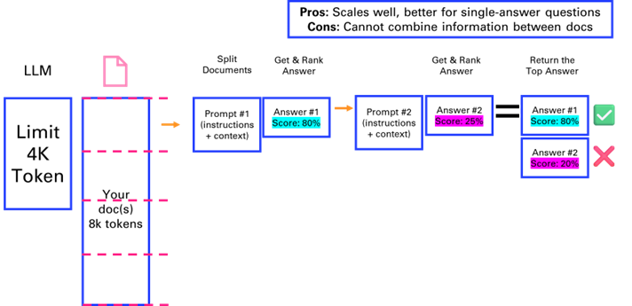
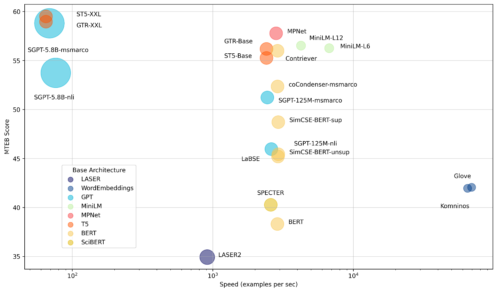
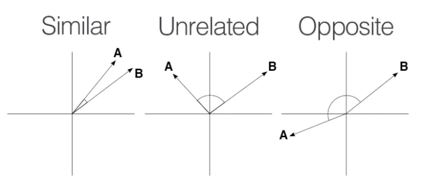
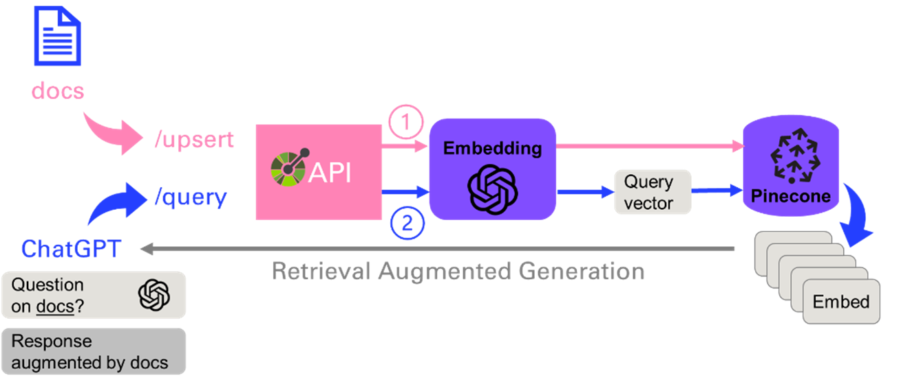

# 4. Vector search & Question Answering

Another very popular application of the Large Language Models is
[question answering](https://python.langchain.com/docs/use_cases/question_answering/). Unlike summarization that can be solved with a
fixed context, answering questions can be a moving target.

This is why we will investigate methods to extend the context with
additional tools such as search, and introduce a special kind of search
called similarity search over a vector database of embeddings.

A lot of new concepts we will present in this chapter. But before we do,
let's look at a method called Map Rerank that is very close to the ones
covered in the previous chapter.

## 4.1. Map Rerank

If you only have a single but long document that you want to feed as a
source to the LLM to answer your question, you could consider the Map
Rerank method.

This method, suited for question-answer tasks rather than summarization,
involves splitting the document, posing questions to each chunk, and
ranking the answers based on confidence scores. Its effective for
single-answer questions but does not combine information across chunks.



## 4.2. Retrieval-Augmented Generation

The previous approach of Map Rerank that consists in asking questions to
each section of a document isn't optimal, as the number of requests to
the LLM grows proportionally with the length of the doc. Another
approach which consists in only retrieving the meaningful context for
the request to the LLM is called Retrieval-Augmented Generation.


**Resources**:

-   Retrieval-Augmented Generation for Knowledge-Intensive NLP Tasks
    <https://arxiv.org/pdf/2005.11401.pdf>

-   IBM Blog - What is retrieval-augmented generation?
    <https://research.ibm.com/blog/retrieval-augmented-generation-RAG>

-   Youtube video - What is Retrieval-Augmented Generation (RAG)?
    <https://www.youtube.com/watch?v=T-D1OfcDW1M>

### 4.2.1. Traditional search

One of the first applications of ChatGPT was to answer questions that we
previously were searching on the internet, via a search engine like
Google. After all, a large language model is nothing more than a (very)
compressed version of the internet, as it is the corpus on which they
are primarily trained.

In this chapter, we will implement a very simple search tool that will
input information from Google into our ChatGPT request. This way, the
chatbot will be able to answer news related questions such as *"Who is
the CEO of Twitter?"*.

```python
# Don't forget to load your OPENAI_API_KEY as env variable
from openai import OpenAI
openai = OpenAI()
def ask(question):
    completion = openai.chat.completions.create(
        model="gpt-3.5-turbo",
        messages=[
            {"role": "user", "content": question}
        ]
        )
    return completion.choices[0].message.content

prompt = "who is the CEO of twitter?"
ask(prompt)
```
As of September 2021, the CEO of Twitter is Jack Dorsey.

ChatGPT is at least taking the precaution of stating the date of its
recollection. But if we check on Google, we can see that things have
changed quite a bit at Twitter since 2021 (even the name).


Lets implement a simple search engine that will be able to answer
questions about an evolving topic. In the following example, we will
parse the Google result page. It provides typically 10 results,
sometimes prefaced by a ["featured snippet"](https://support.google.com/websearch/answer/93517071) followed by other
questions that "people also ask", and at the end of the list of results,
a few "related searches". We will then check the number of tokens on the
page to make sure that it isn't too long to "stuff" it with the initial
question into a prompt for ChatGPT.
```python
from bs4 import BeautifulSoup
import requests
prompt = who is the CEO of twitter?
def search(prompt):
    url = f"https://www.google.com/search?q={prompt}"
    html = requests.get(url).text
    with open(search.html,w) as f:
        f.write(html)
    # Get the text of the webpage
    soup = BeautifulSoup(html, "html.parser")
    text = soup.get_text()
    return text

text = search(prompt)
len(text)
```
```
8162
```
```python
import tiktoken
def num_tokens(string: str) -> int:
    """Returns the number of tokens in a text string."""
    encoding_name = 'cl100k_base'
    encoding = tiktoken.get_encoding(encoding_name)
    num_tokens = len(encoding.encode(string))
    return num_tokens

num_tokens(text)
```
```
2116
```
The google result page is typically dense enough that we can simply
stuff it into a model and get a good answer. Sometimes, you might want
to retrieve the top 3 or 5 pages from the search to get a more
comprehensive answer.
```python
question = f"""Given the following context of Google search, answer
the question:

{prompt}

---

Here is the context retrieve from Google search:

{text}

"""

ask(question)
```
```
The CEO of Twitter is Linda Yaccarino.
```
The heavy lifting in this example is performed by the search engine
Google, and its excellent algorithm [PageRank](https://ahrefs.com/blog/google-pagerank/), that ranks web pages
in search results by evaluating the number and quality of links to a
page. ChatGPT is relegated to the second role by "simply" ingesting the
raw unprocessed text of the result page to make sense of the information
and present it in a human friendly way.

Traditional search can also be called **keyword** **search**, in that it
is leveraging inverted indexes, a data structure that allows a very
quick lookup of documents containing certain words. This enables fast
and accurate retrieval of documents based on keyword matches. The
distributed nature of this architecture allows search engines to scale
seamlessly, making it possible for platforms like Google to index the
vast expanse of the early internet in the late 1990s.

Fetching documents is just one part of delivering a performant search
experience; ranking is equally crucial. The introduction of [TF-IDF](https://monkeylearn.com/blog/what-is-tf-idf/)
(term-frequency, inverse-document-frequency) marked a significant
breakthrough in ranking methodologies. TF-IDF assigns a score to each
document based on the frequency of query terms within it (TF) and across
the entire corpus (IDF). This scoring mechanism ensures that documents
matching the query well and containing rare, specific terms are ranked
higher, enhancing relevance.

While traditional search engines have laid the groundwork for modern
information retrieval systems, they come with [several limitations](https://www.algolia.com/blog/ai/vector-vs-keyword-search-why-you-should-care/)
that impact their effectiveness and user experience.

-   **Text Processing Challenges**

Search engines rely on keyword-based indexing, which poses challenges in
text processing. Issues such as hyphenation, language differences, and
case sensitivity can lead to inconsistencies in indexing and retrieval,
affecting the search quality.

-   **Exact Matches and Stemming**

Exact matching poses challenges, as queries for "cats" might not
retrieve documents containing "cat." Stemming, the process of reducing
words to their root form, is a common solution. However, it introduces
edge cases and exceptions, such as "universal" and "university" being
stemmed to the same token.

-   **Word Ambiguity and Synonyms**

Ambiguous words like "jaguar" present challenges in understanding user
intent, as the context is often required to disambiguate meanings.
Additionally, synonyms and related terms need to be mapped to ensure
comprehensive retrieval, adding complexity to the system.

-   **Misspelling and Autocorrection**

Spelling accuracy is crucial in keyword-based search engines. Misspelled
queries can lead to irrelevant or no results. Implementing an effective
autocorrect feature requires specific development tailored to the
platforms domain and user base.

-   **Language Support**

Supporting multiple languages introduces additional complexity,
requiring the resolution of each aforementioned challenge for each
supported language. This multiplies the development effort and can
result in varying search quality across languages.

All those limitations motivate the need for another class of search,
called vector search.

### 4.2.2. Vector search

Now, lets look into the concept of vector search, a technique for
information retrieval that leverages a numeric representation of text
(as vectors) to find semantically similar documents or passages.

-   Embeddings: Vector representation of text

[Vector embeddings](https://www.pinecone.io/learn/vector-embeddings/) capture the semantic meaning of text by mapping
words, sentences, or documents into high-dimensional vector spaces.
Similar items in this space are close to each other, while dissimilar
items are far apart. This property makes vector embeddings ideal for
tasks like search and recommendation.


-   Different ways to break down text into numbers

This conversion from text to vector can be processed in several ways. A
simple approach is to look at each letter as a number. Another approach
is words-level embeddings, like [Word2Vec](https://www.tensorflow.org/text/tutorials/word2vec), developed by Google. It
uses shallow neural networks to produce word embeddings. It comes in two
flavors: Continuous Bag-of-Words (CBOW) and Skip-Gram, each capturing
different word relationships.

-   Example of embedding service

Let's take a look at an example with the [OpenAI's text embeddings](https://platform.openai.com/docs/guides/embeddings),
on the first paragraph of chapter 1 of [A Tale of Two Cities by Charles
Dickens](https://www.gutenberg.org/ebooks/98)
```python
paragraph = """
It was the best of times, it was the worst of times, it was the age of
wisdom, it was the age of foolishness, it was the epoch of belief, it
was the epoch of incredulity, it was the season of Light, it was the
season of Darkness, it was the spring of hope, it was the winter of
despair, we had everything before us, we had nothing before us, we were
all going direct to Heaven, we were all going direct the other way--in
short, the period was so far like the present period, that some of its
noisiest authorities insisted on its being received, for good or for
evil, in the superlative degree of comparison only.
"""
sentences = paragraph.replace("\n"," ").split(", ")
```
```python
from openai import OpenAI

client = OpenAI()

sentence = sentences[0]

response = client.embeddings.create(
    input=sentence,
    model="text-embedding-3-small"
)

embedding = response.data[0].embedding
print(len(embedding))
embedding[:3]
```
```
1536
[-0.0071602072566747665, -0.013691387139260769, 0.02635223977267742]
```
We can batch things up by sending the whole list of sentences to the
OpenAI embeddings service, and use numpy as a way to store and index the
vectors:
```python
import numpy as np

response = client.embeddings.create(
    input=sentences,
    model="text-embedding-3-small"
)

v = [d.embedding for d in response.data]
v = np.array(v)
v.shape
```
```
(18, 1536)
```
-   Trade-offs of different embedding models

Different factors that comes into consideration when choosing an
embedding model:

-   Size of the dictionary

-   Performance of the calculation

-   Price of the service (if hosted)

Using larger embeddings, for example storing them in a vector store for
retrieval, generally costs more and consumes more compute, memory and
storage than using smaller embeddings. By default, the length of the
embedding vector will be 1536 for text-embedding-3-small or 3072 for
text-embedding-3-large.

The [Massive Text Embedding Benchmark (MTEB)](https://huggingface.co/blog/mteb) from Hugging Face helps
in assessing the performance of different embedding models, representing
here models by average English MTEB score (y) vs speed (x) vs embedding
size (circle size):



-   Alternative embedding models:

[Sentence transformers](https://sbert.net/) is a python framework that provides access to
state of the art embeddings models, like the one referred to in the
benchmark above.
```
pip install -U sentence-transformers
```
```python
from sentence_transformers import SentenceTransformer
model = SentenceTransformer(all-MiniLM-L6-v2) # or
all-mpnet-base-v2

# Sentences are encoded by calling model.encode()
embedding = model.encode(sentence)
embedding.shape
```
```
(384,)
```
-   Calculate [semantic similarity](https://www.youtube.com/watch?v=Ey81KfQ3PQU)

There are different ways to calculate the distance in a high dimensional
vector space. One approach is to use trigonometry, with [cosine
similarity](https://en.wikipedia.org/wiki/Cosine_similarity) described with the following 3 cases in 2 dimensions:




We can simply use provides the [numpy.dot](https://numpy.org/doc/stable/reference/generated/numpy.dot.html) function to calculate the
dot product between two vectors.
```python
def cosine_similarity(vec1, vec2):
    dot_product = np.dot(vec1, vec2)
    norm_vec1 = np.linalg.norm(vec1)
    norm_vec2 = np.linalg.norm(vec2)
    return dot_product / (norm_vec1 * norm_vec2)

sentences[0], sentences[1], cosine_similarity(v[0], v[1])
```
```
( It was the best of times, it was the worst of times,
0.6745445520884016)
```
```python
sentences[2], sentences[3], cosine_similarity(v[2], v[3])
```
```
(it was the age of wisdom,
it was the age of foolishness,
0.8072276532681985)
```
The previous illustrations of vector search by computing on the fly the
distance with every vector of the database isn't scalable. That is why
you need to [index your database](https://www.youtube.com/watch?v=dN0lsF2cvm4 ).

### 4.2.3. LlamaIndex: building an index

One of the early frameworks that competed with LangChain nicely to
enable question answering was [LlamaIndex](https://docs.llamaindex.ai/en/stable/) (initially known as
GPTindex). It stood out by the simplicity of its implementation.

The concept is quite straightforward:

-   You store your documents in tidy location

-   You build an index on your data

-   You define a query engine/retriever based on this index

-   You ask questions against this query engine\
    (in the first versions, you would ask questions directly against the
    index)

Let's illustrate this by a simple demo based on their [starter
tutorial](https://docs.llamaindex.ai/en/stable/getting_started/starter_example.html):

-   **Step 1: Document loader (PDF reader)**

With a little bit of practice, you will realize that the performance and
robustness of your LLM application relies a lot on the preprocessing
pipeline that feeds chunks of text for retrieval-augmented generation.

As such, it is interesting to spend some time on the inputs of your
knowledge retrieval engine. Document loaders are an important part of
the equation, as they structure the information that is ingested.

In this chapter, we will use the book Impromptu as context to answer
questions with ChatGPT. Let's start by extracting the content of this
pdf with [pypdf](https://pypdf.readthedocs.io/en/stable/):
```python
import requests, io, pypdf
# get the impromptu book
url =
"https://www.impromptubook.com/wp-content/uploads/2023/03/impromptu-rh.pdf"

def pdf_to_pages(file):
    "extract text (pages) from pdf file"
    pages = []
    pdf = pypdf.PdfReader(file)
    for p in range(len(pdf.pages)):
        page = pdf.pages[p]
        text = page.extract_text()
        pages += [text]
    return pages

r = requests.get(url)
f = io.BytesIO(r.content)
pages = pdf_to_pages(f)
print(pages[1])
```
```
Impromptu
Amplifying Our Humanity
Through AI
By Reid Hoffman
with GPT-4
```
```python
if not os.path.exists("impromptu"):
    os.mkdir("impromptu")
for i, page in enumerate(pages):
    with open(f"impromptu/{i}.txt","w", encoding=utf-8) as f:
        f.write(page)
sep = '\n'
book = sep.join(pages)
print(book[0:35])
```
```
Impromptu
Amplifying Our Humanity
```
```python
num_tokens(book)
```
83310

-   **Step 2: Build an index**
```python
from llama_index import SimpleDirectoryReader, VectorStoreIndex
documents = SimpleDirectoryReader("impromptu").load_data()
index = VectorStoreIndex.from_documents(documents)
# save to disk
index.storage_context.persist()
```
-   **Step 3: Query the index**
```python
query_engine = index.as_query_engine()
response = query_engine.query('what is the potential of AI for
Education?')
print(response)
```
```
AI has the potential to become a powerful tool in education,
transforming the way we learn and deliver instruction. It can provide
personalized and individualized learning experiences tailored to each
students needs and interests. AI can also assist teachers in
identifying the topics and skills that students need to focus on,
providing guidance and support as needed. Additionally, AI-driven tools
can automate and streamline certain aspects of teaching, such as grading
and content creation, freeing up teachers time to focus on engaging
and inspiring their students. However, the full potential of AI in
education may be limited by factors such as cost, access, and privacy
concerns.
```
```python
sources = [s.node.get_text() for s in response.source_nodes]
print(sources[0][0:11])
```
```
47Education
```
The beauty of this approach is that is simply stores the embeddings into
json files. You can take a look at the storage folder created that maps
documents hash to an embedding.

But this simple text file approach doesn't scale so well when it comes
to storing large document bases. For this, let's look into vector
databases.

### 4.2.4. Vector databases

A vector database is a data store that stores data as high-dimensional
vectors, which are mathematical representations of attributes or
features. Some examples of vector databases include: Chroma, Pinecone,
Weaviate, Faiss, Qdrant, MongoDB

Let's start with Chroma, that arguably provides the lowest learning
curve to set up and use a [vector database with semantic search](https://www.youtube.com/watch?v=QSW2L8dkaZk). Pip
install it, discover the basic commands and call it from LangChain.
```
pip install -U langchain langchain-openai pypdf chromadb
```
```python
import chromadb
# client = chromadb.HttpClient()
client = chromadb.PersistentClient()
collection = client.create_collection("sample_collection")
# Add docs to the collection. Can also update and delete. Row-based API coming soon!
collection.add(
    documents=["This is document1", "This is document2"], # we
embed for you, or bring your own
    metadatas=[{"source": "notion"}, {"source":
"google-docs"}], # filter on arbitrary metadata!
    ids=["doc1", "doc2"], # must be unique for each doc
)

results = collection.query(
    query_texts=["This is a query document"],
    n_results=2,
    # where={"metadata_field": "is_equal_to_this"}, # optional filter
    # where_document={"\$contains":"search_string"}  # optional filter
)  

results
```
```
{ids: [[doc1, doc2]],
distances: [[0.9026352763807001, 1.0358158255050436]],
metadatas: [[{source: notion}, {source:
google-docs}]],
embeddings: None,
documents: [[This is document1, This is document2]],
uris: None,
data: None}
```
Now let's integrate it in LangChain. For this example, we will only
index the chapter 1 of Impromptu on Education (not using the full book
to avoid unnecessary cost to create embeddings).
```python
import requests, io, pypdf
from langchain.chains import RetrievalQA
from langchain_community.document_loaders import PyPDFLoader
from langchain.vectorstores import Chroma
from langchain_openai import ChatOpenAI, OpenAIEmbeddings
chat = ChatOpenAI(model_name=gpt-3.5-turbo)
url =
'https://www.impromptubook.com/wp-content/uploads/2023/03/impromptu-rh.pdf'

# Retrieve the pdf and extract chap 32-54
r = requests.get(url)
f = io.BytesIO(r.content)
pdf = pypdf.PdfReader(f)
writer = pypdf.PdfWriter()
for p in range(31,54):
    writer.add_page(pdf.pages[p])
with open("impromptu_32-54.pdf","wb") as f:
    writer.write(f)
# Load the document and split it into pages
loader = PyPDFLoader("impromptu_32-54.pdf")
pages = loader.load_and_split()
# select which embeddings we want to use
embeddings = OpenAIEmbeddings()
# create the vectorestore to use as the index
db = Chroma.from_documents(pages, embeddings)
# expose this index in a retriever interface
retriever = db.as_retriever(search_type="similarity",
search_kwargs={"k":3})
# create a chain to answer questions
qa = RetrievalQA.from_chain_type(
    llm=chat, chain_type="stuff", retriever=retriever,
return_source_documents=True)
query = 'what are the opportunities of using AI?'
result = qa.invoke({"query": query})
result
```
```
{query: what are the opportunities of using AI?,
result: The opportunities of using AI in education include
automating and streamlining mundane tasks like grading and content
creation, providing personalized and individualized learning
experiences, giving teachers more time to focus on engaging students,
and potentially transforming the way we learn and deliver instruction.
AI can also help identify topics and skills students need to focus on
and provide guidance and support accordingly.,
source_documents: [Document(page_content=\...,
metadata={page: 22, source: impromptu_32-54.pdf}),
Document(page_content=\..., metadata={page: 21, source:
impromptu_32-54.pdf}),
Document(page_content=\... , metadata={page: 3, source:
impromptu_32-54.pdf})]}
```
Let's try [Facebook AI Similarity Search (faiss)](https://github.com/facebookresearch/faiss), which is known to
be insanely performant:
```
pip install faiss-cpu
```
```python
from langchain_community.vectorstores import FAISS
from langchain_openai import OpenAIEmbeddings
faiss_index = FAISS.from_documents(pages, OpenAIEmbeddings())
docs = faiss_index.similarity_search("what are the opportunities of using AI?", k=3)
for doc in docs:
    print(str(doc.metadata["page"]) + ":", doc.page_content[:48])
```
```
22: 47Education
the technology will also create an e
21: 46Impromptu: Amplifying Our Humanity Through AI
3: 28Impromptu: Amplifying Our Humanity Through AI
```
Finally, after trying several vector databases, you can build a
production system with Pinecone like this:


As you will see in a future chapter, this [application](https://github.com/pinecone-io/examples/blob/master/learn/generation/openai/chatgpt/plugins/langchain-docs-plugin.ipynb) can be nicely
architectured with plugins, that clearly define the API with two main
endpoints: **upsert** (to update or insert the vector database), or
**query** that will convert the prompt into an embedding and perform a
vector search to find the N (= 5) closest ones.

## 4.3. Application: Question answering on Book

This is what the app will look like, a simple text entry and a button to
trigger the workflow. The answer will be written in the body, with
sources from the document corpus. Check out the code under
[chap4/qa_app.py](chap4/qa_app.py).


As usual I first implement a version of this workflow in a notebook, so
that I can iterate and debug interactively. Then I refactor the code as
an app, by adding some UI components. You could imagine additional
features, like the ability to upload your own documents.

## 4.4. Application: Movie search and recommendation engine

In April 2023, [Andrej Karpathy](https://karpathy.ai/), one of the founding members of
OpenAI and former Director of AI at Tesla, shared this fun weekend hack,
a movie search and recommendation engine:
[awesome-movies.life](https://awesome-movies.life)


Even though Karpathy was too ashamed of the design to share the code,
Leonie -- developer advocate at Weaviate [reimplemented it](https://towardsdatascience.com/recreating-andrej-karpathys-weekend-project-a-movie-search-engine-9b270d7a92e4), using a
vector database instead of simply storing embeddings as numpy arrays.
This is a perfect additional exercise to make sure that you master the
notions in this chapter.