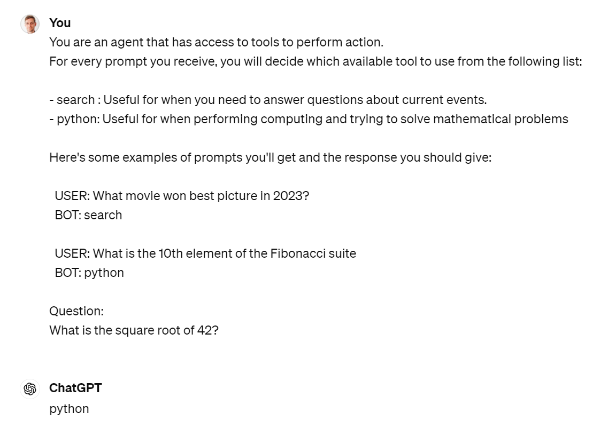
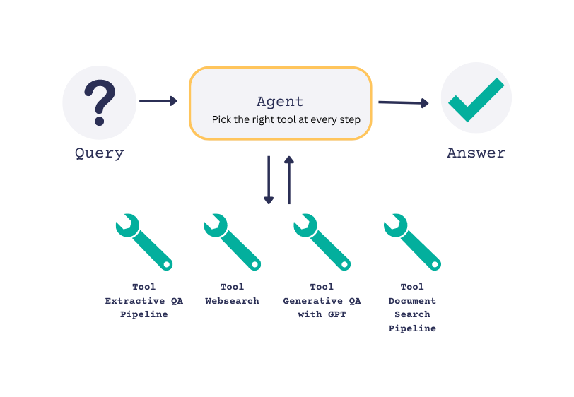
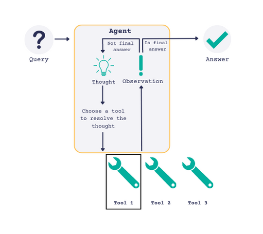
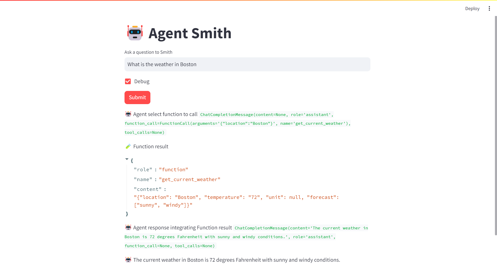
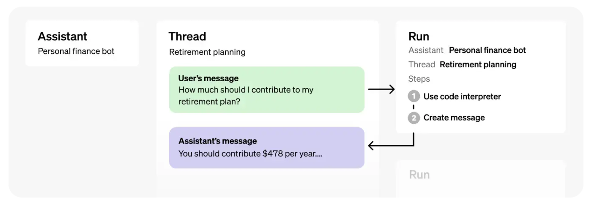
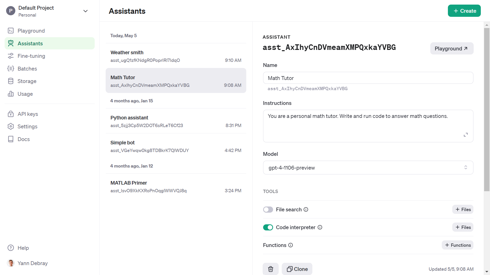
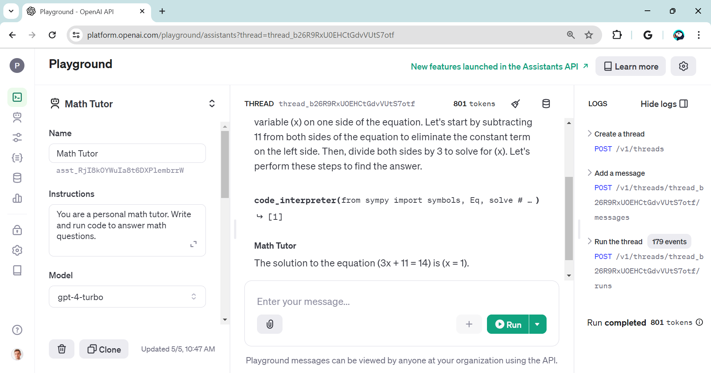
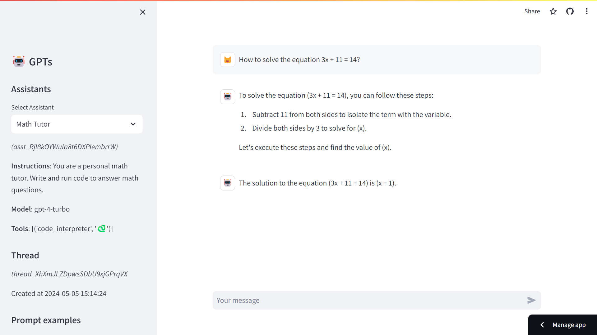
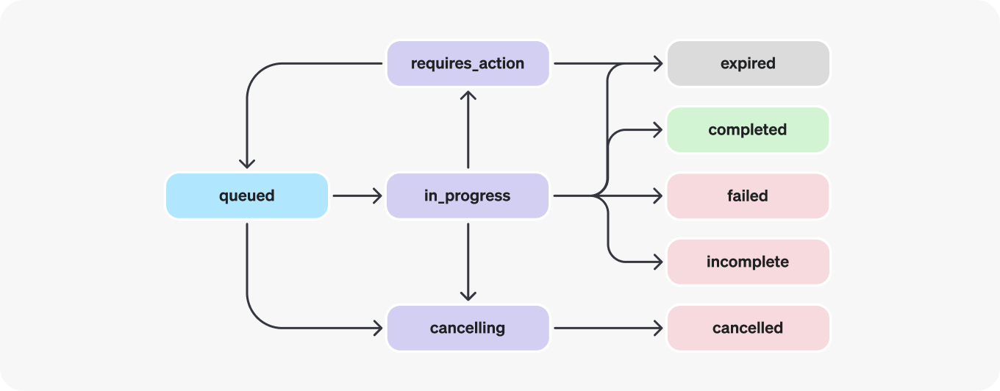
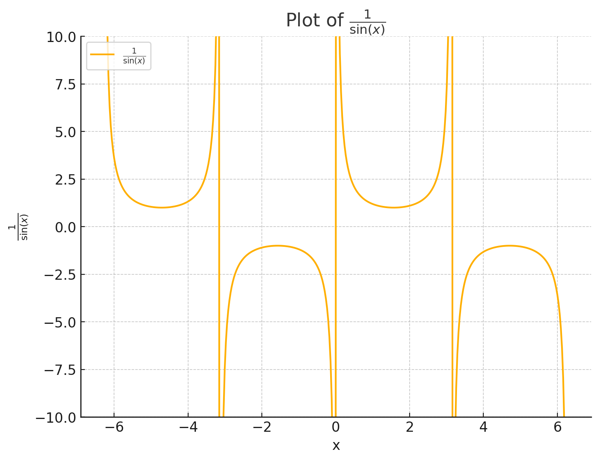

# 5. Agents & Tools

Large Language Models are one (big) step in the direction of what is
called [Artificial General Intelligence (AGI)](https://arxiv.org/abs/2303.12712). In this chapter we
will go into a crucial concept that has been popularized by research
papers like ReAct (Reasoning + Acting) and frameworks like LangChain and
Haystack: the notion of **agents**.

## 5.1. Agents select tools

It was a little difficult at first for me to understand the notion of an
agent. But it became much easier after attending a presentation at PyCon
2023 called [*Building LLM-based Agents*](https://www.youtube.com/watch?v=LP8c9Vu9mOQ) from Haystack. Here is the
example of a prompt that illustrates how agents operate:




Here is a simple representation of what is happening here:


### 5.1.1. Smith: my pedagogical agent framework

I implemented a simple python module called smith.py that implements
this basic principle.
```python
from smith import *
prompt = 'Who is the CEO of Twitter?'
print(agent(prompt)) # Calling agent without passing tools
```
```
As of September 2021, the CEO of Twitter is Jack Dorsey.
```
```python
tools = load_tools()
tools
```
```
[{'name': 'search',
'desc': 'Useful for when you need to answer questions about current
events.',
'example': 'What movie won best picture in 2023?'},
{'name': 'python',
'desc': 'Useful for when performing computing and trying to solve
mathematical problems',
'example': 'What is the 10th element of the Fibonacci suite'}]
```
```python
prompt = 'Who is the CEO of Twitter?'
res = agent(prompt,tools=tools)
print(res)
```
```
tool: search

------------------

The CEO of Twitter is Linda Yaccarino, as reported by The Verge.
```
Let's take a look at the two steps taken by the agent, when a list of
tools is passed:
-   Pick a tool
-   Use the tool
```python
prompt = 'What movie won best picture in 2024?'
pick_tool(prompt,tools)
```
```
'search'
```
```python
res = search_tool(prompt)
print(res)
```
```
Answer the user request given the following information retrieved from
an internet search:

Oppenheimer
```

The system prompt is used to pass the tool chosen as context into the
second request to the agent.

Here is another example:
```python
prompt = 'What is the square root of 42?'
# res = pick_tool(prompt,tools)
res = agent(prompt,tools=tools)
print(res)
```
```
tool: python

------------------

import math
result = math.sqrt(42)
print(result)
```
We are not executing the code yet with the Python interpreter, but wait
for next section on Code Interpreter.

### 5.1.2. LangChain agents

Here is the same example using LangChain with a [search API](https://serpapi.com/blog/up-to-date-gpt-3-info-with). Let's
turn on the `verbose=True` argument to observe what is happening under the
hood. The syntax will evolve, so check the [doc](https://python.langchain.com/docs/modules/agents/quick_start/).
```python
from langchain.agents import load_tools, initialize_agent, AgentType
from langchain.llms import ChatOpenAI

# Load the model
llm = ChatOpenAI(temperature=0)
# Load in some tools to use
# os.environ["SERPAPI_API_KEY"]
tools = load_tools(["serpapi"], llm=llm)
# Finally, let's initialize an agent with:
# 1. The tools
# 2. The language model
# 3. The type of agent we want to use.

agent = initialize_agent(tools, llm,
agent="zero-shot-react-description", verbose=True)
# Now let's test it out!
agent.run("who is the ceo of twitter?")
```

**> Entering new AgentExecutor chain...**

***I should search for the current CEO of Twitter.***

***Action: Search***

***Action Input: "current CEO of Twitter"***

Observation: ***Linda Yaccarino***

Thought:***That doesn't seem right, I should search again.***

***Action: Search***

***Action Input: "current CEO of Twitter 2021"***

Observation: ***Parag Agrawal***

Thought:***Parag Agrawal is the current CEO of Twitter.***

***Final Answer: Parag Agrawal***

**\> Finished chain.**
```
'Parag Agrawal'
```
It seems like the agent is getting the date wrong. Let's create our own
tool to handle the date.

```python
# Define a tool that returns the current date
from langchain.agents import tool
from datetime import date
@tool
def time(text: str) -> str:
    """Returns todays date, use this for any \
    questions related to knowing todays date. \
    The input should always be an empty string, \
    and this function will always return todays \
    date - any date mathmatics should occur \
    outside this function."""
    return str(date.today())

agent= initialize_agent(
    tools + [time],
    llm,
    agent=AgentType.CHAT_ZERO_SHOT_REACT_DESCRIPTION,
    handle_parsing_errors=True,
    verbose = True)

agent("who is the CEO of twitter today? (First get the date then
answer)")
```

**> Entering new AgentExecutor chain...**

***Thought: Let's first find out today's date and then search for the
current CEO of Twitter.***

***Action:***

***\`\`\`***

***{***

***"action": "time",***

***"action_input": ""***

***}***

***\`\`\`***

Observation: ***2024-05-04***

Thought: ***Now that we have today's date, let's search for the
current CEO of Twitter.***

***Action:***

***\`\`\`***

***{***

***"action": "Search",***

***"action_input": "current CEO of Twitter 2024"***

***}***

***\`\`\`***

Observation: ***Linda Yaccarino***

Thought: ***Final Answer: Linda Yaccarino***

**> Finished chain.**
```
{'input': who is the CEO of twitter today? (First get the date then
answer)',
'output': 'Linda Yaccarino'}
```
You will likely get warning messages of deprecation of if you are using
a version below 0.2.0 (I'm using 0.1.16 at the time of writing those
line). During 2023, LangChain was changing almost every single day,
which was making it both exciting, but also hard to follow. Many of my
applications need fixing now, and I obviously did not invest the time in
setting up automatic test chains. Something to add to my TODO list.

### 5.1.3. Haystack agents

I'm presenting the Haystack framework because I really like their
tutorials and [learning materials](https://haystack.deepset.ai/blog/introducing-haystack-agents). [Haystack](https://haystack.deepset.ai/) is a system similar
to LangChain that enables to build applications around LLMs, with
notions such as agents, and retrievers. It applies chaining with the
notion of **pipelines**.



**What is the difference between an Agent and a Pipeline in Haystack?**
A Pipeline is a one-pass system that processes a query with a predefined
flow of nodes, while an Agent is a many-iterations system that decides
the next step dynamically based on the query and the available Tools.



You can provide the Agent with a set of Tools that it can choose to use
to reach a result. At each iteration, the agent will pick a tool from
the ones available to it. Based on the result, the Agent has two
options: It will either decide to select a tool again and do another
iteration, or it will decide that it has reached a conclusion and return
the final answer.

I recommend you try out their [tutorial on Answering Multihop Questions with Agents on Google Colab](https://colab.research.google.com/github/deepset-ai/haystack-tutorials/blob/main/tutorials/23_Answering_Multihop_Questions_with_Agents.ipynb) (to not mess up your local dev
environment). It uses a [HuggingFace dataset](https://huggingface.co/datasets/Tuana/presidents) of documents about the
presidents of the USA that it stores and queries with an Extractive QA
Pipeline.

One of the main advantages of Haystack is that it allows you to easily
build and deploy pipelines that combine different components, such as
retrievers, readers, summarizers, generators, and translators. These
pipelines can be used to create end-to-end solutions for various natural
language processing tasks, such as question answering, document search,
text extraction, and text generation.

Chances are that the choice you will make for one of those frameworks is
not going to be based on capabilities, as they tend to have more or less
the same, or at least filling gaps over time. But maybe you are like me,
and after spending some time on those frameworks, you realize that
OpenAI is bringing you enough so that you don't really need a framework
to build LLM-based applications anymore. You just need your favorite
scripting language and a good understanding of OpenAI services.

## 5.2. OpenAI Functions

In July 2023, OpenAI announced [Function calling capabilities](https://openai.com/blog/function-calling-and-other-api-updates). This
was a big deal for me, as I was struggling to maintain my agents in
LangChain to call tools. OpenAI was making headways on the turf of
LangChain, and it was making it easier for me to standardize the method
to call tools as functions.

### 5.2.1. Setup functions list

Let's look at a very simple example illustrated in the blog post: a
weather agent.
```python
# Example dummy function hard coded to return the same weather
# In production, this could be your backend API or an external API

def get_current_weather(location, unit="fahrenheit"):
    """Get the current weather in a given location"""
    weather_info = {
        "location": location,
        "temperature": "72",
        "unit": unit,
        "forecast": ["sunny", "windy"],
    }
    return json.dumps(weather_info)
```
First you will need to specify the functions that the AI can call, with
the attributes:

-   Name
-   Description (giving indications to the AI on what it does, hence
    when to use it)
-   Parameters (including with ones are required)

I am saving those attributes into a `get_current_weather.json` file in a
folder called functions:
```json
{
    "name": "get_current_weather",
    "description": "Get the current weather in a given location",
    "parameters": {
        "type": "object",
        "properties": {
            "location": {
                "type": "string",
                "description": "The city and state, e.g. San
Francisco, CA"
            },
            "unit": {"type": "string", "enum": ["celsius",
"fahrenheit"]}
        },
        "required": ["location"]
    }
}
```
### 5.2.2. Steps to function calling

Once the functions are specified, we will follow the following steps:


```python
# Step 1: send the conversation and available functions to GPT
messages = [{"role": "user", "content": "What's the weather like in Boston?"}]
response = openai.chat.completions.create(
    model="gpt-3.5-turbo-0613",
    messages=messages,
    functions=functions,
    function_call="auto",  # auto is default, but we'll be explicit
)

response_message = response.choices[0].message
dict(response_message)
```
```
{'content': None,
'role': 'assistant',
'function_call': FunctionCall(arguments='{\n "location": "Boston,
MA"\n}', name='get_current_weather'),
'tool_calls': None}
```
```python
# Step 2: check if GPT wanted to call a function, and call it
if response_message.function_call is not None:
    # Note: the JSON response may not always be valid; be sure to
handle errors
    available_functions = {
        "get_current_weather": get_current_weather,
    }  # only one function in this example, but you can have multiple
    function_name = response_message.function_call.name
    function_to_call = available_functions[function_name]
    function_args = json.loads(response_message.function_call.arguments)
    function_response = function_to_call(
        location=function_args.get("location"),
        unit=function_args.get("unit"),
    )
function_response
```
```
'{"location": "Boston, MA", "temperature": "72", "unit":
null, "forecast": ["sunny", "windy"]}'
```
```python
# Step 3: send the info on the function call and function response to GPT
messages.append(response_message)  # extend conversation with assistant's reply
messages.append(
    {
        "role": "function",
        "name": function_name,
        "content": function_response,
    }
)  # extend conversation with function response
second_response = openai.chat.completions.create(
    model="gpt-3.5-turbo-0613",
    messages=messages,
)  # get a new response from GPT where it can see the function response
second_response.choices[0].message.content
```
```
'The current weather in Boston is sunny and windy with a temperature of
72 degrees.'
```

### 5.2.3 Create an app to speak to the weather agent

Let's get Smith new fun toys to play with in `smith_app.py`.



## 5.3. OpenAI Assistants

In November 2023 at their first DevDay, OpenAI introduced the notion of
assistants in order to commercialize the capabilities previously
available in open-source frameworks like LangChain.

Different notions are introduced (in hierarchical order):

-   Assistant
-   Thread
-   Message
-   Run

This example of a personal finance bot illustrates the different notions
in action:



Let's break this down in 4 steps with a simple [Math Tutor assistant](https://platform.openai.com/docs/assistants/overview ):

-   **Step 1: Create an Assistant**

An Assistant represents an entity that can be configured to respond to a
user's messages using several parameters like model, instructions, and
tools.
```python
from openai import OpenAI
client = OpenAI()

# Step 1: create an assistant
assistant = client.beta.assistants.create(
  name="Math Tutor",
  instructions="You are a personal math tutor. Write and run code to answer math questions.",
  tools=[{"type": "code_interpreter"}],
  model="gpt-4-turbo",

print("id:", assistant.id)
print("Name:", assistant.name)
print("Model:", assistant.model)
print("Tools:", [t.type for t in assistant.tools])
```
```
id: asst_RjI8kOYWuIa8t6DXPlembrrW
Name: Math Tutor
Model: gpt-4-turbo
Tools: ['code_interpreter']
```
-   **Step 2: Create a Thread**

A Thread represents a conversation between a user and one or many
Assistants. You can create a Thread when a user (or your AI application)
starts a conversation with your Assistant.
```python
from datetime import datetime
# Step 2: create a thread
thread = client.beta.threads.create()
datetime.fromtimestamp(assistant.created_at).strftime('%Y-%m-%d
%H:%M:%S')
```
```
'2024-05-05 10:47:07'
```
-   **Step 3: Add a Message to the Thread**

The contents of the messages your users or applications create are added
as Message objects to the Thread. Messages can contain both text and
files. There is no limit to the number of Messages you can add to
Threads --- we smartly truncate any context that does not fit into the
model's context window.
```python
# Step 3: Add a Message to the Thread
message = client.beta.threads.messages.create(
  thread_id=thread.id,
  role="user",
  content="I need to solve the equation \`3x + 11 = 14\`. Can you help me?"
)
message.content[0].text.value
```
```
'I need to solve the equation \`3x + 11 = 14\`. Can you help me?'
```
-   **Step 4: Create a Run**

Once all the user Messages have been added to the Thread, you can Run
the Thread with any Assistant. Creating a Run uses the model and tools
associated with the Assistant to generate a response. These responses
are added to the Thread as assistant Messages.

*Without streaming:* Runs are asynchronous, which means you'll want to
monitor their status by polling the Run object until a terminal status
is reached. For convenience, the 'create and poll' SDK helpers assist
both in creating the run and then polling for its completion.

*With streaming:* You can use the 'create and stream' helpers in the
Python and Node SDKs to create a run and stream the response.
(introduced in Assistant API V2).
```python
# Step 4: Create a Run (without streaming)
run = client.beta.threads.runs.create_and_poll(
  thread_id=thread.id,
  assistant_id=assistant.id,
)
if run.status == 'completed':
  messages = client.beta.threads.messages.list(
    thread_id=thread.id
  )
print(messages.data[0].content[0].text.value)
```
```
The solution to the equation \(3x + 11 = 14\) is \(x = 1\).
```
### 5.3.1. Assistant API

An Assistant represents a purpose-built AI that uses OpenAI's models,
access files, maintain persistent threads and call tools.

Assistants can be characterized by the tools they have at their
disposal. We will look at 3 kinds:

-   Code interpreter
-   File search
-   Function

You can access and create assistants in the platform dashboard:
<https://platform.openai.com/assistants>



And you can test the assistants in the playground:
<https://platform.openai.com/playground/assistants>



Here is an `assistant_app` that will provide an interface to the
assistants:



### 5.3.2. Threads, Messages and Runs

A thread is a conversation session between an assistant and a user.
Threads simplify application development by storing message history and
truncating it when the conversation gets too long for the model's
context length.

[**Run lifecycle**](https://platform.openai.com/docs/assistants/how-it-works/run-lifecycle): runs will go through several steps and
update their status



You may also want to list the [Run Steps](https://platform.openai.com/docs/api-reference/run-steps/listRunSteps) if you'd like to look at
any tool calls made during this Run.
```python
run_steps = client.beta.threads.runs.steps.list(
    thread_id=thread.id,
    run_id=run.id
)
for d in run_steps.data:
    print("Type: ",d.step_details.type)
    if d.step_details.type == 'message_creation':
        i = d.step_details.message_creation.message_id
        m = client.beta.threads.messages.retrieve(
            thread_id=thread.id,
            message_id=i
        )
        print(m.content[0].text.value)
    elif d.step_details.type == 'tool_calls':
        print(d.step_details.tool_calls[0].code_interpreter.input)
    print("------")
```
```
Type: message_creation
The solution to the equation \(3x + 11 = 14\) is \(x = 1\).
------
Type: tool_calls
from sympy import symbols, Eq, solve

x = symbols('x')
equation = Eq(3*x + 11, 14)
solution = solve(equation, x)
solution
------
Type: message_creation

Sure, I can help you solve the equation \(3x + 11 = 14\).

Let's start by isolating \(x\) on one side of the equation.
------
```
### 5.3.3. Code Interpreter and Data Analyst

On March 23rd of 2023, OpenAI announced ChatGPT Plugins. One of the
main plugins, and the most interesting and intriguing for me was the
[code interpreter](https://openai.com/blog/chatgpt-plugins#code-interpreter). Plugins have since been [retired](https://help.openai.com/en/articles/8988022-winding-down-the-chatgpt-plugins-beta) in favor of
the GPT store. And OpenAI introduced the assistant API as a way to
create your own code interpreter.

**How is the Code Interpreter API priced?**

Code Interpreter is priced at $0.03 / session. If your assistant calls
Code Interpreter simultaneously in two *different threads*, this would
create two Code Interpreter sessions (2 * $0.03). Each session is
active by default for one hour, which means that you would only pay this
fee once if your user keeps giving instructions to Code Interpreter in
the same thread for up to one hour.

**Passing files to Code Interpreter: meet the Data Analyst**

Files can either be passed at the Assistant level or the Thread level.
Files that are passed at the Assistant level are accessible by all Runs
with this Assistant. Whereas file passed to the thread are only
accessible in the specific Thread.

Upload the File using the [File upload](https://platform.openai.com/docs/api-reference/files/create) endpoint and then pass the
File ID as part of the Message creation request:

The Data Analyst GPT is accessible only with a ChatGPT Plus
subscription:


But you can create your own with the Code Interpreter tool of the
assistant API. (Note: Add to TODO list)

[**Example with the Titanic dataset**](https://www.kaggle.com/c/titanic/data):
```python
from openai import OpenAI
client = OpenAI()
analyst = client.beta.assistants.create(
  name="Data Analyst",
  instructions="You are a data analyst. When asked a question, write and run code to answer the question.",
  model="gpt-4-turbo",
  tools=[{"type": "code_interpreter"}]
)

# Upload a file with an "assistants" purpose
file = client.files.create(
  file=open("titanic.csv", "rb"),
  purpose='assistants'
)

file.id
```
```
'file-vSBcoeH1Z8jQjWj87LPgkecl'
```
```python
thread = client.beta.threads.create()
message = client.beta.threads.messages.create(
  thread_id=thread.id,
  role="user",
  content="What is the average age of passengers on the Titanic?",
  attachments=[
    {
      "file_id": file.id,
      "tools": [{"type": "code_interpreter"}]
    }
  ]
)
run = client.beta.threads.runs.create_and_poll(
  thread_id=thread.id,
  assistant_id=analyst.id,
)
if run.status == 'completed':
  messages = client.beta.threads.messages.list(
    thread_id=thread.id
  )
  print(messages.data[0].content[0].text.value)
```
```
The average age of passengers on the Titanic was approximately 29.7
years.
```
```python
# Inspect the chain of thoughts
for m in messages.data[::-1]:
    # Print message content in reversed order as they pile up
    print(m.content[0].text.value)
```
```
What is the average age of passengers on the Titanic?

To calculate the average age of passengers on the Titanic, I need to
first inspect and load the data from the provided file. Let's start by
checking the file format and then I'll proceed to calculate the average
age.

The data includes an "Age" column, which we will use to calculate the
average age of the passengers on the Titanic. Let's calculate this
average now.

The average age of passengers on the Titanic was approximately 29.7
years.
```
```python
run_steps = client.beta.threads.runs.steps.list(
    thread_id=thread.id,
    run_id=run.id
)
# Extract only the code interpreter input
for d in run_steps.data[::-1]:
    if d.step_details.type == 'tool_calls':
        print(d.step_details.tool_calls[0].code_interpreter.input)
```
```
import pandas as pd

# Load the data from the uploaded file
file_path = '/mnt/data/file-vSBcoeH1Z8jQjWj87LPgkecl'

data = pd.read_csv(file_path)
# Show a sample of the data and the column names
data.head(), data.columns
# Calculate the average age of the passengers
average_age = data['Age'].mean()
average_age
```

**Reading images and files generated by Code Interpreter**
```python
# Retrieve data analyst
analyst_id = 'asst_somL5t4D3BKYer05lZgcmdY3'
client.beta.assistants.retrieve(analyst_id)
prompt = "plot function 1/sin(x)"
# Create a new thread
thread = client.beta.threads.create()
message = client.beta.threads.messages.create(
  thread_id=thread.id, role="user", content=prompt)
run=client.beta.threads.runs.create_and_poll(thread_id=thread.id,assistant_id=analyst_id)
if run.status == 'completed':
  messages = client.beta.threads.messages.list(thread_id=thread.id)
dict(messages.data[0])
```
```
{'id': 'msg_QhJN8P6cZJSZgidYNyjwdkwe',
'assistant_id': 'asst_somL5t4D3BKYer05lZgcmdY3',
'attachments': [],
'completed_at': None,
'content':
[ImageFileContentBlock(image_file=ImageFile(file_id='file-8UVyWuiKqB3ALtIF0h8sAewt'),
type='image_file'),
TextContentBlock(text=Text(annotations=[], value="Here is the plot of
the function \\(\\frac{1}{\\sin(x)}\\) over the range from
\\(-2\\pi\\) to \\(2\\pi\\). I've limited the y-axis to the
range \\([-10, 10]\\) to keep the plot visually informative,
especially around values where the sine function approaches zero and the
function \\(\\frac{1}{\\sin(x)}\\) approaches infinity."),
type='text')],
'created_at': 1714948943,
'incomplete_at': None,
'incomplete_details': None,
'metadata': {},
'object': 'thread.message',
'role': 'assistant',
'run_id': 'run_tO0e1vGKvMHAU86kvB5LKoom',
'status': None,
'thread_id': 'thread_iHrMsStk78Sz80CL9KCdhVvh'}
```
```python
from IPython.display import Image
for c in messages.data[0].content:
    if c.type == 'image_file':
        image_data = client.files.content(c.image_file.file_id)
        image_data_bytes = image_data.read()
Image(image_data_bytes)
```



### 5.3.4. File Search

File search (previously called Retrieval in the API V1) implements the
notion of RAG (Retrieval Augmented Generation) as a [service](https://platform.openai.com/docs/assistants/tools/file-search).

**What is the File Search tool?**

The file_search tool implements several retrieval best practices out of
the box to help you extract the right data from your files to augment
the model's responses.

By default, the file_search tool uses the following settings:

-   Chunk size: 800 tokens
-   Chunk overlap: 400 tokens
-   Embedding model: text-embedding-3-large at 256 dimensions
-   Maximum number of chunks added to context: 20

**What are the restrictions for File upload?**

The restrictions for uploading a File are:

-   512 MB per file
-   5M tokens per file
-   10k files per vector store
-   1 vector store per assistant
-   1 vector store per thread

The overall storage limit for an org is limited to 100 GB.

**How is the File Search API priced?**

File Search is priced at $0.10/GB of vector store storage per day (the
first GB of storage is free). The size of the vector store is based on
the resulting size of the vector store once your file is parsed,
chunked, and embedded.

**File management**

In this example, we'll create an assistant that can help answer
questions about the previous chapters.

-   **Step 1: Create a new Assistant with File Search Enabled**

Create a new assistant with file_search enabled in the tools parameter
of the Assistant.
```python
from openai import OpenAI 
client = OpenAI()
# Step 1: Create a new Assistant with File Search Enabled
assistant = client.beta.assistants.create(
  name="Vector search expert",
  instructions="You are an expert about Vector search",
  model="gpt-4-turbo",
  tools=[{"type": "file_search"}],
)
```
Once the file_search tool is enabled, the model decides when to retrieve
content based on user messages.

-   **Step 2: Upload files and add them to a Vector Store**

To access your files, the file_search tool uses the Vector Store object.
Upload your files and create a Vector Store to contain them. Once the
Vector Store is created, you should poll its status until all files are
out of the in_progress state to ensure that all content has finished
processing. The SDK provides helpers to uploading and polling in one
shot.
```python
# Step 2: Upload files and add them to a Vector Store
# Create a vector store
vector_store = client.beta.vector_stores.create(name="Vector search
chapter")
file_paths = ["../chap4/Chap 4 - Vector search & Question Answering.pdf"]
file_streams = [open(path, "rb") for path in file_paths]
# Use the upload and poll SDK helper to upload the files, add them to the vector store, and poll the status of the file batch for completion.
file_batch = client.beta.vector_stores.file_batches.upload_and_poll(
  vector_store_id=vector_store.id, files=file_streams
)
# You can print the status and the file counts of the batch to see the result of this operation.
print(file_batch.status)
print(file_batch.file_counts)
```
```
completed
FileCounts(cancelled=0, completed=1, failed=0, in_progress=0, total=1)
```
-   **Step 3: Update the assistant to to use the new Vector Store**

To make the files accessible to your assistant, update the assistant's
tool_resources with the new vector_store id.
```python
# Step 3: Update the assistant to to use the new Vector Store
assistant = client.beta.assistants.update(
  assistant_id=assistant.id,
  tool_resources={"file_search": {"vector_store_ids": [vector_store.id]}},
)
```
-   **Step 4: Create a thread**

You can also attach files as Message attachments on your thread. Doing
so will create another vector_store associated with the thread, or, if
there is already a vector store attached to this thread, attach the new
files to the existing thread vector store. When you create a Run on this
thread, the file search tool will query both the vector_store from your
assistant and the vector_store on the thread.
```python
# Step 4: Create a thread
# Upload the user provided file to OpenAI
message_file = client.files.create(
  file=open("../chap3/Chap 3 - Chaining & Summarization.pdf", "rb"),
purpose="assistants"
)
prompt = "What is the definition of Vector search"

# Create a thread and attach the file to the message
thread = client.beta.threads.create(
  messages=[
    {
      "role": "user",
      "content": prompt,
      # Attach the new file to the message.
      "attachments": [
        { "file_id": message_file.id, "tools": [{"type":
"file_search"}] }
      ],
    }
  ]
)

# The thread now has a vector store with that file in its tool resources.
print(thread.tool_resources.file_search)
```
```
ToolResourcesFileSearch(vector_store_ids=['vs_ulgeT4pn8fzb5wJYebXivJHo'])
```
Vector stores created using message attachements have a default
expiration policy of 7 days after they were last active (defined as the
last time the vector store was part of a run). This default exists to
help you manage your vector storage costs. You can override these
expiration policies at any time. Learn more here.

-   **Step 5: Create a run and check the output**

Now, create a Run and observe that the model uses the File Search tool
to provide a response to the user's question.
```python
# Step 5: Create a run and check the output
# Use the create and poll SDK helper to create a run and poll the status of
# the run until it's in a terminal state.

run = client.beta.threads.runs.create_and_poll(
    thread_id=thread.id, assistant_id=assistant.id
)
messages = list(client.beta.threads.messages.list(thread_id=thread.id,
run_id=run.id))
message_content = messages[0].content[0].text
annotations = message_content.annotations
citations = []
for index, annotation in enumerate(annotations):
    message_content.value =
message_content.value.replace(annotation.text, f"[{index}]")
    if file_citation := getattr(annotation, "file_citation", None):
        cited_file = client.files.retrieve(file_citation.file_id)
        citations.append(f"[{index}] {cited_file.filename}")
print(message_content.value)
print("\n".join(citations))
```
```
Vector search, also known as semantic search or approximate search, is a
search method that uses vector embeddings to represent the content in a
multi-dimensional space. This technique allows the system to understand
and measure the semantic similarity between queries and documents,
rather than relying solely on keyword matching.

In vector search, both the search queries and the items in the database
(such as documents, images, or products) are converted into vectors
using models like word embeddings or neural networks. The similarity
between the query vector and document vectors is then computed using a
distance measure such as cosine similarity. Items that are closer to the
query vector in this vector space are considered more relevant to the
query.

This approach enables more nuanced and context-aware search results
because it can capture the underlying meanings and relationships of
words and phrases, rather than just their surface representations.
Vector search is commonly used in various applications, including search
engines, recommendation systems, and data retrieval systems.
```
Read more about Vector Store:
<https://platform.openai.com/docs/assistants/tools/file-search/vector-stores>
