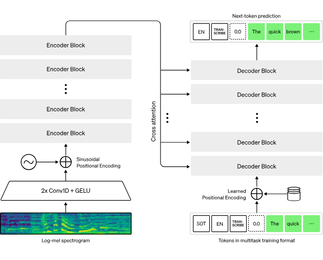
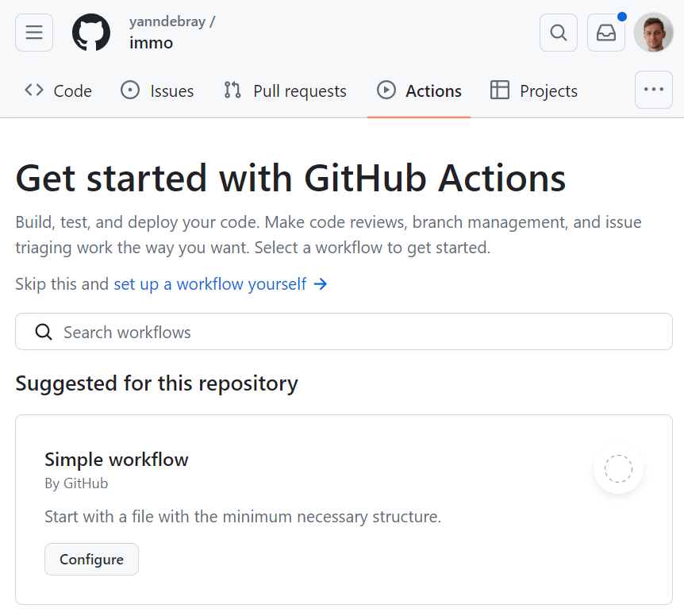
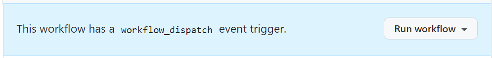
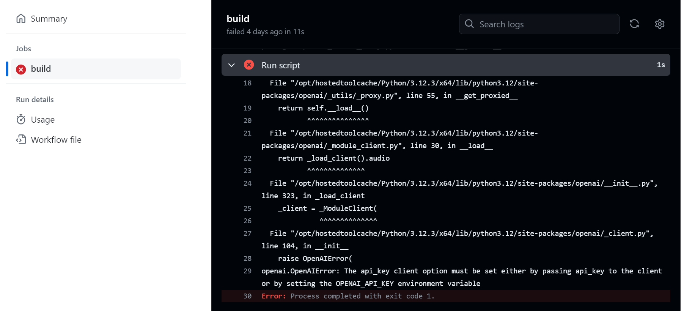
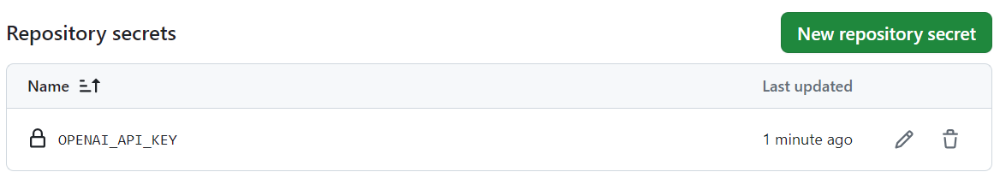
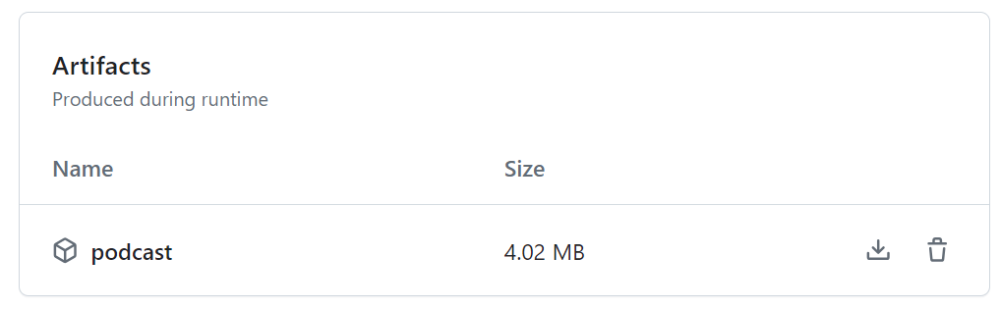
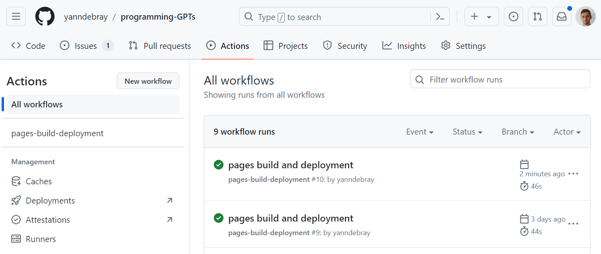

# 6. Speech-to-Text and Text-to-Speech

In this chapter, you will learn how to transcribe text from speech (such
as Youtube videos) and synthetize speech from text (such as articles).

This flavor of AI involving speech was popularized with personal & home
assistants such as Alexa from Amazon. But up until the new wave of
Generative AI coming with ChatGPT, interacting with voice was primarily
reduced to *speech command recognition*. The assistant awakens when you
call her name -- "Alexa" or "Ok Google" -- awaits instructions and
synthesizes the answer.

Another pop reference to this kind of AI in science fiction is
[J.A.R.V.I.S](https://en.wikipedia.org/wiki/J.A.R.V.I.S.) the engineering assistant of iron-man, that appeared in
the first movie from 2008.

## 6.1. Transcription

Transcribing spoken language into text has traditionally been a complex
and resource-intensive process. Like with text, the signal carried by
the sound of a voice can be processed by a deep neural network that has
been trained to convert it into text. With the [recent boom of Generative
AI](https://www.assemblyai.com/blog/recent-developments-in-generative-ai-for-audio/), speech-to-text (STT) has become more accurate, efficient, and
accessible than ever before. Architectures very similar to Large
Language Models excel in understanding context, semantics, and nuances
in language, making them ideal candidates for speech transcription
tasks. As you can see from the following diagram, the input audio signal
is fed as a spectrogram, that is then encoded into an intermediate
representation, further decoded into text, through the same next-word
prediction mechanism as ChatGPT.



This has very valuable applications in the professional world, such as
transcribing meetings to enable [summaries](https://platform.openai.com/docs/tutorials/meeting-minutes) as demonstrated in
[chapter 3](#_Summarization).

A few pure players of Speech AI have specialized in this task, like
[AssemblyAI](https://www.youtube.com/watch?v=r8KTOBOMm0A) and [Gladia](https://techcrunch.com/2023/06/19/gladia-turns-any-audio-into-text-in-near-real-time/). But here again, a large chunk of this
market is driven by OpenAI, with the release of [Whisper](https://openai.com/research/whisper) as
open-source in September 2022 (just a few months before ChatGPT).

Whisper can be downloaded locally to perform transcription without
having to send your audio files over the internet. This is useful for
privacy reasons, or when you have a slow or no internet connection.

`pip install -U openai-whisper`

It also requires the command-line tool [ffmpeg](https://ffmpeg.org/) to be installed on
your system.

There are five model sizes, four with English-only versions, offering
speed and accuracy tradeoffs. Below are the names of the available
models and their approximate memory requirements and inference speed
relative to the large model; actual speed may vary depending on many
factors including the available hardware.

  | Size   | Parameters | English-only model | Multilingual model | Required VRAM | Relative speed |
|--------|------------|--------------------|--------------------|---------------|----------------|
| tiny   | 39 M       | tiny.en            | tiny               | ~1 GB         | ~32x           |
| base   | 74 M       | base.en            | base               | ~1 GB         | ~16x           |
| small  | 244 M      | small.en           | small              | ~2 GB         | ~6x            |
| medium | 769 M      | medium.en          | medium             | ~5 GB         | ~2x            |
| large  | 1550 M     | N/A                | large              | ~10 GB        | 1x             |


For a simple example, we will use the base multilingual model (to
account for my terrible French accent).
```python
# Listen to the audio before transcribing
from IPython.display import Audio
file = '../data/audio/enYann-tale_of_two_cities.mp3'
Audio(file)
```


```python
import whisper
model = whisper.load_model("base")
result = model.transcribe(file)
print(result["text"])
```
```
It was the best of times, it was the worst of times, ...
```
You can also use Whisper through the [transcription API](https://platform.openai.com/docs/guides/speech-to-text) of openAI.
Currently, there is no difference between the open-source version of
Whisper and the version available through the API. However, through the
API, OpenAI offers an optimized inference process which makes running
Whisper through the API much faster than doing it through other means.
```python
import openai
from pathlib import Path
file_path = Path(file)
transcription = openai.audio.transcriptions.create(model="whisper-1",
file=file_path)
transcription.text
```
```
'It was the best of times. It was the worst of times. ...'
```
## 6.2. Voice synthesis

If you listened to the audio recording of the previous example, you
might have been thinking that I sounded weird (more than usual) with a
German accent at time, and a British pronunciation here and there. What
I did not tell before is that this short narration was generated using a
clone of my voice.

To perform this magic trick, I am using a service called [Elevenlabs](https://elevenlabs.io/).
It offers a free tier with 10,000 Characters per month (\~10 min audio).
But you will need to upgrade to the starter tier for \$5/month in order
to clone your voice with as little as 1 minute of audio. I simply
extracted 5 samples of 1 min from a meeting where I was presenting, but
the quality could be improved, especially if I avoid saying "hum" every
other sentence.

OpenAI released a [Text-to-Speech](https://platform.openai.com/docs/guides/text-to-speech) API that you can conveniently use
since you already have an OpenAI account and API key. They are two
versions of the model (`tts-1` optimized for speed, `tts-1-hd` optimized for
quality), and 6 voices to choose from (alloy, echo, fable, onyx, nova,
and shimmer).
```python
import openai
speech_file_path = "../data/audio/speech.mp3"
response = openai.audio.speech.create(
  model="tts-1", voice="alloy",
  input="The quick brown fox jumped over the lazy dog.")
response.stream_to_file(speech_file_path)
Audio(speech_file_path)
```
## 6.3. Application: Daily tech podcast

Let's apply the use of text-to-speech to create a daily tech podcast:

-   Parse Techcrunch RSS feed
-   Synthetize the last 5 news articles into separate audio files
-   Schedule a GitHub Action to run daily


### 6.3.1. Parse the Techcrunch RSS feed

[RSS](https://en.wikipedia.org/wiki/RSS) stands for Really Simple Syndication, and an RSS feed is a file
that automatically updates information and stores it in reverse
chronological order. RSS feeds can contain headlines, summaries, update
notices, and links back to articles on a website's page. They are a
staple of digital communications and are used on many digital platforms,
including blogs and websites. RSS feeds can be used to:

-   Get the latest news and events from websites, blogs, or podcasts
-   Use content for inspiration for social media posts, newsletters, and
    website content
-   Allow creators to reach audiences reliably

This might sound to you like pre-2000 internet stuff, but it is actually
quite handy to build applications like our daily podcast. In 2018, Wired
published an article named ["It's Time for an RSS Revival"](https://www.wired.com/story/rss-readers-feedly-inoreader-old-reader/),
citing that RSS gives more control over content compared to algorithms
and trackers from social media sites. At that time, [Feedly](https://feedly.com/news-reader) was the
most popular RSS reader. Chrome on Android has added the ability to
follow RSS feeds as of 2021.

You can use a dedicated python library called [feedparser](https://feedparser.readthedocs.io/en/latest/) (`pip
install feedparser`). I will simply default to the basic xml parsing
capabilities in base python
```python
import requests, datetime
url = "https://techcrunch.com/feed"
date = datetime.datetime.now().strftime("%Y-%m-%d") # date in format
YYYY-MM-DD
rss = requests.get(url).content
with open(f"../data/rss/techcrunch\_{date}.xml", "wb") as f:
    f.write(rss)
```
```python
# load existing rss feed
import os
feeds = os.listdir('../data/rss/')
with open(f"../data/rss/{feeds[0]}", "rb") as f:
    rss = f.read()
```
```python
import xml.etree.ElementTree as ET
# Parse the XML document
tree = ET.fromstring(rss)
# Get the channel element
channel = tree.find('channel')
# Print the channel title
print(f"Channel Title: {channel.find('title').text}")
# Print the channel description
print(f"Channel Description: {channel.find('description').text}")
# Print the channel link
print(f"Channel Link: {channel.find('link').text}")
# Print the channel last build date
print(f"Last Build Date: {channel.find('lastBuildDate').text}")
```
```
Channel Title: TechCrunch
Channel Description: Startup and Technology News
Channel Link: <https://techcrunch.com/>
Last Build Date: Sat, 27 Apr 2024 20:20:46 +0000
```

### 6.3.2. Synthetize the last 3 news articles into separate audio files

We can start with just the last article for simplicity. But it's more
convenient to batch it up and save several at a time. Between 3 and 5
seem like a good number for my daily commute.
```python
# Print the items
items = channel.findall('item')
print(f"\nItems ({len(items)}):\n")
for item in items[:3]:
    title = item.find('title').text
    link = item.find('link').text
    print(f"Title: {title}")
    print(f"Link: {link}")
    print("-" * 80)
```
```
Items (20):

Title: TikTok faces a ban in the US, Tesla profits drop and healthcare
data leaks

Link:
<https://techcrunch.com/2024/04/27/tiktok-faces-a-ban-in-the-us-tesla-profits-drop-and-healthcare-data-leaks/>

--------------------------------------------------------------------------------

Title: Will a TikTok ban impact creator economy startups? Not really,
founders say

Link:
<https://techcrunch.com/2024/04/27/will-a-tiktok-ban-impact-creator-economy-startups-not-really-founders-say/>

--------------------------------------------------------------------------------

Title: Investors won't give you the real reason they are passing on your
startup

Link: <https://techcrunch.com/2024/04/27/your-team-sucks/>

--------------------------------------------------------------------------------
```
```python
from IPython.display import HTML
item = items[0]
description = item.find('description').text.strip().replace('\<p\>© 2024 TechCrunch. All rights reserved. For personal use only.\</p\>','')
HTML(description)
```
```
Welcome, folks, to Week in Review (WiR), TechCrunch's regular newsletter
covering this week's noteworthy happenings in tech. TikTok's fate in the
U.S. looks uncertain after President Joe Biden signed a bill that
included a deadline for ByteDance, TikTok's parent company, to divest
itself of TikTok within nine months or face a ban on distributing it
[...]
```
```python
from bs4 import BeautifulSoup
def scrape_article(item):
  title = item.find('title').text
  link = item.find('link').text
  html = requests.get(link).text
  soup = BeautifulSoup(html, "html.parser")
  # extract only the text from the class article-content
  text = soup.find(class_="article-content").get_text()
  # Save the text to file
  with open(f"../data/txt/{title}.txt", "w", encoding="utf-8") as
f:
      f.write(text)
  return (title,link,text)

(title,link,text) = scrape_article(item)
print(text[0:42])
```
```
Welcome, folks, to Week in Review (WiR),
```
**/!\\** Article titles can contain characters that are
not valid to serve as file names.

For this, we will use the regular expression module of Python and locate
a pattern in a string.
```python
import re
title = re.sub(r'[\<\>:"/\\\\\|?*]', '-', title)
```
This expression means match any character that is in this set, and
replace them with the character **-** . The characters in this set
are <, >, :, ", /, \, |, ?, and *. These are characters that are
not allowed in filenames in many file systems.
```python
import openai
speech_file_path = f"../data/audio/{title}.mp3"
def tts(text, speech_file_path):
    response = openai.audio.speech.create(
      model="tts-1",
      voice="alloy",
      input=text
    )
    response.stream_to_file(speech_file_path)
tts(text, speech_file_path)
len(text)
```
```
3533
```
**/!\\** TTS services have characters limits (4000 for
OpenAI, 5000 for ElevenLabs)

If the length of the article exceeds the transcription limit, you have
two options:

-   split the article into several parts and then concatenate the
    transcriptions.

-   summarize the article (by setting a character limit in the prompt)
    and then transcribe it.

```python
(title,link,text) = scrape_article(items[1])
print(f"Title: {title}")
print(f"Link: {link}")
print(f"Text: {text[:42]}...")
print(f"Characters: {len(text)}")
```
```
Title: Will a TikTok ban impact creator economy startups- Not really,
founders say
Link:
<https://techcrunch.com/2024/04/27/will-a-tiktok-ban-impact-creator-economy-startups-not-really-founders-say/>
Text:
President Joe Biden signed a bill on Wedn...
Characters: 7189
```
**Method 1:** Split article in chunks
```python
# Split text into chunks of 4000 characters
chunks = [text[i:i+4000] for i in range(0, len(text), 4000)]
for i,chunk in enumerate(chunks):
    chunk_file_path = speech_file_path.replace(".mp3",f" - chunk
{i+1}.mp3")
    tts(chunk, chunk_file_path)
    print(f"Chunk {i+1} - Characters: {len(chunk)} - File:
{chunk_file_path}")
```
```
Chunk 1 - Characters: 4000 - File: ../data/audio/Will a TikTok ban
impact creator economy startups- Not really, founders say - chunk 1.mp3
Chunk 2 - Characters: 3189 - File: ../data/audio/Will a TikTok ban
impact creator economy startups- Not really, founders say - chunk 2.mp3
```
```python
from pydub import AudioSegment
def merge_audio_files(files, output_file):
    combined = AudioSegment.empty()
    for file in files:
        sound = AudioSegment.from_file(file)
        combined += sound
        os.remove(file)
    combined.export(output_file, format="mp3")
  
files = [speech_file_path.replace(".mp3",f" - chunk {i+1}.mp3") for
i in range(len(chunks))]
merge_audio_files(files, speech_file_path)
```
The junction between the chunks isn't great especially if it's a
sentence that is cut in half, or worse mid-word. You can try to split
the article in a way that makes sense, for example by splitting at the
end of a paragraph.

**Method 2:** Split article in chunks
```python
def summarize(text):
    inst = '''Summarize the following article in less than 4000
characters.'''
    completion = openai.chat.completions.create(
        model='gpt-3.5-turbo',
        messages= [
            {'role': 'system', 'content': inst },
            {'role': 'user', 'content': text }]
    )
    return completion.choices[0].message.content

summary = summarize(text)
print(f"Summary: {summary[:42]}")
print(f"Characters: {len(summary)}")
```
```
Summary: President Joe Biden signed a bill allowing
Characters: 1435
```
```python
tts(summary, speech_file_path.replace(".mp3"," - summarized.mp3"))
```
### 6.3.3. Schedule a GitHub Action to run daily

[GitHub Actions](https://github.com/features/actions) is a beautiful feature that enables to automate
workflows around your code. You can use different trigger to run those
actions. In this example, we will trigger on a schedule (every night).

In a repository of your choice, simply navigate to the Actions tab, and
select `set up a workflow yourself`.



This will create the file: `<repo_name>/.github/workflows/main.yml` -
Enter the following code:
```yaml
name: daily tech podcast
on:  
  # Triggers the workflow on a schedule, every day at 00:00 UTC
  schedule:    
    - cron: "0 0 * * *"  
  # Allows you to run this workflow manually from the Actions tab
  workflow_dispatch:
jobs:  
  # This workflow contains a single job called "build"
  build:    
    runs-on: ubuntu-latest    
    steps:      
      # Checks-out your repository under \$ GITHUB_WORKSPACE, so your job can access it
      - uses: actions/checkout@v4
      - name: Set up Python
        uses: actions/setup-python@v5
        with:
          python-version: '3.x'
      - name: Install dependencies
        run: python -m pip install requests openai elevenlabs bs4 pydub
      - name: Install ffmpeg
        run: \|
          sudo apt-get update
          sudo apt-get install ffmpeg
      - name: Run script
        run: python daily_tech_podcast.py
      # Save the result as artifact
      - name: Archive output data
        uses: actions/upload-artifact@v4
        with:
          name: podcast
          path: podcast/tech[0-9][0-9][0-9][0-9]-[0-9][0-9]-[0-9][0-9]/
env:
  OPENAI_API_KEY: \${{secrets.OPENAI_API_KEY}}
  # ELEVEN_API_KEY: \${{secrets.ELEVEN_API_KEY}}
```
Some explanations of what this is doing:

-   Actions use a [YAML format](https://realpython.com/python-yaml/) to specify the elements of the job to run.

-   Actions use the [cron syntax](https://crontab.guru/every-day) to specify the schedule at which to run.

-   You can also specify workflow_dispatch to get the following manual
    trigger in the actions tab:



-   [Setup Python and install the necessary dependencies in the runner](https://docs.github.com/en/actions/automating-builds-and-tests/building-and-testing-python)

-   If the run fails, you will get an email. You can analyze the log to see what went south:



-   As you can see in the previous error, we forgot to provide the
    `OPENAI_API_KEY`. You can set it up as a repository secret, under the
    repo settings/secrets/actions:



-   Once the jobs ran according to plan (which happens), you can [upload the resulting artifact](https://github.com/actions/upload-artifact ):

    Point to the file or the entire directory:
    `path: path/to/artifact/result.txt`
    `path: path/to/artifact/`
    Insert a wild card in the path, in order to take variations into account:
    `path: path/**/[abc]rtifac?/*`
    This wildcard pattern matches paths that start with "path/", followed by any number of directories (including none) due to the "**" wildcard, then a directory with any single character, followed by "rtifac", then a single character, and finally, anything (file or directory) due to the last "*". The square brackets "[abc]" indicate that the character at that position can be either 'a', 'b', or 'c'. The question mark "?" indicates that there can be zero or one occurrence of any character at that position.

The artifact will be available in the detail of the run, as a zip file:



A quick note on the use of GitHub actions for this repo. If you navigate
to this tab, you will see that actions are also triggered every time a
new change has been pushed. It is building a website that renders all
the markdown files of the repo as html on:
[yanndebray.github.io/programming-GPTs/](https://yanndebray.github.io/programming-GPTs/)

This other amazing capability is called [GitHub Pages](https://pages.github.com/).


