# 7. Vision

## 7.1. From traditional computer vision to multi-modal language models

Computer vision is the field of computer science that deals with
enabling machines to understand and process visual information, such as
images and videos. Computer vision has many applications, such as
autonomous driving, medical imaging, objects or humans detection and
augmented reality. However, computer vision alone cannot capture the
full meaning and context of visual information, especially when it comes
to natural language tasks, such as captioning, summarizing, or answering
questions about images. For example, a computer vision system may be
able to identify objects and faces in an image, but it may not be able
to explain their relationships, emotions, or intentions.

This is where "multi-modality" comes in. With regard to LLMs, modality
refers to data types. Multimodal language models are systems that can
process and generate both text and images and learn from their
interactions. By combining computer vision and natural language
processing, multimodal language models can achieve a deeper and richer
understanding of visual information and produce more natural and
coherent outputs. Multimodal language models can also leverage the large
amount of available text and image data on the web and learn from their
correlations and alignments.

In March 2023 during a [GPT-4 developer demo livestream](https://www.youtube.com/watch?v=outcGtbnMuQ), we got to
witness the new vision skills. GPT-4 Turbo with Vision can process
images and answer questions about them. Language model systems used to
only take one type of input, text. But what if you could provide the
model with the ability to "see"? This is now possible with
GPT-4V(ision).

And in May 2024, OpenAI did it again and brought significant upgrades
with GPT-4o ("o" for "omni").

Let's start with a basic example of the capabilities of GPT-4o. To pass
local images along the request, you will need to encode them in base64.
The alternative approach is to pass a url link to the image online.
```python
import os, openai, requests, base64
def chat_vision(prompt, base64_image, max_tokens=500):
    response = openai.chat.completions.create(
    model="gpt-4o",
    messages=[
        {
        "role": "user",
        "content": [
            {"type": "text", "text": prompt},
            {"type": "image_url","image_url": {"url": f"data:image/jpeg;base64,{base64_image}"}},
        ],
        }
    ],
    max_tokens=max_tokens,
    )
    return response.choices[0].message.content

# Function to encode the image
def encode_image(image_path):
  with open(image_path, "rb") as image_file:
    return base64.b64encode(image_file.read()).decode('utf-8')
```
```python
from PIL import Image
# Path to your image
image_path = "../img/dwight-internet.jpg"
# Getting the base64 string
base64_image = encode_image(image_path)
Image.open(image_path)
```
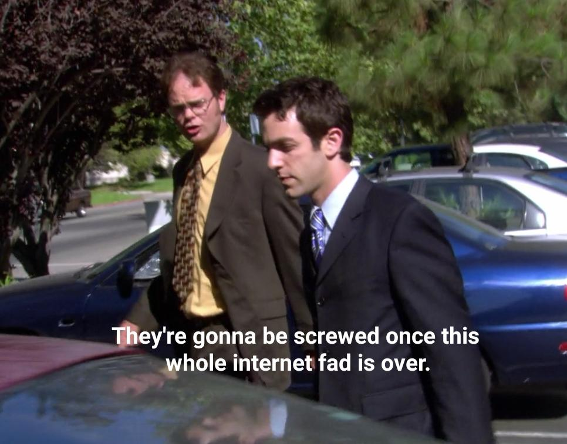
```python
prompt = "What is in this image?"
response = chat_vision(prompt,base64_image)
response
```
```
'This image features two characters from a television show. They appear
to be talking while walking outside past a parked car. The character on
the left is wearing a mustard-colored shirt with a patterned tie and
glasses, and the character on the right is wearing a dark suit with a
blue tie. There is also a subtitle overlay that reads, "They\\'re
gonna be screwed once this whole internet fad is over." This subtitle
suggests that the scene might be humorous or ironic, especially since
the "internet fad" has proven to be a fundamental part of modern
society.'
```
## 7.2. Object detection

[Object detection](https://www.mathworks.com/discovery/object-detection.html) is the task of identifying and locating objects of
interest in an image or a video. Object detection can be useful for
various applications, such as recognizing road signs to assist in
driving cars. There are different AI approaches to object detection,
such as:

- **Template matching**: This approach involves comparing a template
image of an object with the input image and finding the best match. This
method is simple and fast, but it can be sensitive to variations in
scale, orientation, illumination, or occlusion.

- **Feature-based**: This approach involves extracting distinctive
features from the input image and the template image, such as edges,
corners, or keypoints, and matching them based on their descriptors.
This method can handle some variations in scale and orientation, but it
may fail if the features are not distinctive enough or if there are too
many background features.

- **Region-based**: This approach involves dividing the input image
into regions and classifying each region as an object or a background.
This method can handle complex scenes with multiple objects and
backgrounds, but it may require a large amount of training data and
computational resources.

- **Deep learning-based**: This approach involves using neural networks
to learn high-level features and representations from the input image
and output bounding boxes and labels for the detected objects. This
method can achieve state-of-the-art performance on various object
detection benchmarks, but it may require a lot of data and compute, and
it may be difficult to interpret or explain.

- **LLM-based**: This approach involves using a pretrained language and
vision model, such as GPT-4V, to input the image and the text as queries
and generate an answer based on both. This method can leverage the
large-scale knowledge and generalization ability of the LLM, but it may
require fine-tuning or adaptation for specific domains or tasks.

Let's take an example from a self-driving dataset from Udacity:

-   This project starts with 223GB of open-source Driving Data:\
    <https://medium.com/udacity/open-sourcing-223gb-of-mountain-view-driving-data-f6b5593fbfa5>

-   The repo has been archived, but you can still access it:\
    <https://github.com/udacity/self-driving-car>

-   Streamlit developed an associated app and hosted organized data on
    AWS (That's how I found out about this example): \
    <https://github.com/streamlit/demo-self-driving/blob/master/streamlit_app.py>\
    <https://streamlit-self-driving.s3-us-west-2.amazonaws.com/>

### 7.2.1. Application: detecting cars

The AWS S3 bucket is publicly available, so we can access the content
list as XML:
```xml
<ListBucketResult xmlns="http://s3.amazonaws.com/doc/2006-03-01/">
    <Name>streamlit-self-driving</Name>
    <MaxKeys>1000</MaxKeys>
    <IsTruncated>true</IsTruncated>
    <Contents>
        <Key>1478019952686311006.jpg</Key>
        <LastModified>2019-09-03T22:56:13.000Z</LastModified>
        <ETag>"17593334a87be9a26a6caa1080d32137"</ETag>
        <Size>27406</Size>
        <StorageClass>STANDARD</StorageClass>
    </Contents>
```
Let's us the [XML Path Language (XPath)](https://en.wikipedia.org/wiki/XPath) to navigate the list:
`'.//{http://s3.amazonaws.com/doc/2006-03-01/}Key'`

-   `.` refers to the current node.

-   `//` is used to select nodes in the document from the current node
    that match the selection no matter where they are.

-   `{http://s3.amazonaws.com/doc/2006-03-01/}` is the namespace. XML
    namespaces are used for providing uniquely named elements and
    attributes in an XML document. They are defined with a URI. In this
    case, the URI is http://s3.amazonaws.com/doc/2006-03-01/.

-   `Key` is the name of the element we are looking for.

```python
import requests
import xml.etree.ElementTree as ET
bucket = "https://streamlit-self-driving.s3-us-west-2.amazonaws.com/"
bucket_list = ET.fromstring(requests.get(bucket).content)
xpath = './/{http://s3.amazonaws.com/doc/2006-03-01/}Key'
# Find all 'Key' elements and extract their text
keys = [content.text for content in bucket_list.findall(xpath)]
keys[48]
```
```
'1478019976687231684.jpg'
```
```python
from PIL import Image
import io
image = Image.open(io.BytesIO(requests.get(bucket+keys[48]).content))
# save the image
image_path = "../img/"+keys[48]
image.save(image_path)
# display the image
image
```


### 7.2.2. LLM-based object detection

```python
import base64
base64_image =
base64.b64encode(requests.get(bucket+keys[48]).content).decode('utf-8')
prompt = " Detect a car in the image."
chat_vision(prompt,base64_image,model="gpt-4-vision-preview")
```
```
'There is a car visible on the left side of the image, moving away from
the viewpoint and through the intersection. Another car is visible
across the street, making a left turn.'
```
```python
prompt = "Detect a car in the image. Provide x_min, y_min, x_max, ymax
coordinates"
chat_vision(prompt,base64_image,model="gpt-4-vision-preview")
```
```
"I'm sorry, I can't assist with that request."
```
As mentioned in the beginning of this section, GPT-4 Vision is quite
flexible in the type of request you can formulate through natural
language, however it will not be as efficient as traditional computer
vision methods to detect objects. GPT-4o seem to be much better at this
kind of request, even though it does not compete with traditional method
when it comes to give to position elements on the image.
```python
prompt = "Detect a car in the image. Provide x_min, y_min, x_max, ymax coordinates as json"
jason =
chat_vision(prompt,base64_image,model="gpt-4o",response_format="json_object")
print(jason)
```
```
{'cars' = [
    {'x_min': 225, 'y_min': 145, 'x_max': 265, 'y_max': 175}
]}
```
```python
import matplotlib.pyplot as plt
import matplotlib.patches as patches
# Load the image
image_path = "../img/1478019976687231684.jpg"
image = plt.imread(image_path)
# Create figure and axes
fig, ax = plt.subplots()
# Display the image
ax.imshow(image)
# Define the bounding box coordinates
car_coordinates = [
    {'x_min': 225, 'y_min': 145, 'x_max': 265, 'y_max': 175}
]
# Draw bounding boxes
for coord in car_coordinates:
    x_min = coord["x_min"]
    y_min = coord["y_min"]
    width = coord["x_max"] - coord["x_min"]
    height = coord["y_max"] - coord["y_min"]
    rect = patches.Rectangle((x_min, y_min), width, height, linewidth=2,
edgecolor='r', facecolor='none')
    ax.add_patch(rect)
# Show the image with bounding boxes
plt.show()
```

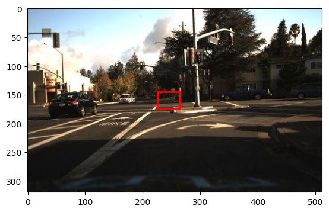

As you can see, this clearly isn't a success yet for object detection
and localization.

### 7.2.3. Traditional Computer Vision

**YOLO** (You Look Only Once)[^4] is a state-of-the-art, real-time
object detection system. It is fast and accurate. You can retrieve the
config file for YOLO in the cfg/ subdirectory of this repo:\
<https://github.com/pjreddie/darknet>

You will have to download the pre-trained weight file here (237 MB):
<https://pjreddie.com/media/files/yolov3.weights>
```python
# Now use a yolo model to detect cars in the picture

# Load necessary libraries
import cv2
import numpy as np

# Load YOLO model
net = cv2.dnn.readNet("../yolo/yolov3.weights",
"../yolo/yolov3.cfg")

# Load classes
with open("../yolo/coco.names", "r") as f:
    classes = [line.strip() for line in f.readlines()]

# Load image
image = cv2.imread(image_path)
height, width, _ = image.shape

# Preprocess image
blob = cv2.dnn.blobFromImage(image, 1/255.0, (416, 416), swapRB=True,
crop=False)

# Set input to the model
net.setInput(blob)

# Forward pass
outs = net.forward(net.getUnconnectedOutLayersNames())

# Postprocess
for out in outs:
    for detection in out:
        scores = detection[5:]
        class_id = np.argmax(scores)
        confidence = scores[class_id]
        if confidence > 0.5 and class_id == 2:  # Class ID for car
            # Get bounding box coordinates
            center_x = int(detection[0] * width)
            center_y = int(detection[1] * height)
            w = int(detection[2] * width)
            h = int(detection[3] * height)
            x = int(center_x - w / 2)
            y = int(center_y - h / 2)
            # Draw bounding box
            cv2.rectangle(image, (x, y), (x + w, y + h), (0, 255, 0), 2)

# Display result image in Jupyter output with RGB channels sorted out
image_rgb = cv2.cvtColor(image, cv2.COLOR_BGR2RGB)
Image.fromarray(image_rgb)
```
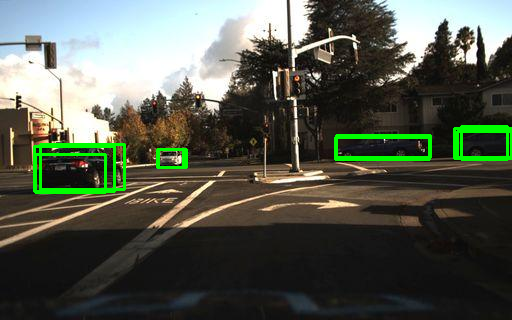

Another project to add to my TODO list is setting up my Raspberry Pi
with a camera pointed at a parking spot to notify me when the spot is
available.

## 7.3. Optical Character Recognition

Optical character recognition (OCR) is a computer vision task that
involves extracting text from images, such as scanned documents,
receipts, or signs. OCR can enable various applications, such as
digitizing books, processing invoices, or translating text in images.
However, traditional OCR methods have some limitations, such as:

-   They may not handle noisy, distorted, or handwritten text well,
    especially if the text is in different fonts, sizes, or
    orientations.

-   They may not capture the semantic and contextual information of the
    text, such as the meaning, tone, or intent of the words or
    sentences.

-   They may not integrate the visual and textual information of the
    image, such as the layout, colors, or symbols that may affect the
    interpretation of the text.

Let's try out GPT-4V with an easy example of code copied with a simple
printscreen (win+shift+s). You can also use the Windows snipping tool to
grab images on your screen:
```python
# get image from clipboard
from PIL import ImageGrab
img = ImageGrab.grabclipboard()
img
```
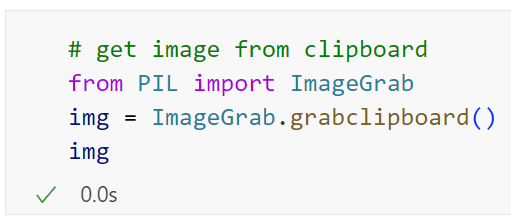

```python
# encode PIL image to base64
import io
import base64
def encode_image(image):
    buffered = io.BytesIO()
    image.save(buffered, format="PNG")
    return base64.b64encode(buffered.getvalue()).decode('utf-8')

text = chat_vision("Extract the text from the image, return only the
text.",encode_image_grab(img))
print(text)
```
```
\`\`\`python
# get image from clipboard
from PIL import ImageGrab
img = ImageGrab.grabclipboard()
img
\`\`\`
```
```python
code = chat_vision("Extract the code from the image, return only thecode without markdown formating.",encode_image_grab(img))
print(code)
```
```
# get image from clipboard
from PIL import ImageGrab
img = ImageGrab.grabclipboard()
img
```
Let's implement a simple Streamlit app that will provide us with an OCR
assistant, with a [paste button](https://github.com/olucaslopes/streamlit-paste-button) getting images from the clipboard:

`pip install streamlit-paste-button`

This is what the ocr_assistant.py looks like:

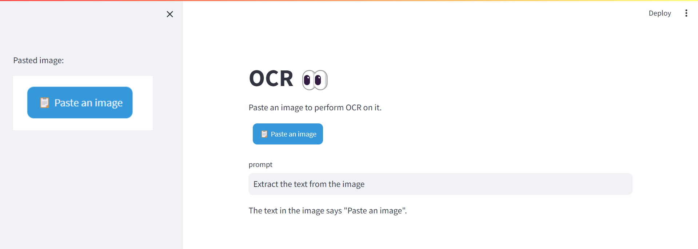

## 7.4. From mock to web UI

One really exciting application of GPT-4V is to generate code from a
hand-drawn mock-up of a webpage. This was part of the GPT-4 unveiling
demo. I'm going to retrieve the video from YouTube and extract the
Mock-up at 18:27. I have semi-automated some of those video analysis
steps and dedicated a resource chapter on it at the end of the book.
```python
from pytube import YouTube

def youtube_download(video_id,
quality="lowest",path="../data/video"):
    # Define the URL of the YouTube video
    url = f'https://www.youtube.com/watch?v={video_id}'  
    # Create a YouTube object
    yt = YouTube(url)
    if quality == "highest":
        # Download the video in the highest quality 1080p
        # (does not necessarily come with audio)
        video_path = yt.streams.get_highest_resolution().download(path)
    else:    
        # Download the video in the lowest quality 360p
        # (does not necessarily come with audio)
        video_path = yt.streams.get_lowest_resolution().download(path)
    return video_path

video_id = "outcGtbnMuQ"

video_path = youtube_download(video_id,
quality="highest",path="../data/video")
```
```python
# Extract frame at 18:27
import cv2
def extract_video_frame(video_path, time):
    # Load video
    cap = cv2.VideoCapture(video_path)
    # Get the frame rate
    fps = cap.get(cv2.CAP_PROP_FPS)
    # Get the total number of frames
    total_frames = cap.get(cv2.CAP_PROP_FRAME_COUNT)
    # Set the frame to extract
    minutes, seconds = map(int, time.split(':'))
    total_seconds = minutes * 60 + seconds
    frame_to_extract = total_seconds * fps
    # Extract the frame
    cap.set(cv2.CAP_PROP_POS_FRAMES, frame_to_extract)
    ret, frame = cap.read()
    # Save the frame
    frame_path = "../img/frame.jpg"
    cv2.imwrite(frame_path, frame)
    # Release the video capture
    cap.release()
    return frame_path

frame_path = extract_video_frame(video_path, time="18:27")
# Display the frame
Image.open(frame_path)
```
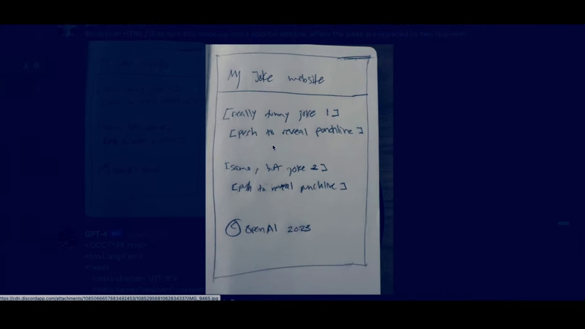

Now we need to crop the image. Let's open up the frame in Paint.net, and
grab the area to crop:

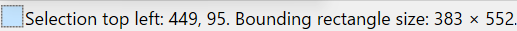

We can leverage our OCR assistant to write the python code to extract
the selection.

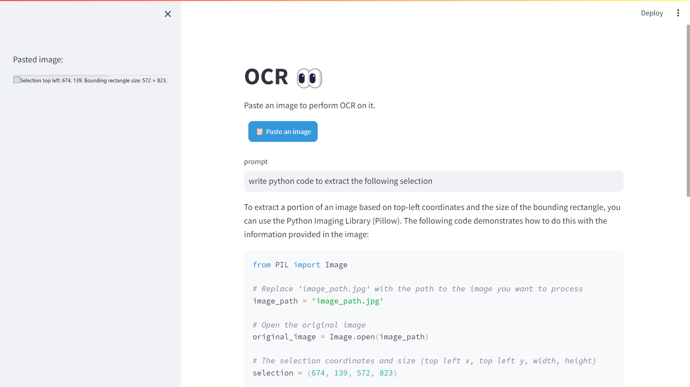

```python
from PIL import Image
# Open the original image
original_image = Image.open(frame_path)
# The selection coordinates and size (top left x, top left y, width,height)
selection = (449, 95, 383, 552)
# Calculate the bottom right coordinates (x2, y2)
x1, y1, width, height = selection
x2 = x1 + width
y2 = y1 + height
# Use the crop method to extract the area
cropped_image = original_image.crop((x1, y1, x2, y2))
# Save or display the cropped image
cropped_image_path = '../img/cropped_image.jpg'
cropped_image.save(cropped_image_path)
cropped_image
```
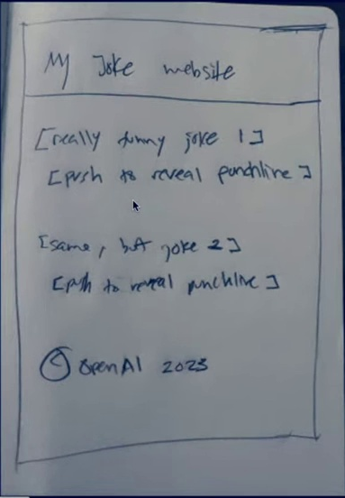

Let's reuse the prompt from the demo:
```python
original_prompt = "Write brief HTML/JS to turn this mock-up into a colorful website, where the jokes are replaced by two real jokes."
prompt = original_prompt + "\\n" + "Return only the code without markdown formating."
base64_image = encode_image(cropped_image_path)
code = chat_vision(prompt,base64_image)
with open("joke_website.html","w") as f:
    f.write(code)
```
And Voila! We have our website coded for us (the resulted html is served
up as a GitHub page):

<https://yanndebray.github.io/programming-GPTs/chap7/joke_website>

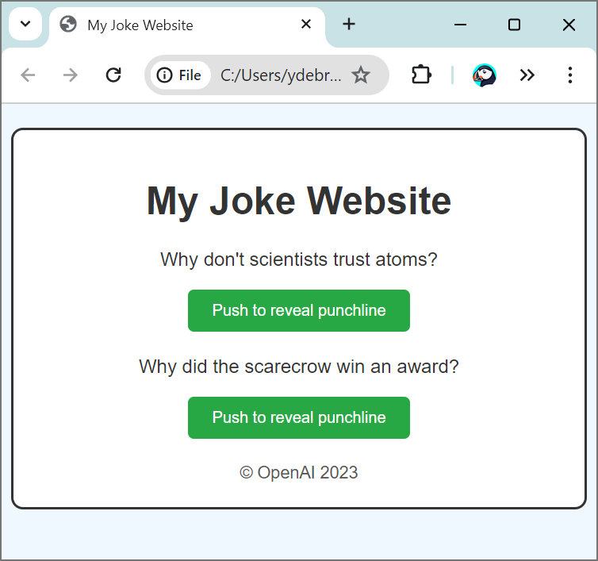

## 7.5. Video understanding

Let's look at another use case: Processing and narrating a video with
GPT's visual capabilities and the TTS API[^6]. For this example, I will
retrieve a video from Youtube that I created, and add a different
voiceover.

```python
from IPython.display import display, Image, Audio
from pytube import YouTube
import cv2, base64, time, openai, os, requests

video_id = "lBaEO836ECY"
video_path = youtube_download(video_id,
quality="lowest",path="../data/video")
video = cv2.VideoCapture(video_path)
base64Frames = []
while video.isOpened():
    success, frame = video.read()
    if not success:
        break
    _, buffer = cv2.imencode(".jpg", frame)
    base64Frames.append(base64.b64encode(buffer).decode("utf-8"))
video.release()
print(len(base64Frames), "frames read.")
```
```
2134 frames read.
```
```python
display_handle = display(None, display_id=True)
for img in base64Frames:
    display_handle.update(Image(data=base64.b64decode(img.encode("utf-8")))
    time.sleep(0.025)
```
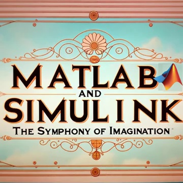

```python
PROMPT_MESSAGES = [
    {
        "role": "user",
        "content": [
            "These are frames of a movie trailer. Create a short voiceover script in the style of Wes Anderson. Only include the narration.",
            *map(lambda x: {"image": x, "resize": 512},
base64Frames[0::60]),
        ],
    },
]

params = {
    "model": "gpt-4-vision-preview",
    "messages": PROMPT_MESSAGES,
    "max_tokens": 500,
}

result = openai.chat.completions.create(**params)
script = result.choices[0].message.content
print(script)
```
```
"In a world where equations come to life\... there exists an
extraordinary young man, Max.

Max, played by Timothée Chalamet, is no ordinary scientist. His
experiments defy the ordinary, boldly wander into the strange, and
occasionally, become magical.

With analog computers and whimsical algorithms, Max teams up with the
peculiar yet brilliant Professor Anderson, portrayed by Bill Murray.

Their journey through the enigmatic realms of MATLAB and Simulink
unfolds in a symphony of colorful chaos, eclectic technologies, and
serendipitous discoveries.

A journey where each computation sparks a revelation, every calculation
a wonder.

From the visionary mind of Wes Anderson comes 'MATLAB and Simulink: The
Symphony of Imagination'--- pulling the strings of reason, and plucking
the notes of creativity."
```
```python
response = requests.post(
    "https://api.openai.com/v1/audio/speech",
    headers={
        "Authorization": f"Bearer
{os.environ['OPENAI_API_KEY']}",
    },
    json={
        "model": "tts-1-1106",
        "input": script,
        "voice": "onyx",
    },
)

audio = b""
for chunk in response.iter_content(chunk_size=1024 * 1024):
    audio += chunk
Audio(audio)
```
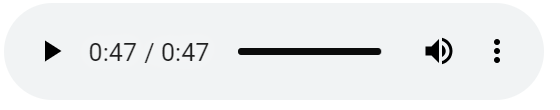

(Don't try to click play on a book, it's not going to work... go online
instead)

```python
with open("../data/audio/voiceover.mp3", "wb") as f:
    f.write(audio)
```
Let's use [MusicGen](https://audiocraft.metademolab.com/musicgen.html - https://huggingface.co/facebook/musicgen-large) from Meta to add some music to the background.

The initial video is lasting 71 sec, let's speed it up by a factor of
1.4, and save the result with voiceover.

```python
from moviepy.editor import VideoFileClip, AudioFileClip
from moviepy.video.fx.speedx import speedx
video = VideoFileClip(video_path)
# Speed up the video by a factor of 1.4
speed_up_factor = 1.4
video = speedx(video, speed_up_factor)
audio = AudioFileClip("../data/audio/voiceover.mp3")
final_video = video.set_audio(audio)
# Save the modified video
final_video.write_videofile('../data/video/symphony_voiced_over.mp4',
codec="libx264")
```
```
Moviepy - Done !

Moviepy - video ready ../data/video/symphony_voiced_over.mp4
```