# 8. DALL-E image generation

This whole journey started for me in the first days of December 2022,
right after the release of ChatGPT. But since the API to call the
GPT-3.5 model did not become available until March of 2023, I played
around with the other services provided by OpenAI. Back then, [image generation](https://platform.openai.com/docs/guides/images) was one of the APIs that could call programmatically a
model named [DALL-E](https://openai.com/index/dall-e-2/) (already in v2 since august 2022). In parallel
other Generative AI models, like the open-source [Stable Diffusion](https://stability.ai/news/stable-diffusion-public-release) or
the proprietary [Midjourney](https://www.midjourney.com/) enabled very realistic and artistic
images creation. Since then, DALL-E 3 caught up with those image models
and enabled use cases like generating images with text represented in
it.

To get started you can do this tutorial:
<https://realpython.com/generate-images-with-dalle-openai-api/>

I tried out a few on fun projects like [*Creating Viral Videos With AI*](https://www.youtube.com/watch?v=pgdmhwtsntk). In the previous chapter, the video in the style of Wes Anderson
was completely generated with AI. I even created a mini-series of short
videos on TikTok called Biomachines. The story was derived from the
following prompt:

Write a story about humans being biological machines trained by the
experience of life. The story takes place in 2025, after the advent of
large language models

In this chapter we will see how to create a graphical novel on the same
topic.


The methods investigated are:

-   Generation
-   Edits (In- & Outpainting)
-   Variation

The capabilities accessible through the ChatGPT app (with the Plus paid
plan) are different from what can be done programmatically. For clarity,
I'll be explicit in this chapter about the use of the ChatGPT App, and
the use of the OpenAI API endpoints. This logo here represents the "GPT"
in the ChatGPT app.

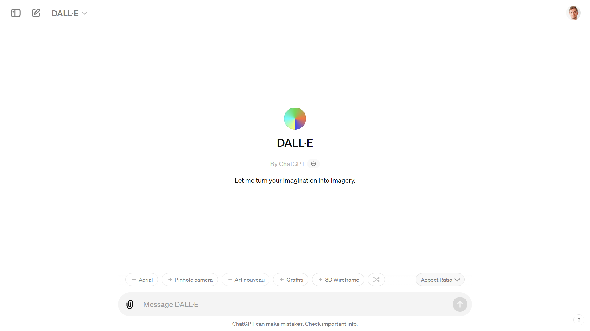

## 8.1. Generation

The first step in a story is a character. The difficulty with AI
generated image is to maintain consistency in the characters of your
plot. With DALL-E in the ChatGPT app, you can iterate and refine your
prompt in a conversation with @DALL-E. If you are not happy with a
result, you can ask to regenerate the image.

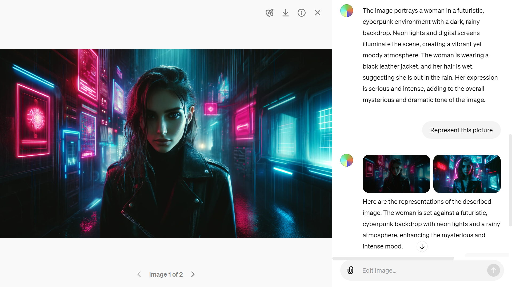

With the app you can also upload an existing image to ask ChatGPT to
describe it for you. This iterative process is helpful to capture the
essence of the scene that you are trying to generate.

The image generations API endpoint allows you to create an original
image given a text prompt. With DALL-E 3, images can have a size of
1024x1024, 1024x1792 or 1792x1024 pixels. With DALL-E 2, sizes are
1024x1024, 512x512 or 256x256.

By default, images are generated at standard quality, but when using
DALL-E 3 you can set quality: "hd" for enhanced detail. Square,
standard quality images are the fastest to generate.

You can request 1 image at a time with DALL-E 3 (request more by making
parallel requests) or up to 10 images at a time using DALL-E 2 with the
n parameter.

After many hesitations, I decided to use only the module `PIL.Image`
instead of the object `Image` from the module `IPython.display`

```python
from PIL import Image

img_prompt = """
An 8-bit pixelated game side scroller called biomachines.
cyberpunk story about humans being biological machines. Pixelated like
NES. Bright colors. Huge glowing pixels. Pixelated."""

response = openai.images.generate(
  model="dall-e-3",
  prompt=img_prompt,
  size="1792x1024",
  quality="standard",
  n=1,
)

image_url = response.data[0].url
print(image_url)
image = Image.open(requests.get(image_url, stream = True).raw)
image.save("biomachines-8bits.png")
image
```


To perform edits and variations, you will need to generate square images
(ratio 1:1).
```python
# Crop the image in the format 1:1
import Image
image = Image.open("biomachines-8bits.png")
width, height = image.size
left = (width - height) / 2
top = 0
right = (width + height) / 2
bottom = height
im = image.crop((left, top, right, bottom))
im.save("biomachines-8bits_1024x1024.png")
```

## 8.2. Edits
Edits can be performed interactively with the ChatGPT app by selecting a
region in the image:


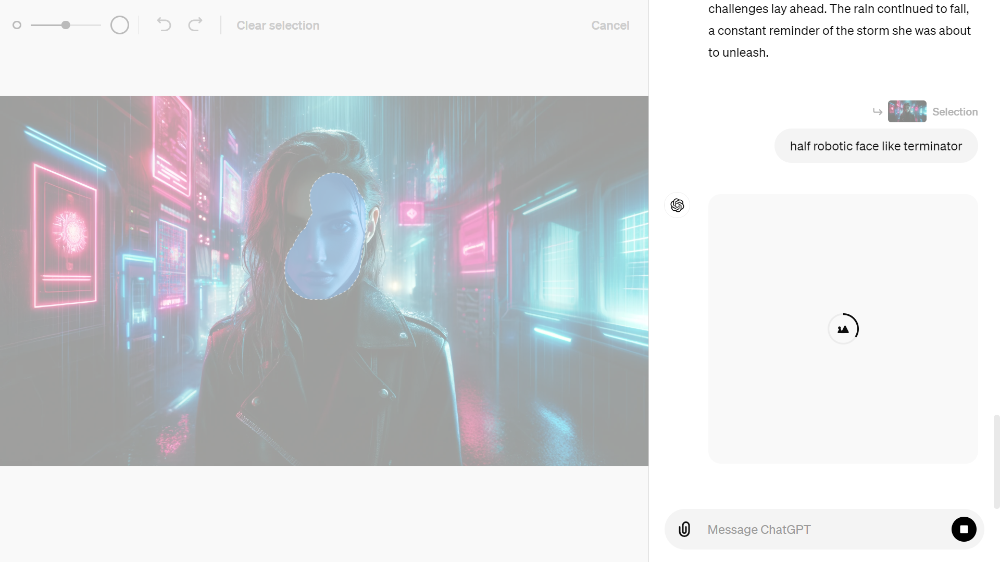

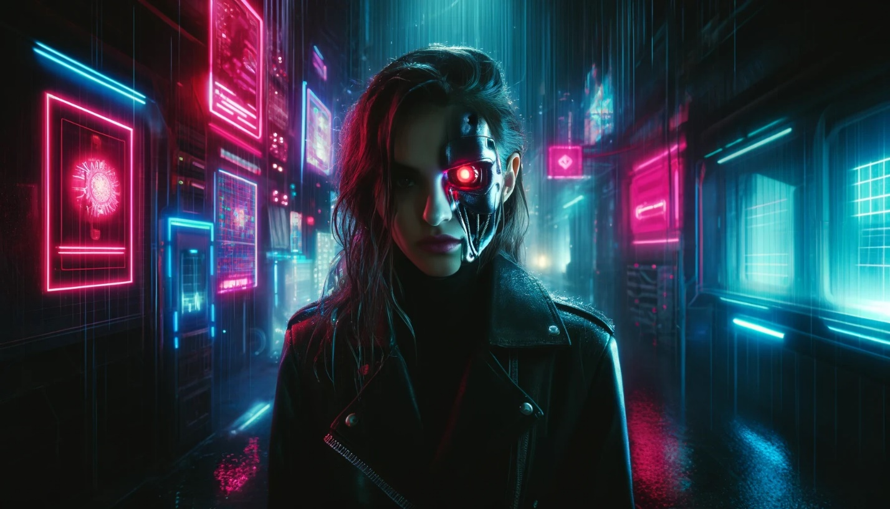

"Inpainting" via the API are only available with DALL-E 2. The image
edits endpoint allows you to edit or extend an image by uploading an
image and mask indicating which areas should be replaced. The
transparent areas of the mask indicate where the image should be edited,
and the prompt should describe the full new image, **not just the erased
area.**

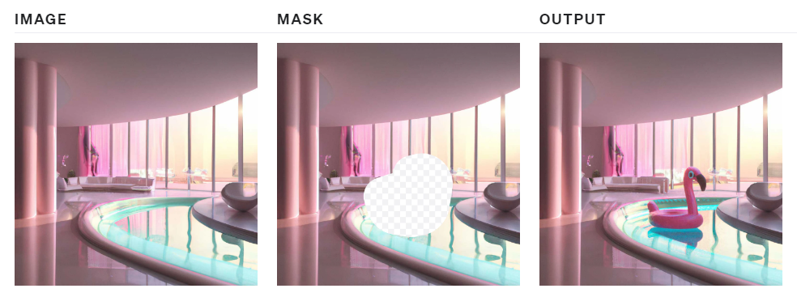

To perform this operation manually, you can use [Paint.net](https://www.getpaint.net/) to erase the masked area in the picture.
```python
response = openai.images.edit(
  model="dall-e-2",
  image=open("biomachines-8bits.png", "rb"),
  mask=open("mask.png", "rb"),
  prompt="""
  Terminator giant skull face in a cyberpunk 8 bits pixelated video game
  """,
  n=1,
  size="1024x1024"
)

image_url = response.data[0].url
image = Image.open(requests.get(image_url, stream = True).raw)
image.save("biomachines_terminator.png")
```
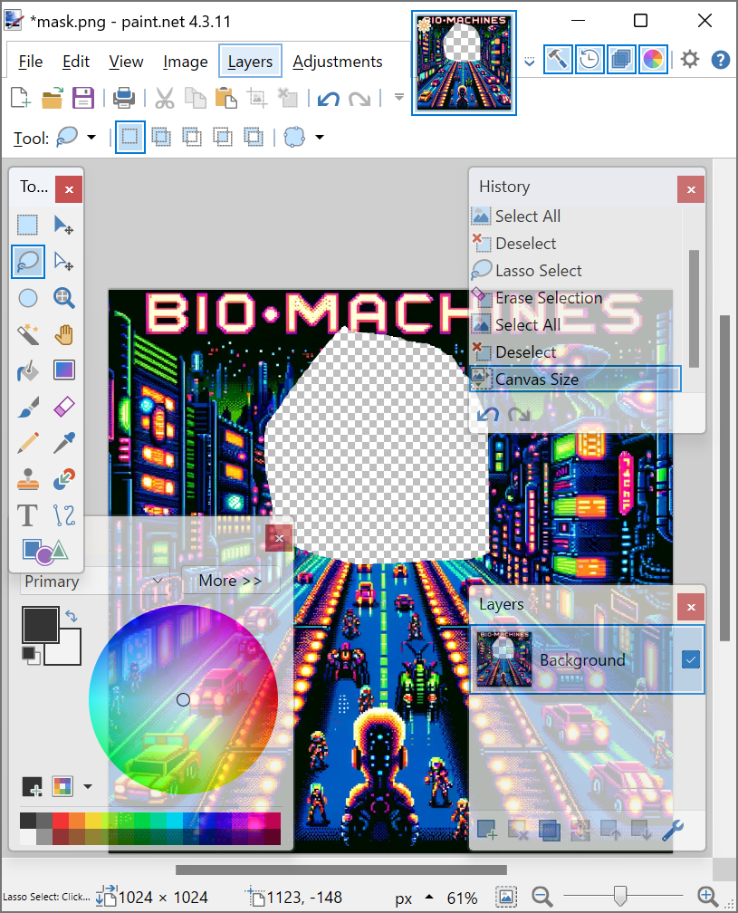

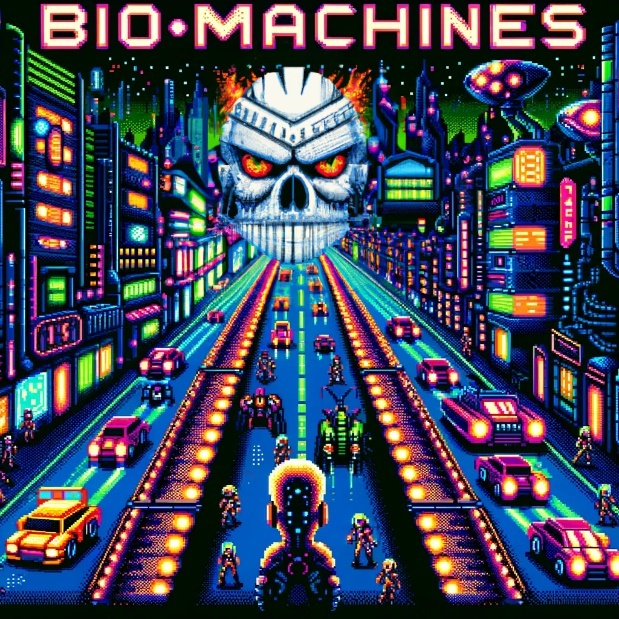

"Outpainting" is following the same principal as "inpainting", but you
only need to shift the image outside of the canvas in the direction that
you want to fill.

Before DALL-E got available in the ChatGPT app, you could access it in a
lab environment to "outpaint":

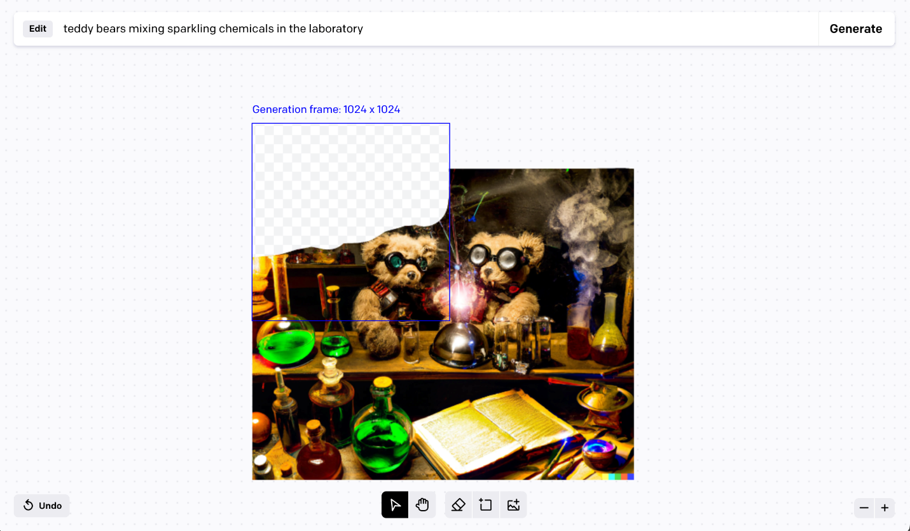

Since this app is no longer available, we can use a [Streamlit app with a drawable canvas](https://github.com/andfanilo/streamlit-drawable-canvas) that will fulfill some of those needs.

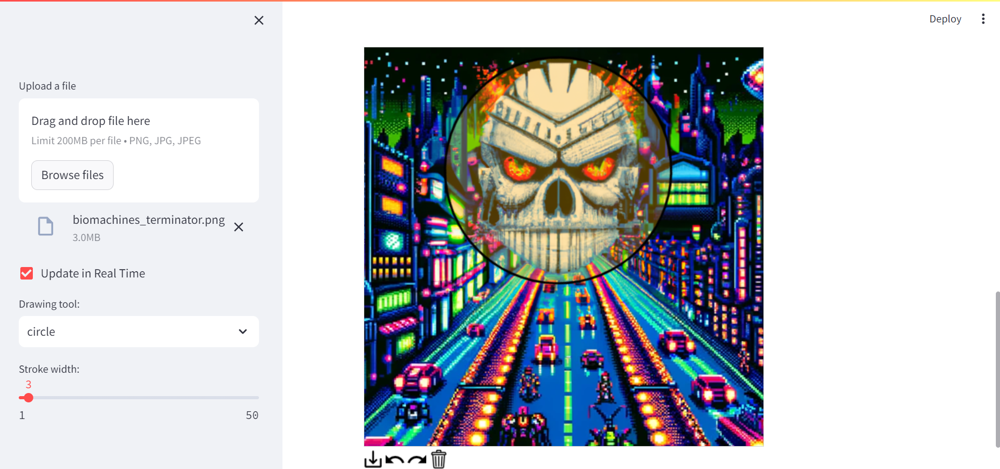


## 8.3. Variations

Variations are easy to understand. You input an image of the right
format, and get another flavor of it:
```python
from PIL import Image
response = openai.images.create_variation(
  model="dall-e-2",
  image=open("biomachines_car.png", "rb"),
  n=2,
  size="1024x1024"
)

image_url = response.data[0].url
print(image_url)
image = Image.open(requests.get(image_url, stream = True).raw)
image.save("biomachines_car_variation.png")
```
You can get several variants, by entering n=2 for instance.

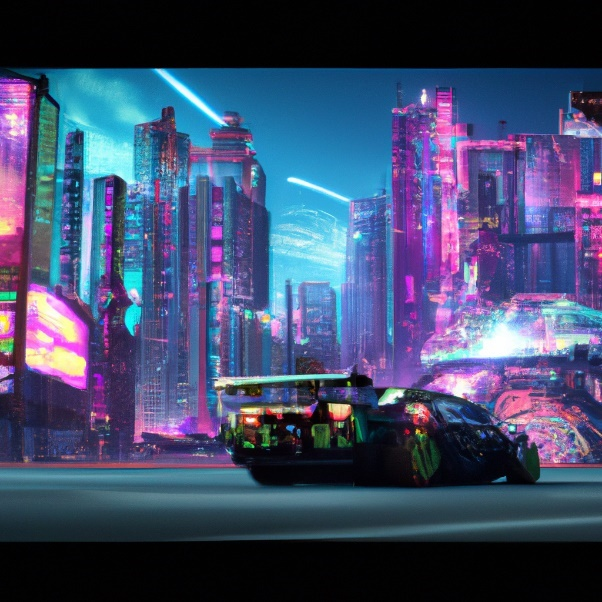

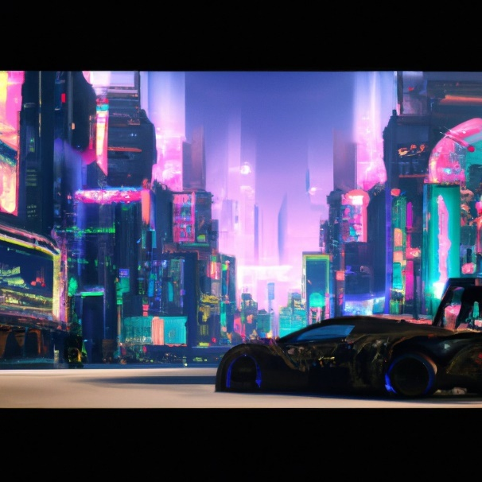

## 8.4. Application: GPT Journey - choose your own adventure

Imagine playing a text-based game where you can not only read the story,
but also see the images generated by your choices. That's what GPT
Journey offers: a choose your own adventure game powered by artificial
intelligence. This concept was developed by the genius Sentdex on his
[Youtube channel](https://www.youtube.com/watch?v=YY7LIEHiAfg). You can also retrieve the code on Github:
<https://github.com/yanndebray/GPT-Journey>

GPT Journey uses Dall-E to create images from natural language queries,
and ChatGPT to generate interactive dialogues with characters and
scenarios. In this section, you will learn how to build your own version
of GPT Journey using Python and Flask. You will see how to:

-   Use the ChatGPT to create coherent dynamic text responses based on
    user choices
-   Use the Dall-E to create images from text descriptions to produce an
    engaging game experience
-   Build a Streamlit application to host the game online (original
    version in Flask)

By the end of this section, you will have a fun and creative game that
showcases the power of AI for story telling. Let's get started!

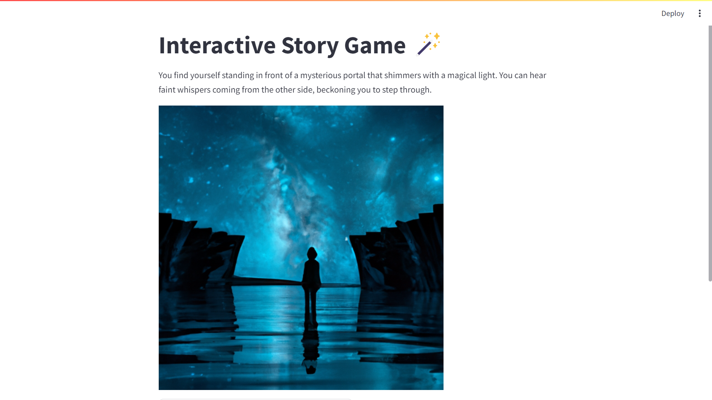

If you scroll down you will see several options (typically varying from
2 to 4):

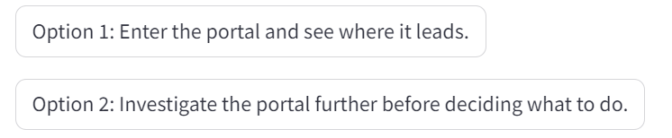

Try it out and see where it leads you ... Adventure is out there!