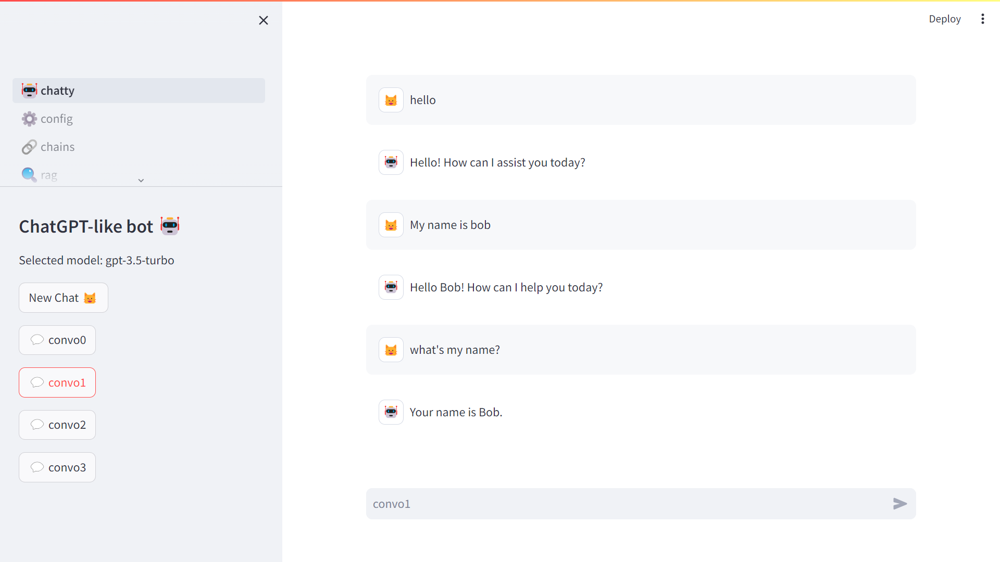
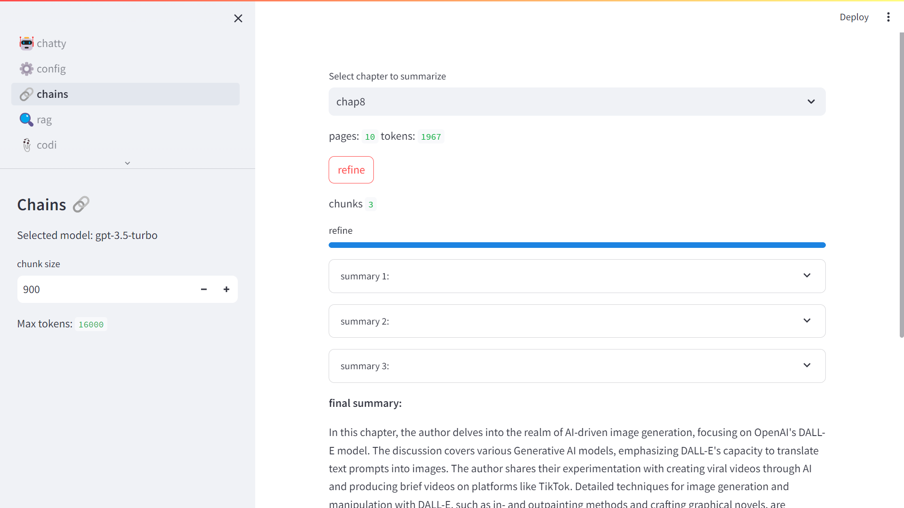
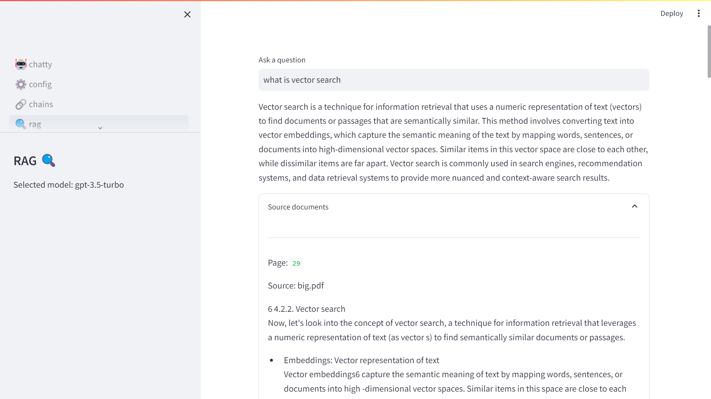
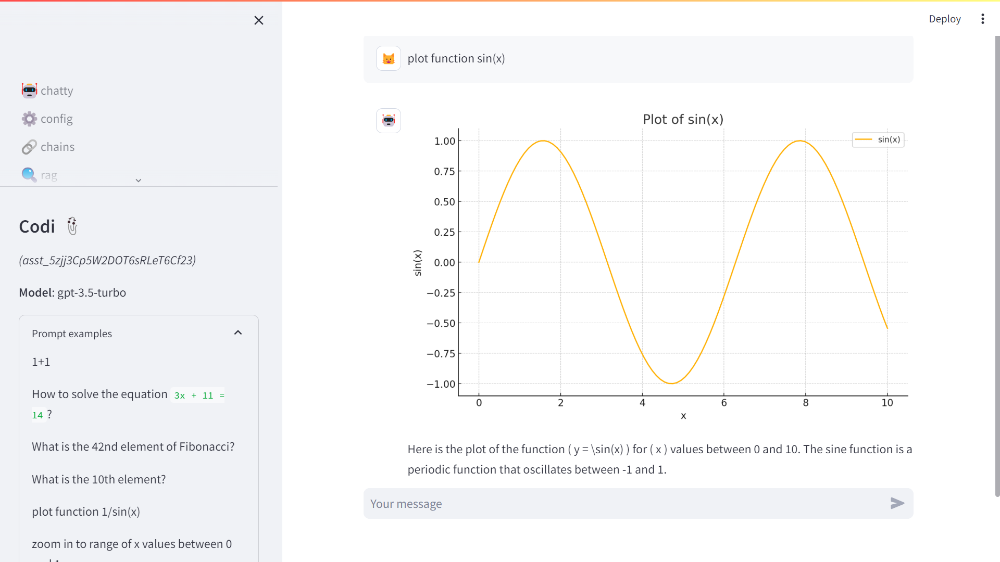
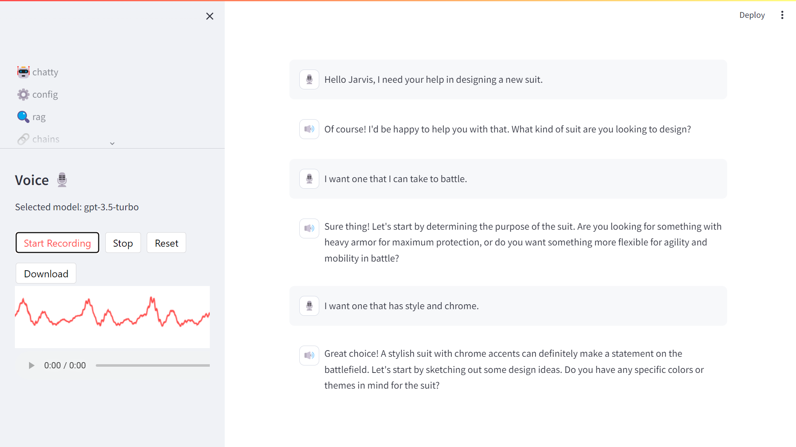
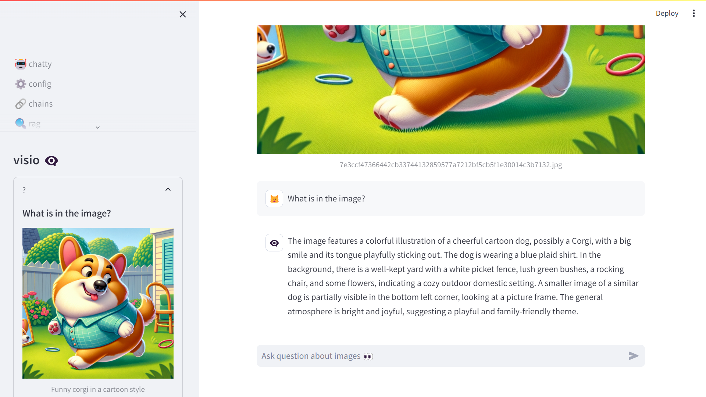
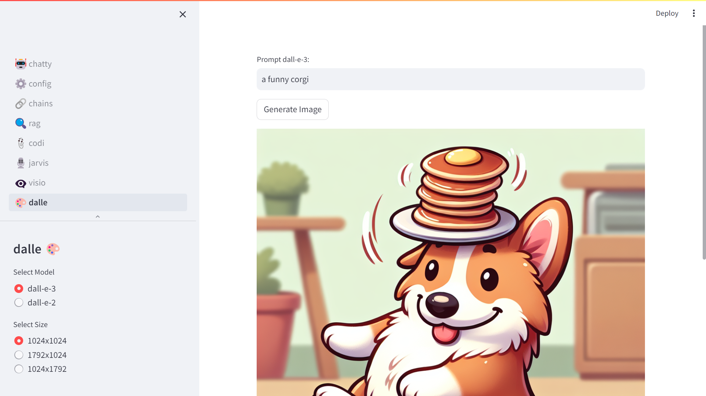

9.  Conclusion

In this book we prioritized a deeper dive into how you can build your
own AI-powered products via the ChatGPT API as it gives you more options
than the GPT builder in the ChatGPT App (with Plus subscription).

In each chapter, we have seen one of the extended capabilities of the
ChatGPT API. Let's summarize all of those into one multipage app. This
should act as a companion to this book, and a template for you to start
your own AI-powered product (you just have to bring your own OpenAI API
key).

I'll personify each of the GPTs that we will go through in this app and
give each of them a funny name.

-   🤖chatty:

Our good old chat, with the memory of the conversation saved as session
state. This one is important to get the basics of how to call an LLM. In
the appendix, we will see a version of chatty calling Mistral AI.

-   ⚙️ config:

This isn't really a GPT, but more an extension of chatty. It enables you
to configure your bot, export and delete the history of messages. This
way if you want to host this app online, you can give basic privacy
settings to your users.

-   🔗 sumi:

Summarizing is a useful use case of LLMs, and it is one of the first
GPTs I created when the GPT-3.5 API came out. This version is more meant
for pedagogical objective to explain how the text is broken down into
chunks, and to see the impact of changing the chunk size, for instance
from 1000 to 900 on chapter 8 that represents 1967 tokens in total. You
can also try it out on longer chapters, to observe how the summary gets
refined over the iterations.

-   🔍 ragu:

RAG is an important part of the excitement around the chaining of calls
to LLMs. This GPT uses a vector database that contains the chapters of
this book to answer questions. You can derive your own version with the
document database of your choice. An alternative for this is to use
OpenAI's file search service.

-   📎 codi:

This GPT is one of my favorites. It is less capable than the version
described in chapter 5 that enables file inputs for advanced data
analysis.

-   🎙️jarvis:

This is probably the prototypical chatbot that most of us think about
when building our own GPT. It's a variation of chatty with added bells
and whistles to take your voice as input. I didn't go the extra mile of
adding a voice synthesis of the bot response, as I was worried it would
bring me to the "uncanny valley". This expression represents the strange
feeling that humans experience when an AI tries to mimic human functions
but does not quite get it right (like when you have a weird looking
human image generated).

-   👁️‍🗨️ visio:

This one sounds like a superhero name. And it does translate some of the
feeling of being able to extract information from images. When this
capability will scale to take video as input, it will open up a whole
new dimension of copilot use cases.

-   🎨dalle:

This one is more artistic but can be useful for you to generate logos
and images like the one on the cover of this book. If your application
of AI is more for artwork or entertainment, this GPT is a good start.

